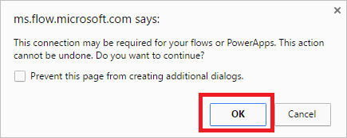

# Gestione delle connessioni in Microsoft Flow
[!INCLUDE [view-pending-approvals](includes/cc-rebrand.md)]
Se si crea una connessione in Microsoft Flow, è possibile accedere facilmente ai dati durante la compilazione di un flusso. Microsoft Flow include connessioni di uso comune, tra cui SharePoint, SQL Server, Office 365, OneDrive for business, Salesforce, Excel, Dropbox, Twitter e altro ancora. Le connessioni vengono condivise con PowerApps. Pertanto, quando si crea una connessione in un prodotto, la connessione viene visualizzata nell'altra.

Ad esempio, è possibile usare una connessione per eseguire queste attività:

* Aggiornare un elenco di SharePoint.
* Ottenere i dati da un file di Excel nell'account OneDrive for business o Dropbox.
* Inviare un messaggio di posta elettronica in Office 365.
* Inviare un tweet.

È possibile creare una connessione in più scenari, ad esempio:

* Creazione di un [flusso da un modello](get-started-logic-template.md)
* Creazione di un [flusso da zero](get-started-logic-flow.md) o aggiornamento di un flusso esistente
* Creazione diretta di una connessione nel [sito web Microsoft Flow][1]

In questo argomento viene illustrato come gestire le connessioni nel [sito web Microsoft Flow][1].

## Aggiungere una connessione
1. Nel [sito web Microsoft Flow][1]accedere con l'account aziendale o dell'organizzazione.
2. Nell'angolo in alto a destra selezionare l'icona dell'ingranaggio e quindi selezionare **Connections (connessioni**).
   
    
3. Selezionare **Crea connessione**.
4. Nell'elenco delle **connessioni disponibili**selezionare la connessione che si desidera configurare, ad esempio SharePoint.
5. Selezionare il pulsante **Crea connessione** , quindi immettere le credenziali per configurare la connessione.

Quando la connessione è configurata, viene elencata in **connessioni personali**.

## Connettersi ai dati tramite un gateway dati locale
Al momento della stesura di questo articolo, SQL Server e SharePoint Server supportano il gateway dati locale. Per creare una connessione che usa un gateway:

1. Per aggiungere una connessione, attenersi alla procedura riportata in precedenza in questo argomento.
2. Nell'elenco delle **connessioni disponibili**selezionare **SQL Server**, quindi selezionare la casella di controllo **Connetti tramite gateway dati locale** .
   
    
   
   > [!IMPORTANT]
   > I gateway dati di Microsoft SharePoint supportano il traffico HTTP, ma non il traffico HTTPS.
   > 
   > 
3. Fornire le credenziali della connessione, quindi selezionare il gateway che si vuole usare.
   
    Per altre informazioni, vedere [gestire i gateway](gateway-manage.md) e [comprendere i gateway](gateway-reference.md).
   
    Quando la connessione è configurata, viene elencata in **connessioni personali**.

## Eliminare una connessione
1. Andare alla pagina **connessioni personali** e quindi selezionare l'icona del cestino per la connessione che si vuole eliminare.
   
    
2. Selezionare **OK** per confermare che si desidera eliminare la connessione.
   
    

Quando si elimina una connessione, questa viene rimossa sia da PowerApps che da Microsoft Flow.

## Aggiornare una connessione
È possibile aggiornare una connessione che non funziona perché la password o i dettagli dell'account sono stati modificati.

1. Nella pagina **connessioni personali** selezionare il collegamento **Verifica password** per la connessione che si desidera aggiornare.
   
    
2. Quando richiesto, aggiornare la connessione con le nuove credenziali.

Quando si aggiorna una connessione, questa viene aggiornata sia per PowerApps che per Microsoft Flow.

## Risolvere i problemi relativi a una connessione
A seconda dei criteri dell'organizzazione, potrebbe essere necessario usare lo stesso account per accedere a Microsoft Flow e creare una connessione a SharePoint, Office 365 o OneDrive for business.

Ad esempio, è possibile accedere a Microsoft Flow con *yourname@outlook.com* ma essere bloccati quando si tenta di connettersi a SharePoint con *yourname@contoso.com* . È invece possibile accedere a Microsoft Flow con *yourname@contoso.com* e si sarà in grado di connettersi a SharePoint.

<!--Reference links in article-->
[1]: https://flow.microsoft.com
