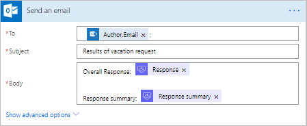

# Creare un flusso di approvazione che richieda agli utenti di approvare
[!INCLUDE [view-pending-approvals](includes/cc-rebrand.md)]

Questa procedura dettagliata illustra come creare un flusso di lavoro di approvazione che richiede l'approvazione di una richiesta di ferie da parte di tutti (tutti i responsabili approvazione assegnati), ma qualsiasi responsabile approvazione può rifiutare l'intera richiesta.

Questo tipo di flusso di lavoro di approvazione è utile in un'organizzazione che richiede l'approvazione di una richiesta di ferie da parte del responsabile di una persona e del responsabile. Tuttavia, uno dei responsabili può rifiutare la richiesta senza l'input dell'altra persona.

> [!NOTE]
> Sebbene questa procedura dettagliata evidenzi uno scenario di approvazione delle ferie, è possibile usare questo tipo di flusso di approvazione in qualsiasi situazione in cui sono necessari più responsabili approvazione per approvare una richiesta.
>
>

## Prerequisiti

* Accesso a [Microsoft Flow](https://flow.microsoft.com), Microsoft Office 365 Outlook e Microsoft Office utenti 365.
* [Elenco](https://support.office.com/article/SharePoint-lists-I-An-introduction-f11cd5fe-bc87-4f9e-9bfe-bbd87a22a194)di SharePoint.

    Questa procedura dettagliata presuppone che sia stato creato un elenco di SharePoint che viene usato per richiedere vacanze. Vedere la procedura dettagliata sulle [approvazioni parallele](parallel-modern-approvals.md) per un esempio approfondito che illustra l'aspetto dell'elenco di SharePoint.
* Familiarità con le nozioni di base per la creazione di flussi.

    È possibile esaminare come aggiungere [azioni, trigger](multi-step-logic-flow.md#add-another-action)e [condizioni](add-condition.md). Nei passaggi seguenti si presuppone che si sappia come eseguire queste azioni.

> [!NOTE]
> Sebbene in questa procedura dettagliata venga usato SharePoint e Office 365 Outlook, è possibile usare altri servizi, ad esempio Zendesk, Salesforce, Gmail o uno dei servizi più di [200](https://flow.microsoft.com/connectors/) supportati da Microsoft Flow.
>
>

## Creare il flusso

> [!NOTE]
> Se in precedenza non è stata creata una connessione a SharePoint o a Office 365, seguire le istruzioni visualizzate quando viene richiesto di eseguire l'accesso.
>
>

Questa procedura dettagliata usa i token. Per visualizzare l'elenco dei token, toccare o fare clic su un controllo di input, quindi cercare il token nell'elenco di **contenuto dinamico** visualizzato.

Accedere [Microsoft Flow](https://flow.microsoft.com)e quindi seguire questa procedura per creare il flusso.

1. Selezionare **flussi personali** > **Crea da zero**, nella parte superiore destra della schermata.
1. Aggiungere il trigger **SharePoint-quando viene creato o modificato un elemento** .
1. Immettere l' **indirizzo del sito** per il sito di SharePoint che ospita l'elenco delle richieste di ferie e quindi selezionare il **nome dell'elenco**di elenchi.
1. Aggiungere l'azione **Office 365 users-get Manager V2** , selezionare la casella **User (UPN)** , quindi aggiungere il token **creato da posta elettronica** .

    Il token **creato da posta elettronica** si trova nella categoria **quando viene creato o modificato un elemento** dell'elenco di **contenuto dinamico** . Questo token fornisce in modo dinamico l'accesso ai dati relativi al responsabile della persona che ha creato l'elemento in SharePoint.

1. Aggiungere un'altra azione di **Office 365 users-get Manager V2** e quindi aggiungere il token di **posta** alla casella **User (UPN)** .

    Il token di **posta** si trova sotto la categoria **Get Manager v2 2** dell'elenco di **contenuto dinamico** . Questo token fornisce in modo dinamico l'accesso all'indirizzo di posta elettronica per il responsabile del Manager.

    È anche possibile rinominare la scheda **Get Manager v2 2** in un elemento significativo, ad esempio "Skip Level Manager".
1. Aggiungere l'azione **avviare un'approvazione** , quindi selezionare **Everyone dall'elenco assegnato** dall'elenco tipo di **approvazione** .

   > [!IMPORTANT]
   > Se un responsabile approvazione rifiuta, la richiesta di approvazione viene considerata rifiutata per tutti i responsabili approvazione.
   >
   >
1. Usare la tabella seguente come guida per completare la scheda **avviare un'approvazione** .

   | campo | Descrizione |
   | --- | --- |
   |  Tipo di approvazione |Usare **chiunque dall'elenco assegnato** per indicare che uno dei responsabili approvazione può approvare o rifiutare la richiesta. 
Usare **tutti dall'elenco assegnato** per indicare che una richiesta viene approvata solo se ogni utente acconsente e la richiesta viene negata se una singola persona la rifiuta. |
   |  titolo |Titolo della richiesta di approvazione. |
   |  Assegnato a |Indirizzi di posta elettronica dei responsabili approvazione. |
   |  Dettagli |Qualsiasi informazione aggiuntiva che si desidera inviare ai responsabili approvazione elencati nel campo **assegnato a** . |
   |  Collegamento elemento |URL dell'elemento di approvazione. In questo esempio, si tratta di un collegamento all'elemento in SharePoint. |
   |  Descrizione collegamento elemento |Descrizione di testo per il **collegamento dell'elemento**. |

   > [!TIP]
   > L'azione **Avvia un'approvazione** fornisce diversi token, tra cui il **Riepilogo** **della risposta e** della risposta. Usare questi token nel flusso per fornire report avanzati dei risultati da un'esecuzione di un flusso di richiesta di approvazione.
   >
   >

    La scheda **Avvia un'approvazione** è un modello per la richiesta di approvazione inviata ai responsabili dell'approvazione. Configurarlo in modo che sia utile per l'organizzazione. Ecco un esempio.

    

1. Aggiungere l'azione **Office 365 Outlook-invia un messaggio di posta elettronica** e configurarla per l'invio di un messaggio di posta elettronica con i risultati della richiesta.

    Di seguito è riportato un esempio di come potrebbe apparire la scheda **Invia un messaggio di posta elettronica** .

    

> [!NOTE]
> Qualsiasi azione che segue l'azione **Avvia un'approvazione** viene eseguita in base alla selezione nell'elenco **tipo di approvazione** nella scheda **Avvia un'approvazione** . La tabella seguente elenca il comportamento in base alla selezione effettuata.
>
>

| Tipo di approvazione | Comportamento |
| --- | --- |
| Tutti gli utenti dall'elenco assegnato |Le azioni che seguono l'azione **Avvia un'approvazione** vengono eseguite dopo che uno qualsiasi dei responsabili approvazione decide. |
| Tutti dall'elenco assegnato |Le azioni che seguono l'azione **avviare un'approvazione** vengono eseguite dopo il rifiuto di un responsabile approvazione o che tutti approvino la richiesta. |

Nella parte superiore della schermata immettere un nome per il flusso nella casella **Nome flusso** e quindi selezionare **Crea flusso** per salvarlo.

Il flusso è stato completato. Se è stata seguita, il flusso è simile a questa immagine.

A questo punto, ogni volta che un elemento viene aggiunto all'elenco di SharePoint o in caso di modifica di un elemento, il flusso viene attivato e invia le richieste di approvazione a tutti i responsabili approvazione elencati nella casella **assegnato a** della scheda **avviare un'approvazione** . Il flusso invia le richieste di approvazione tramite l'app per dispositivi mobili Microsoft Flow e tramite posta elettronica. La persona che crea l'elemento in SharePoint riceve un messaggio di posta elettronica che riepiloga i risultati, indicando chiaramente se la richiesta è stata approvata o rifiutata.

Di seguito è riportato un esempio della richiesta di approvazione inviata a ogni responsabile approvazione.

Di seguito è riportato un esempio di come può essere un riepilogo di risposta e risposta dopo l'esecuzione del flusso.

## Altre informazioni sulle approvazioni

* [Approvazioni moderne dell'approvatore singolo](modern-approvals.md)
* [Approvazioni moderne sequenziali](sequential-modern-approvals.md)
* [Approvazioni moderne parallele](parallel-modern-approvals.md)
* [Approvazioni e Microsoft Common Data Service](common-data-model-approve.md)
* [Approva le richieste in viaggio](mobile-approvals.md)
