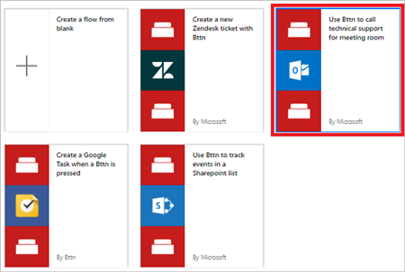

# Eseguire i flussi con i pulsanti fisici (bttn) di The Button Corporation (anteprima)
Attivare i flussi premendo un bttn (un pulsante fisico creato da [The Button Corporation](https://my.bt.tn/)). Ad esempio, è possibile premere un bttn che attiva un flusso per eseguire queste attività:

* contattare il supporto tecnico con informazioni sul percorso
* inviare un messaggio di posta elettronica al team
* bloccare il calendario
* riordinare forniture

> [!IMPORTANT]
> È necessario [registrare](https://my.bt.tn/) il bttn per poterlo usare in un flusso.
> 
> [!TIP]
> Configurare tutte le proprietà bttn, ad esempio nome, posizione e indirizzo e-mail, sul [sito Web bttn](https://my.bt.tn/) prima di creare il flusso.
> 
> 

È anche possibile attivare un flusso usando un [pulsante fisico Flic](flic-button-flows.md).

## Prerequisiti
* Avere accesso a [Microsoft Flow](https://flow.microsoft.com).
* Almeno un [bttn registrato](https://my.bt.tn/).

## Creare un flusso che viene attivato da un bttn
In questa procedura dettagliata, verrà usato un modello del supporto tecnico per creare un flusso che sia possibile attivare con la semplice pressione di un [bttn](https://my.bt.tn/). Quando viene eseguito il flusso, genera una richiesta di supporto e la invia quindi al supporto tecnico. La richiesta di supporto fornisce al supporto tecnico la posizione della sala in cui è necessaria assistenza. Questa procedura dettagliata illustra come creare questo flusso a partire da un modello, ma è possibile usare il modello vuoto, che assegna il controllo completo su tutti gli aspetti del flusso.

È possibile usare uno di questi modelli per creare rapidamente flussi per il bttn e connettersi a Zendesk, Google e SharePoint, tra gli altri:

Suggerimento: ai fini di questa procedura dettagliata, assegnare al bttn un nome che rappresenti una sala riunioni in un edificio tipico.

Le impostazioni per il bttn dovrebbero essere simili a questo esempio (dal sito Web bttn):

Ora che è stato registrato e configurato il bttn, si inizierà a creare il flusso.

### Accedi e selezionare un modello
1. Accedere a [Microsoft Flow](https://flow.microsoft.com).
   
    
   
    Nota: in alternativa, è possibile creare flussi nell'app per dispositivi mobili Microsoft Flow per [Android](https://aka.ms/flowmobiledocsandroid), [iOS](https://aka.ms/flowmobiledocsios) o [Windows Phone](https://aka.ms/flowmobilewindows).
2. Immettere **bttn** nella casella di ricerca, quindi selezionare l'icona di ricerca.
   
    
   
    Dopo aver selezionato l'icona di ricerca, vengono visualizzati tutti i modelli che è possibile usare con i bttn.
3. Selezionare il modello **Use Bttn to call technical support for meeting room** (Usa Bttn per chiamare il supporto tecnico per la sala riunioni).
   
    

### Autorizzare Microsoft Flow a connettersi al bttn
1. Se richiesto, accedere ai servizi bttn e Office 365 Outlook, in modo da abilitare il pulsante **Continua**.
   
    
2. Quando si accede al servizio bttn, autorizzare Microsoft Flow a usare i bttn.
   
    **Importante**: se si non autorizza Microsoft Flow a usare i bttn, non è possibile visualizzarli o connettersi a essi da Microsoft Flow.
   
    
3. Dopo aver effettuato l'accesso a entrambi i servizi, selezionare **Continua**.
   
    

### Selezionare il bttn che attiva il flusso
1. Nella scheda **When a bttn is pressed** (Quando si preme un bttn), aprire l'elenco di ID bttn e quindi selezionare il bttn da usare.
   
    
   
    Il flusso dovrebbe ora essere simile a questo esempio.
   
    
2. Assegnare un nome al flusso e quindi selezionare **Crea flusso** per salvarlo.
   
    

## Testare il flusso e confermare i risultati
1. Premere il pulsante sul bttn.
2. Visualizzare la cronologia di esecuzione del flusso per confermare che sia stata eseguita correttamente.
   
    È possibile controllare la cronologia di esecuzione nel sito Web Microsoft Flow o nel dispositivo mobile.
   
    Nota: lo stato dell'esecuzione è impostato su **in esecuzione** fino a quando un utente seleziona **Riconoscimento** nel messaggio di richiesta di supporto.
3. È anche possibile confermare che il messaggio di posta elettronica sia stato inviato al team di supporto.
   
    Se la procedura è stata seguita correttamente, il messaggio di posta elettronica di supporto sarà simile a questo esempio:
   
    

## Risoluzione dei problemi
* Se il flusso non è stato attivato, accedere al sito di The Button Corporation e verificare se le attività del pulsante (pressioni) vengono registrate.
* È anche possibile analizzare l'attività di esecuzione nel sito Microsoft Flow e verificare la presenza di messaggi di errore.

## Altre informazioni
* [Condividere i flussi dei pulsanti](share-buttons.md).
* Informazioni su come usare i [token per attivare i pulsanti](introduction-to-button-trigger-tokens.md) per inviare dati correnti quando vengono eseguiti i flussi dei pulsanti.
* [Installare l'app Microsoft Flow per Android](https://aka.ms/flowmobiledocsandroid).
* [Installare l'app Microsoft Flow per iOS](https://aka.ms/flowmobiledocsios).

