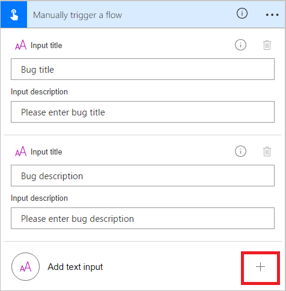

# Introduzione ai flussi di un pulsante con input dell'utente
Creare un flusso di un pulsante per eseguire attività di routine semplicemente toccando un pulsante. Personalizzare il flusso consentendo all'utente di fornire dettagli specifici che verranno usati quando viene eseguito il flusso. Questo argomento illustra come creare un flusso di un pulsante che accetta l'input dell'utente e quindi eseguire il flusso di un pulsante, evidenziando come fornire l'input dell'utente.

È possibile creare il flusso di un pulsante nel sito Web di Microsoft Flow o nell'app per dispositivi mobili per Microsoft Flow. In questo argomento, si userà il sito Web.

### Prerequisiti
* Un account nel sito Web di Microsoft Flow.

## Aprire il modello
1. Accedere al [sito Web di Microsoft Flow](https://flow.microsoft.com), immettere **Visual Studio** nella casella di ricerca e quindi scegliere o toccare l'icona di ricerca per trovare tutti i modelli relativi a Visual Studio:
   
      
2. Selezionare il modello **Open a Priority 2 Bug in Visual Studio** (Apri un bug con priorità 2 in Visual Studio):
   
      
3. Selezionare il pulsante **Usa questo modello**:
   
      
   
    Questo modello usa Visual Studio Team Services (VSTS) e i servizi di notifica Push. È necessario effettuare l'accesso a questi servizi se non si ha una connessione a nessuno di essi. Il pulsante **Accedi** verrà visualizzato solo se è necessario effettuare l'accesso a un servizio.
4. Dopo aver effettuato l'accesso ai servizi necessari, selezionare il pulsante **Continua**:
   
      
5. (facoltativo) Modificare il nome del flusso digitando un nome a scelta nella casella nella parte superiore del portale:
   
    

## Personalizzare l'input dell'utente
1. Nella scheda di attivazione, selezionare **Modifica**:
   
      
2. Selezionare l'icona **+** per espandere la pagina per poter aggiungere campi di input personalizzati:
   
    
3. Immettere il **titolo** e la **descrizione** dell'input per ogni campo personalizzato da rendere disponibile quando qualcuno esegue il flusso.  
   
    In questo esempio, si creeranno due campi di input personalizzati (**Bug Repro steps** e **Bug severity**, ossia Passaggi per riprodurre il bug e Gravità del bug) in modo che chiunque usi questo flusso possa immettere i passaggi per riprodurre il bug e valutarne la gravità:  
   
    

## Personalizzare il bug
1. Toccare la barra del titolo della scheda **Create a new work item** (Crea un nuovo elemento di lavoro):
   
      
2. Effettuare le selezioni appropriate per l'ambiente VSTS e quindi selezionare **Modifica**:
   
    Ad esempio, connettersi a myinstance.visualstudio.com digitando **myinstance**.
   
      
3. Selezionare **Mostra le opzioni avanzate** per visualizzare gli altri campi di questa scheda:
   
      
4. Posizionare il cursore prima del token **Bug title** token e quindi immettere "Severity:" nel campo di testo **Title**.
5. Con il cursore ancora nel campo di testo del titolo, selezionare il token **Bug severity** token e quindi immettere "--".  
6. Nel campo di testo **Description** posizionare il cursore subito dopo il token **Bug description** e quindi premere INVIO per iniziare una nuova riga.
7. Posizionare il cursore nella nuova riga e quindi selezionare il token **Bug Repro steps**:
   
    

## Personalizzare la notifica push
1. Toccare la barra del titolo della scheda **Send a push notification** (Invia una notifica push) per espanderla.
2. Nell'elenco dei token del contenuto dinamico, selezionare **Vedi altro**e quindi aggiungere il token **URL** nel campo di testo**Collegamento**.
3. Nel campo di testo **Etichetta di collegamento** aggiungere il token **Id**:
   
      
4. Toccare **Crea flusso** nel menu per creare il flusso:   

## Eseguire il flusso
In questa procedura dettagliata, si userà l'app per dispositivi mobili per Microsoft Flow per eseguire il flusso del pulsante appena creato. Si forniranno tutti gli input utente necessari a creare un bug con un titolo, una descrizione, i passaggi per riprodurlo e un livello di gravità.  

1. Nell'app per dispositivi mobili per Microsoft Flow, toccare la scheda **Pulsanti** e quindi toccare il pulsante **Creare report sui bug con passaggi**.
   
      
2. Immettere il titolo per il bug che si sta segnalando e quindi toccare **Avanti**. Ad esempio:
   
      
3. Immettere la descrizione del bug che si sta segnalando e quindi toccare **Avanti**. Ad esempio:
   
      
4. Immettere i passaggi per riprodurre il bug che si sta segnalando e quindi toccare **Avanti**. Ad esempio:
   
      
5. Immettere la gravità del bug che si sta segnalando e quindi toccare **Fine**:  
      
   
    Viene eseguito il flusso.
6. (facoltativo) Toccare la scheda **Attività** per visualizzare i risultati.
   
      
7. (facoltativo) Visualizzare i risultati dettagliati dell'esecuzione toccando il passaggio **Create a new work item** (Crea un nuovo elemento di lavoro).
   
      

## Passaggi successivi
* [Condividere i flussi dei pulsanti](share-buttons.md)
* [Informazioni sui flussi dei pulsanti](introduction-to-button-flows.md)  
* [Informazioni sui flussi dei pulsanti con token di trigger](introduction-to-button-trigger-tokens.md)  

