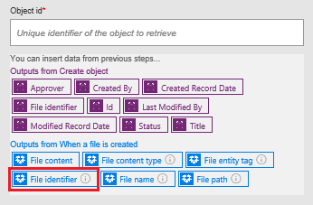
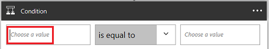

# Creazione di un ciclo di approvazione tramite Microsoft Flow e Microsoft Common Data Service
Common Data Service può rappresentare un modo per creare flussi di informazioni archiviate in un database indipendente di un flusso. L'esempio migliore è con le approvazioni. Se si archivia lo stato di approvazione in un'entità, è possibile sovrapporre il flusso.

In questo esempio, si creerà un processo di approvazione che viene avviato quando un utente aggiunge un file a Dropbox. Quando il file viene aggiunto, le relative informazioni vengono visualizzate in un'app, in cui un revisore può approvare o rifiutare la modifica. Quando il revisore approva o rifiuta la modifica, viene inviato un messaggio di notifica e i file rifiutati vengono eliminati da Dropbox.

Seguendo i passaggi descritti in questa sezione, si procederà a creare:

* un'**entità personalizzata** che conterrà le informazioni relative ai singoli file aggiunti a Dropbox e indicherà se lo stato del file è approvato, rifiutato o in sospeso.
* un **flusso** che aggiunge informazioni all'entità personalizzata quando viene aggiunto un file in Dropbox, invia messaggi quando il file viene approvato o rifiutato ed elimina i file rifiutati. Questa procedura illustra come compilare tale flusso da zero, ma è possibile creare un flusso simile da un modello.
* un'**app** in cui un revisore può approvare o rifiutare i file aggiunti a Dropbox. Si userà PowerApps per generare questa app automaticamente in base ai campi nell'entità personalizzata.

**Prerequisiti**

* Iscriversi a [Microsoft Flow](sign-up-sign-in.md) e [PowerApps](https://powerapps.microsoft.com/tutorials/signup-for-powerapps/).
* Creare connessioni a Dropbox e Office 365 Outlook, come descritto in [Gestire le connessioni](https://powerapps.microsoft.com/tutorials/add-manage-connections/).

## Creare l'entità
1. Accedere a [powerapps.com](https://web.powerapps.com).
2. Se non viene visualizzata la barra di spostamento a sinistra per impostazione predefinita, scegliere o toccare l'icona con tre linee orizzontali in alto a sinistra.
   
    
3. Nella barra di spostamento a sinistra, scegliere o toccare **Gestisci**, quindi scegliere o toccare **Entità**.
   
    
4. Se richiesto, scegliere o toccare **Crea il database personale**.
   
    
5. In alto a destra, scegliere o toccare **Nuova entità**.
   
    
   
    Se la finestra del browser non è ingrandita, questo pulsante potrebbe essere visualizzato in una posizione diversa.
6. In **Nome entità**, specificare un nome che non contenga spazi e che non sia stato assegnato ad altre entità nel database.
   
    Per seguire esattamente questo esempio, specificare **ReviewDropboxFiles**.
   
    
7. In **Nome visualizzato** specificare un nome descrittivo.
   
    
8. Scegliere o toccare **Avanti**.
   
    

## Aggiungere campi all'entità
1. In alto a destra, scegliere o toccare **Aggiungi campo**.
   
    
2. Nella riga vuota che viene visualizzata nella parte inferiore dell'elenco di campi, impostare le proprietà di un campo **Approver**. Per spostarsi alla colonna successiva durante l'impostazione delle proprietà, premere TAB.
   
   * Nella colonna **Nome visualizzato** digitare **Approver**.
   * Nella colonna **Nome** digitare **ApproverEmail**.
   * Nella colonna **Tipo** scegliere o toccare l'opzione **Email**.
   * Nella colonna **Obbligatorio** selezionare la casella di controllo.
     
     
3. Nella riga successiva, impostare le proprietà di un campo **Stato**:
   
   * Nella colonna **Nome visualizzato** digitare **Stato**.
   * Nella colonna **Nome** digitare **Stato**.
   * Nella colonna **Tipo** scegliere o toccare l'opzione **Text**.
   * Nella colonna **Proprietà** lasciare il valore predefinito.
   * Nella colonna **Obbligatorio** selezionare la casella di controllo.
     
     
4. Nella riga successiva, impostare le proprietà di un campo **FileID**:
   
   * Nella colonna **Nome visualizzato** digitare **Identificatore file**.
   * Nella colonna **Nome** digitare **FileID**.
   * Nella colonna **Tipo** scegliere o toccare l'opzione **Text**.
   * Nella colonna **Proprietà** lasciare il valore predefinito.
   * Nella colonna **Unico** selezionare la casella di controllo.
   * Nella colonna **Obbligatorio** selezionare la casella di controllo.
     
     
5. Vicino al bordo destro, scegliere o toccare i puntini di sospensione (...) per il campo **FileID** e quindi scegliere o toccare **Imposta come campo Titolo**.
   
    
6. In basso a sinistra, scegliere o toccare **Crea**.
   
    
7. (facoltativo) Quando l'elenco di entità verrà visualizzato, ingrandire la finestra del browser se non lo è già e quindi scegliere o toccare l'intestazione di colonna **Tipo**. L'elenco viene ordinato con le entità personalizzate, ad esempio quella appena creata, visualizzate nella parte superiore.

## Accedere e creare un flusso
1. Aprire il [portale di Microsoft Flow](https://flow.microsoft.com).
2. Ingrandire la finestra del browser se non lo è già e quindi scegliere o toccare **Accedi** in alto a destra.
   
    
3. Su powerapps.com, nel menu in alto a destra selezionare l'ambiente in cui è stato creato il database.
   
    **Nota**: se non si seleziona lo stesso ambiente, non verrà visualizzata l'entità.
4. In alto a sinistra, scegliere o toccare **Flussi personali**.
   
    
5. In alto a destra, scegliere o toccare **Crea nuovo flusso**.
   
    

## Iniziare quando viene aggiunto un file
1. Nella casella contenente **Cerca altri trigger** digitare o incollare **Dropbox** e quindi scegliere o toccare **Dropbox - Quando viene creato un file**.
   
    
2. In **Cartella**, scegliere o toccare l'icona della cartella e quindi passare alla cartella in cui i file verranno aggiunti.
   
    

## Aggiungere dati all'entità
1. Scegliere o toccare **Nuovo passaggio**, quindi scegliere o toccare **Aggiungi un'azione**.
   
    
2. Nella casella con la scritta **Cercare altre azioni** digitare o incollare **Common Data Service** e quindi scegliere o toccare **Common Data Service - Crea oggetto**.
   
    
3. In **The entity (Entità)**, digitare o incollare **Review (Revisione)**, e quindi scegliere o toccare **Review Dropbox files (Revisione file Dropbox)**.
   
    
4. In **Titolo**, fare clic o toccare nella casella e quindi scegliere o toccare il parametro token **Nome file** nell'elenco per aggiungerlo al campo.
   
    
5. In **Approver (Revisore)**, digitare o incollare l'indirizzo di posta elettronica della persona che esaminerà i file.
   
    **Nota**: per rendere più semplice il test del flusso, specificare il proprio indirizzo. È possibile modificarlo in un secondo momento, quando il flusso sarà pronto per l'uso effettivo.
   
    
6. In **Stato** digitare o incollare **In sospeso**.
   
    
7. In **Identificatore file**, fare clic o toccare nella casella e quindi scegliere o toccare il parametro token **Identificatore file** nell'elenco per aggiungerlo al campo.
   
    

## Controllare se il file è stato rivisto
1. Nell'azione **Crea oggetto** scegliere o toccare **Nuovo passaggio**, scegliere o toccare **Altro** e quindi scegliere o toccare **Aggiungi un'azione fino a**.
   
    
2. In alto a sinistra dell'azione **Esegui fino a** fare clic su o toccare la casella che contiene **Scegliere un valore**.
   
    
   
    **Nota**: se la finestra del browser non è ingrandita, fare clic o toccare nella casella superiore che contiene **Scegliere un valore**.
3. In **Output da Crea oggetto** scegliere o toccare il parametro token **Stato** per aggiungerlo al campo.
   
    
4. Aprire l'elenco al centro dell'azione **Esegui fino a**, quindi scegliere o toccare **non è uguale a**.
   
    
5. In alto a destra dell'azione **Esegui fino a** digitare o incollare **In sospeso** nella casella che contiene **Scegliere un valore**.
   
    
   
    **Nota**: se la finestra del browser non è ingrandita, fare clic o toccare nella casella inferiore che contiene **Scegliere un valore**.
6. Nella parte inferiore dell'azione **Esegui fino a** scegliere o toccare **Aggiungi un'azione**.
   
    
7. Nella casella contenente **Cercare altre azioni** digitare **Common** e quindi scegliere o toccare **Common Data Service - Ottieni oggetto**.
   
    
8. In **The namespace** scegliere o toccare il database.
9. In **The entity (Entità)**, digitare o incollare **Review (Revisione)**, e quindi scegliere o toccare **Review Dropbox files (Revisione file Dropbox)**.
   
    
10. In **ID oggetto**, fare clic o toccare nella casella e quindi scegliere o toccare il parametro token **Identificatore file** per aggiungerlo al campo.
    
     

## Controllare se l'elemento è stato approvato
1. Nell'azione **Esegui fino a** scegliere o toccare **Nuovo passaggio**, quindi scegliere o toccare **Aggiungi una condizione**.
   
    
2. In alto a sinistra della condizione fare clic o toccare nella casella che contiene **Scegliere un valore**.
   
    
   
    **Nota**: se la finestra del browser non è ingrandita, fare clic o toccare nella casella superiore che contiene **Scegliere un valore**.
3. In **Output da Ottieni oggetto** scegliere o toccare il parametro token **Stato** per aggiungerlo al campo.
   
    
4. In alto a destra della condizione digitare o incollare **Approvato** nella casella che contiene **Scegliere un valore**.
   
    
   
    **Nota**: se la finestra del browser non è ingrandita, digitare o incollare **Approvato** nella casella inferiore che contiene **Scegliere un valore**.

## Inviare messaggio di notifica
1. In **Se sì, non fare nulla** scegliere o toccare **Aggiungi un'azione**.
   
    
2. Nella casella contenente **Cercare altre azioni** digitare o incollare **invia messaggio** e quindi scegliere o toccare **Office 365 Outlook - Invia un messaggio di posta elettronica**.
   
    
3. In **A**, digitare o incollare l'indirizzo della persona a cui si vuole inviare una notifica quando viene accettato un elemento.
   
    **Nota**: per rendere più semplice il test del flusso, specificare il proprio indirizzo. È possibile modificarlo quando il flusso sarà pronto per l'uso effettivo.
   
    
4. In **Oggetto**, fare clic o toccare nella casella e quindi scegliere o toccare il parametro token **Nome file** per aggiungerlo al campo.
   
    
5. In **Corpo** digitare o incollare **The item has been approved (L'elemento è stato approvato)**.
   
    
6. In **Se no, non fare nulla** ripetere i passaggi da 1 a 5 in questa procedura, ma specificare il corpo del messaggio di posta elettronica come **The item has been rejected (L'elemento è stato rifiutato)**.
   
    

## Eliminare i file rifiutati
1. Nei campi del messaggio di rifiuto, scegliere o toccare **Aggiungi un'azione**.
   
    
2. Nella casella contenente **Cercare altre azioni** digitare o incollare **Dropbox** e quindi scegliere o toccare **Dropbox - Elimina file**.
   
    
3. In **File**, fare clic o toccare nella casella e quindi scegliere o toccare il parametro token **Identificatore file** per aggiungerlo al campo.
   
    

## Salvare il flusso
1. Nella parte superiore della schermata, digitare o incollare un nome per il flusso che si sta creando, quindi scegliere o toccare **Crea flusso**.
   
    
2. Scegliere o toccare **Chiudi**, quindi scegliere o toccare **Fine**.
3. In Dropbox, aggiungere almeno due file nella cartella specificata: uno per eseguire il test di approvazione e uno per testare il rifiuto.

## Compilare l'app
1. Accedere a [powerapps.com](https://web.powerapps.com), quindi scegliere o toccare **Nuova app** nella parte inferiore della barra di spostamento a sinistra.
   
    
2. Nella finestra di dialogo visualizzata, scegliere o toccare l'opzione per aprire PowerApps Studio per Windows o PowerApps Studio per il Web.
3. Se è stato aperto PowerApps Studio per Windows, scegliere o toccare **Nuovo** nella barra di spostamento a sinistra.
4. In **Create an app from your data** (Crea un'app dai dati) scegliere o toccare **Layout Telefono** nel riquadro **Common Data Service**.
   
    
5. Nella casella **Ricerca** digitare o incollare **Review (Revisione)**.
   
    
6. in **Scegliere un'entità** scegliere o toccare **Review Dropbox Files (Revisione file Dropbox)**.
   
    
7. In basso a destra, scegliere o toccare **Connetti**.
   
    
8. Se viene visualizzata la schermata iniziale della presentazione introduttiva, eseguirla per acquisire familiarità con PowerApps (oppure scegliere o toccare **Ignora**).
   
    
   
    È sempre possibile eseguire la presentazione in un secondo momento scegliendo o toccando l'icona di punto interrogativo in alto a sinistra e quindi scegliendo o toccando **Presentazione introduttiva**.
9. (facoltativo) Nella parte inferiore della schermata, trascinare il dispositivo di scorrimento per ingrandire e visualizzare più facilmente l'app.
   
    

## Personalizzare l'app
1. Nella barra di navigazione a destra, scegliere o toccare il layout che include un'intestazione e una descrizione.
   
    
2. Nella **SchermataEsplora** scegliere o toccare poco sotto la barra di ricerca per selezionare il controllo della casella di testo.
   
    
3. Nel riquadro di destra, aprire l'elenco inferiore scegliendo o toccando la freccia GIÙ.
   
    
4. Nell'elenco in basso, scegliere o toccare **Titolo** per mostrare il nome file dei file aggiunti.
   
    
5. Nel riquadro di destra, aprire l'elenco superiore, quindi scegliere o toccare **Stato** per visualizzare lo stato di ogni file.
   
    

## Testare la soluzione complessiva
1. In PowerApps, aprire la modalità di anteprima scegliendo o toccando il pulsante di riproduzione in alto a sinistra.
   
    
2. Per il primo file nell'elenco, scegliere o toccare la freccia per visualizzare i dettagli su tale file.
   
    
3. In alto a destra, scegliere o toccare l'icona a forma di matita per modificare i dettagli relativi al file.
   
    
4. Nella casella **Stato** digitare o incollare **Approvato**.
   
    
5. In alto a destra, scegliere o toccare l'icona del segno di spunta per salvare le modifiche e tornare alla schermata dei dettagli.
   
    
   
    In pochi minuti, si riceverà un messaggio di posta elettronica che informa che il file è stato approvato.
6. In alto a destra, scegliere o toccare il pulsante Indietro per tornare alla schermata di navigazione.
   
    
7. Per l'altro file nell'elenco, scegliere o toccare la freccia per visualizzare i dettagli su tale file.
   
    
8. In alto a destra, scegliere o toccare l'icona a forma di matita per modificare i dettagli relativi al file.
   
    
9. Nella casella **Stato** digitare o incollare **Rifiutato** (o qualsiasi altra cosa tranne **Approvato**, inclusi **Aprovato** o **Approovato**).
   
    
10. In alto a destra, scegliere o toccare l'icona del segno di spunta per salvare le modifiche e tornare alla schermata dei dettagli.
    
     
    
     In pochi minuti, si riceverà un messaggio di posta elettronica che informa che il file è stato rifiutato e che verrà eliminato da Dropbox.

