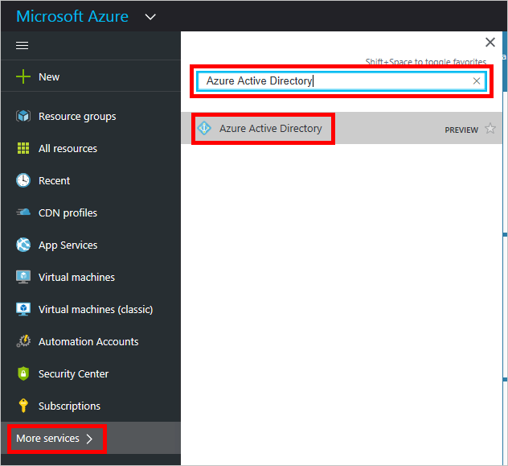
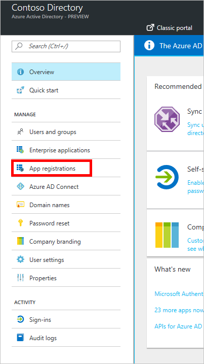
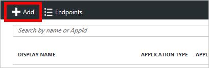

# Usare Azure Active Directory con un connettore personalizzato in Microsoft Flow
Azure Resource Manager (ARM) consente di gestire i componenti di una soluzione in Azure, come i database, le macchine virtuali, i componenti e le app Web. Questa esercitazione illustra come abilitare l'autenticazione in Azure Active Directory, registrare una delle API ARM come connettore personalizzato e quindi connettersi a essa in Microsoft Flow. Questa funzionalità è utile se si vogliono gestire risorse di Azure come parte di un flusso. Per altre informazioni su ARM, vedere [Panoramica su Azure Resource Manager](https://docs.microsoft.com/azure/azure-resource-manager/resource-group-overview).

## Prerequisiti
* Una [sottoscrizione di Azure](https://azure.microsoft.com/free/).
* Un [account Microsoft Flow](https://flow.microsoft.com).
* Il [file OpenAPI di esempio](https://pwrappssamples.blob.core.windows.net/samples/AzureResourceManager.json) usato in questa esercitazione.

## Abilitare l'autenticazione in Azure Active Directory
In primo luogo, è necessario creare un'applicazione di Azure Active Directory (AAD) che eseguirà l'autenticazione quando viene chiamato l'endpoint API di ARM.

1. Accedere al [portale di Azure](https://portal.azure.com).  Se si dispone di più tenant Azure Active Directory, verificare di aver eseguito l'accesso alla directory corretta controllando il nome utente nell'angolo superiore destro.
   
    
2. Nel menu a sinistra fare clic su **More services** (Altri servizi).  Nella casella di testo **Filtro** digitare **Azure Active Directory**, quindi fare clic su **Azure Active Directory**.
   
    
   
    Viene visualizzato il pannello Azure Active Directory.   
3. Nel menu del pannello Azure Active Directory fare clic su **Registrazioni per l'app**.
   
    
4. Nell'elenco di applicazioni registrate fare clic su **Aggiungi**.
   
       
5. Digitare un nome per l'applicazione, lasciare selezionato **App Web/API**, quindi digitare `https://login.windows.net` per **URL di accesso**.  Fare clic su **Crea**.  
   
    
6. Fare clic sulla nuova app nell'elenco.
   
    
   
    Viene visualizzato il pannello App registrata.  Prendere nota dell'**ID applicazione**,  che verrà usato in un secondo momento.
7. Dovrebbe essere visualizzato anche il pannello Impostazioni.  In caso contrario, fare clic sul pulsante **Impostazioni**.
   
    
8. Nel pannello Impostazioni fare clic su **URL di risposta**. Nell'elenco di URL aggiungere `https://msmanaged-na.consent.azure-apim.net/redirect` e fare clic su **Salva**.
   
    
9. Tornare al pannello Impostazioni e fare clic su **Autorizzazioni necessarie**.  Nel pannello Autorizzazioni necessarie fare clic su **Aggiungi**.
   
    
   
    Viene visualizzato il pannello Aggiungi accesso all'API.
10. Fare clic su **Selezionare un'API**. Nel pannello visualizzato fare clic sull'opzione relativa all'API Gestione dei servizi di Azure e quindi su **Seleziona**.
    
    
11. Fare clic su **Selezionare le autorizzazioni**.  In *Autorizzazioni delegate* fare clic su **Access Azure Service Management as organization users** (Accesso a gestione del servizio Azure come utenti dell'organizzazione), quindi su **Seleziona**.
    
    
12. Nel pannello Aggiungi accesso all'API fare clic su **Operazione completata**.
13. Tornare al pannello Impostazioni e fare clic su **Chiavi**.  Nel pannello Chiavi digitare una descrizione per la chiave, selezionare una scadenza e quindi fare clic su **Salva**.  Verrà visualizzata la nuova chiave.  Prendere nota del valore della chiave, perché servirà anch'esso in un secondo momento.  A questo punto è possibile chiudere il portale di Azure.
    
    

## Aggiungere la connessione in Microsoft Flow
Dopo avere configurato l'applicazione di AAD, viene aggiunto il connettore personalizzato.

1. Nell'[App Web Microsoft Flow](https://flow.microsoft.com/) fare clic sul pulsante **Impostazioni** in alto a destra della pagina (icona a forma di ingranaggio).  Quindi scegliere **Connettori personalizzati**.
   
      
2. Scegliere **Crea connettore personalizzato**.  
   
    Verranno chieste le proprietà dell'API.  
   
   | Proprietà | Descrizione |
   | --- | --- |
   | Nome |Nella parte superiore della pagina fare clic su **Untitled** (Senza nome) e assegnare un nome al flusso. |
   | File OpenAPI |Accedere al [file OpenAPI ARM di esempio](https://pwrappssamples.blob.core.windows.net/samples/AzureResourceManager.json). |
   | Caricamento dell'icona dell'API |Fare clic su **Carica icona** per selezionare un file di immagine per l'icona. Va bene qualsiasi immagine in formato PNG o JPG di dimensioni inferiori a 1 MB. |
   | Descrizione |Digitare una descrizione del connettore personalizzato (facoltativa). |
   
      
   
    Selezionare **Continua**.
3. Dal momento che il file OpenAPI usa l'applicazione di AAD per l'autenticazione, nella schermata successiva è necessario specificare alcune informazioni sull'applicazione per Flow.  In **ID client** digitare l'**ID applicazione** di AAD annotato in precedenza.  Usare la **chiave** per il segreto client.  Infine, digitare `https://management.core.windows.net/` per **URL risorsa**.
   
   > [!IMPORTANT]
   > Assicurarsi di riportare l'URL risorsa esattamente come scritto in precedenza, includendo la barra finale.
   > 
   > 
   
    
   
    Dopo aver immesso le informazioni di sicurezza, fare clic sul segno di spunta (**&#x2713;**) accanto al nome del flusso nella parte superiore della pagina per creare il connettore personalizzato.
4. Il connettore personalizzato viene ora visualizzato in **connettori personalizzati**.
   
      
5. Ora che il connettore personalizzato è registrato, è necessario creare una connessione per poterlo usare in app e flussi.  Fare clic su **+** a destra del nome del connettore personalizzato, quindi completare la schermata di accesso.

> [!NOTE]
> Il file OpenAPI di esempio non definisce l'intero set di operazioni di ARM e attualmente contiene solo l'operazione [List all subscriptions](https://msdn.microsoft.com/library/azure/dn790531.aspx) (Elenca tutte le sottoscrizioni).  È possibile modificare questo file OpenAPI o crearne un altro usando l'[editor online di OpenAPI](http://editor.swagger.io/).
> 
> Questo processo può essere usato per accedere a qualsiasi API RESTful autenticata tramite AAD.
> 
> 

## Passaggi successivi
Per informazioni più dettagliate su come creare un flusso, vedere [Start to build with Microsoft Flow](get-started-logic-flow.md) (Iniziare a creare con Microsoft Flow).

Per porre domande o inviare commenti sui connettori personalizzati, [entrare nella community](https://aka.ms/flow-community).

