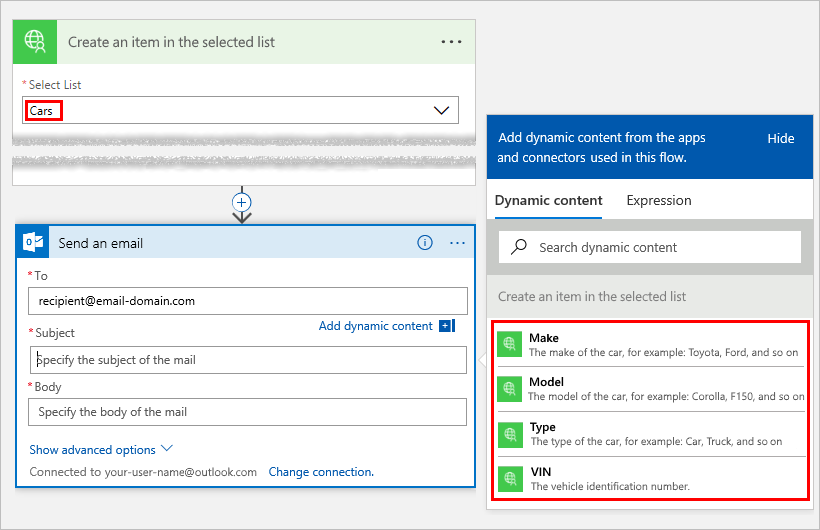

# <a name="openapi-extensions-for-custom-connectors-in-microsoft-flow"></a>Estensioni OpenAPI per connettori personalizzati in Microsoft Flow
## <a name="introduction"></a>Introduzione
Per creare i connettori personalizzati in Microsoft Flow, App per la logica di Azure o Microsoft PowerApps è necessario specificare un file di definizione OpenAPI, ovvero un documento indipendente dal linguaggio e in un formato leggibile al computer che descrive le operazioni e i parametri dell'API. Oltre alla funzionalità predefinita di OpenAPI, è possibile includere anche queste estensioni di OpenAPI quando si creano connettori personalizzati per App per la logica di Azure e Microsoft Flow:

* `summary`
* `x-ms-summary`
* `description`
* `x-ms-visibility`
* `x-ms-dynamic-values`
* `x-ms-dynamic-schema`

Di seguito ci sono altri dettagli su queste estensioni:

<a name="summary"></a>

## <a name="summary"></a>summary
Specifica il titolo per l'azione (operazione). </br>
Si applica a: Operazioni </br>
Consigliato: usare la *maiuscola a inizio frase* per `summary`. </br>
Esempio: "Quando viene aggiunto un evento al calendario" o "Invia un messaggio di posta elettronica"


``` json
"actions" {
  "Send_an_email": {
    /// Other action properties here...
    "summary": "Send an email",
    /// Other action properties here...
  }
},
```

## <a name="x-ms-summary"></a>x-ms-summary
Specifica il titolo per un'entità. </br>
Si applica a: Parametri, Schema di risposta </br>
Consigliato: usare la *maiuscola a inizio titolo* per `x-ms-summary`. </br>
Esempio: "ID calendario", "Oggetto", "Descrizione dell'evento" e così via


``` json
"actions" {
  "Send_an_email": {
    /// Other action properties here...
    "parameters": [ 
      {
        /// Other parameters here...
        "x-ms-summary": "Subject",
        /// Other parameters here...
      }
    ]
  }
},
```
<a name="description"></a>

## <a name="description"></a>description
Specifica una spiegazione dettagliata delle funzionalità dell'operazione o del formato e della funzione di un'entità. </br>
Si applica a: Operazioni, Parametri, Schema di risposta </br>
Consigliato: usare la *maiuscola a inizio frase* per `description`. </br>
Esempio: "Questa operazione viene attivata quando viene aggiunto un nuovo evento al calendario", "Specificare l'oggetto del messaggio di posta elettronica" e così via


``` json
"actions" {
  "Send_an_email": {
     "description": "Specify the subject of the mail",
     /// Other action properties here...
  }
},
```

<a name="visibility"></a>

## <a name="x-ms-visibility"></a>x-ms-visibility
Specifica la visibilità dell'entità verso l'utente. </br>
Valori possibili: `important`, `advanced` e `internal` </br>
Si applica a: Operazioni, Parametri, Schemi

* Le operazioni e i parametri contrassegnati di `important` verranno sono visualizzati per primi all'utente.
* Le operazioni e i parametri di `advanced` sono nascosti sotto un menu aggiuntivo.
* Le operazioni e i parametri di `internal` sono nascosti all'utente.

> [!NOTE]
> Per i parametri che sono `internal` e `required`, si **devono** fornire i valori predefiniti.
> 
> 

Esempio: il menu **Vedi altri** e **Mostra le opzioni avanzate** nascondono le operazioni e i parametri di `advanced`.


``` json
"actions" {
  "Send_an_email": {
     /// Other action properties here...
     "parameters:": [
         {
           "name": "Subject",
           "type": "string",
           "description": "Specify the subject of the mail",
           "x-ms-summary": "Subject",
           "x-ms-visibility": "important",
           /// Other parameter properties here
         }
     ]
     /// Other action properties here...
  }
},
```

## <a name="x-ms-dynamic-values"></a>x-ms-dynamic-values
Mostra un elenco popolato per l'utente in modo che possa selezionare i parametri di input per un'operazione. </br>
Si applica a: Parametri </br>
Come usarlo: aggiungere l'oggetto `x-ms-dynamic-values` della definizione del parametro. A tal proposito, vedere questo [esempio di OpenAPI](https://procsi.blob.core.windows.net/blog-images/sampleDynamicSwagger.json).


### <a name="properties-for-x-ms-dynamic-values"></a>Proprietà per x-ms-dynamic-values
| Nome | Obbligatorio o facoltativo | Descrizione |
| --- | --- | --- |
| **operationID** |Obbligatorio |L'operazione da chiamare per popolare l'elenco. |
| **value-path** |Obbligatorio |Stringa di percorso dell'oggetto all'interno di `value-collection` che fa riferimento al valore del parametro. Se `value-collection` non è specificato, la risposta viene valutata come una matrice. |
| **value-title** |Facoltativo |Stringa di percorso dell'oggetto all'interno di `value-collection` che fa riferimento alla descrizione del valore. Se `value-collection` non è specificato, la risposta viene valutata come una matrice. |
| **value-collection** |Facoltativo |Stringa di percorso che valuta una matrice di oggetti nel payload della risposta |
| **parameters** |Facoltativo |Oggetto le cui proprietà specificano i parametri di input necessari per richiamare un'operazione dynamic-values |

Ecco un esempio che mostra le proprietà in `x-ms-dynamic-values`:

``` json
"x-ms-dynamic-values": {
  "operationId": "PopulateDropdown",
  "value-path": "name",
  "value-title": "properties/displayName",
  "value-collection": "value",
  "parameters": {
     "staticParameter": "{value}",
     "dynamicParameter": {
        "parameter": "{value-to-pass-to-dynamicParameter}"
     }
  }
}
```

## <a name="example-all-the-openapi-extensions-up-to-this-point"></a>Esempio: tutte le estensioni di OpenAPI fino a questo punto
``` json
"/api/lists/{listID-dynamic}": {
    "get": {
        "description": "Get items from a single list - uses dynamic values and outputs dynamic schema",
        "summary": "Gets items from the selected list",
        "operationID": "GetListItems",
        "parameters": [
           {
             "name": "listID-dynamic",
             "type": "string",
             "in": "path",
             "description": "Select the list from where you want outputs",
             "required": true,
             "x-ms-summary": "Select List",
             "x-ms-dynamic-values": {
                "operationID": "GetLists",
                "value-path": "id",
                "value-title": "name"
             }
           }
        ]
    }
}
```

## <a name="x-ms-dynamic-schema"></a>x-ms-dynamic-schema
Indica che lo schema per il parametro o la risposta corrente è dinamico. Questo oggetto può richiamare un'operazione che viene definita dal valore di questo campo, individuare in modo dinamico lo schema e visualizzare l'interfaccia utente appropriata per la raccolta di input utente o visualizzare i campi disponibili. 

Si applica a: Parametri, Risposta

Come usarlo: aggiungere l'oggetto `x-ms-dynamic-schema` a un parametro della richiesta o alla definizione del corpo della risposta. A tal proposito, vedere questo [esempio di OpenAPI](https://procsi.blob.core.windows.net/blog-images/sampleDynamicSwagger.json).

Questo esempio illustra come cambia il modulo di input, in base all'elemento selezionato dall'utente dall'elenco a discesa:


Questo esempio illustra invece come cambiano gli output, in base all'elemento selezionato dall'utente dall'elenco a discesa. In questa versione, l'utente seleziona "Auto":



In questa versione, l'utente seleziona "Cibo":


### <a name="properties-for-x-ms-dynamic-schema"></a>Proprietà per x-ms-dynamic-schema
| Nome | Obbligatorio o facoltativo | Descrizione |
| --- | --- | --- |
| **operationID** |Obbligatorio |L'operazione da chiamare per il recupero dello schema |
| **parameters** |Obbligatorio |Oggetto le cui proprietà specificano i parametri di input necessari per richiamare un'operazione dynamic-schema |
| **value-path** |Facoltativo |Stringa di percorso che fa riferimento alla proprietà che contiene lo schema. </br>Se non specificato, la risposta si presuppone contenere lo schema nelle proprietà dell'oggetto radice. |
|  | | |

Ecco un esempio di parametro dinamico:

``` json
{
  "name": "dynamicListSchema",
  "in": "body",
  "description": "Dynamic schema for items in the selected list",
  "schema": {
    "type": "object",
    "x-ms-dynamic-schema": {
        "operationID": "GetListSchema",
        "parameters": {
          "listID": {
            "parameter": "listID-dynamic"
          }
        },
        "value-path": "items"
    }
  }
}
```

Ecco un esempio di risposta dinamica:

``` json
"DynamicResponseGetListSchema": {
   "type": "object",
   "x-ms-dynamic-schema": {
      "operationID": "GetListSchema",
      "parameters": {
         "listID": {
            "parameter": "listID-dynamic"
         }
      },
      "value-path": "items"
    }
}
```

## <a name="next-steps"></a>Passaggi successivi
[Registrare un connettore personalizzato](register-custom-api.md).

[Usare un'API Web ASP.NET](customapi-web-api-tutorial.md).

[Registrare un'API di Azure Resource Manager](customapi-azure-resource-manager-tutorial.md).

