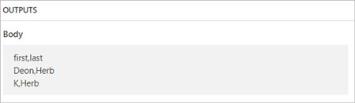

# <a name="use-data-operations-with-microsoft-flow"></a>Usare le operazioni dati con Microsoft Flow
Questa procedura dettagliata illustra alcune delle operazioni dati comuni di Microsoft Flow, come composizione, aggiunta, selezione, filtro matrice, creazione tabella e analisi JSON, disponibili per modificare i dati durante la creazione di flussi.

## <a name="prerequisites"></a>Prerequisiti
* Avere accesso a Microsoft Flow.
* Uno strumento come [PostMan](https://www.getpostman.com/postman) per inviare richieste POST HTTP con una matrice JSON al flusso.

## <a name="use-the-compose-action"></a>Usare l'azione Componi
Usare l'azione **Operazioni dati - Componi** (compose) per evitare di dover immettere più volte gli stessi dati quando si progetta un flusso. Ad esempio, se è necessario immettere la matrice di cifre ````[0,1,2,3,4,5,6,7,8,9]```` più volte durante la progettazione del flusso, è possibile usare l'azione Componi per salvare la matrice come segue:

1. Cercare **Componi**e quindi selezionare l'azione **Operazioni dati - Componi** (compose).
   
    
2. Immettere la matrice nella casella **Input** a cui si vuol fare riferimento in un secondo momento:
   
    

> [!TIP]
> Per farvi riferimento più semplicemente in seguito, rinominare la scheda **Componi** facendo clic sul testo "Componi" nella barra del titolo della scheda **Componi**.
> 
> 

Quando è necessario accedere al contenuto dell'azione Componi, eseguire questa operazione tramite il token **Output** nell'elenco **Aggiunge il contenuto dinamico dalle app e dai connettori usati in questo flusso** seguendo questi passaggi:

1. Aggiungere un'azione, ad esempio **Operazioni dati - Aggiungi**.
2. Selezionare il controllo a cui si vuole aggiungere il contenuto che è stato salvato nell'azione Componi.
   
    Viene aperto l'elenco **Aggiunge il contenuto dinamico dalle app e dai connettori usati in questo flusso**.
3. Nell'elenco **Aggiunge il contenuto dinamico dalle app e dai connettori usati in questo flusso**, selezionare il token **Output** che si trova sotto la categoria **Componi** della scheda **Contenuto dinamico**.
   
    

## <a name="use-the-join-action"></a>Usare l'azione Aggiungi
Usare l'azione **Operazioni dati - Aggiungi** (join) per delimitare una matrice con un separatore a propria scelta. Si supponga ad esempio che il flusso riceva una richiesta Web che include la seguente matrice di indirizzi e-mail: ````["d@example.com", "k@example.com", "dal@example.com"]````. Tuttavia, il programma di posta elettronica richiede che gli indirizzi siano composti da una singola stringa separata da punti e virgola. A tale scopo, usare l'azione **Operazioni dati - Aggiungi** (join) per modificare la virgola di delimitazione in un punto e virgola ";" seguendo questi passaggi:

1. Aggiungere una nuova azione, eseguire la ricerca di **Aggiungi**, quindi selezionare **Operazioni dati - Aggiungi** (join).
   
    
2. Immettere la matrice nella casella **Da** e quindi immettere il nuovo delimitatore che si vuole usare nella casella **Unisci con**.
   
    In questo caso, è stato usato un punto e virgola (;) come nuovo delimitatore.
   
    
3. Salvare il flusso e quindi eseguirlo.
4. Dopo l'esecuzione del flusso, l'output dell'azione **Operazioni dati: Aggiungi** sarà:
   
    

## <a name="use-the-select-action"></a>Usare l'azione Seleziona
Usare l'azione **Operazioni dati - Seleziona** (select) per trasformare la forma degli oggetti in una matrice. Ad esempio, è possibile aggiungere, rimuovere o rinominare gli elementi in ogni oggetto in una matrice.

> [!NOTE]
> Mentre è possibile aggiungere o rimuovere gli elementi usando l'azione Seleziona, è possibile modificare il numero di oggetti nella matrice.
> 
> 

Ad esempio, è possibile usare l'azione Seleziona se i dati vengono immessi nel flusso tramite una richiesta Web in questo formato:

````[ { "first": "Deon", "last": "Herb" }, { "first": "K", "last": "Herb" } ]````

e si vuole modificare la forma dei dati in entrata rinominando "first" in "FirstName", "last" in "LastName" e aggiungendo un nuovo membro denominato "FamilyName" che combina "first" e "last" (separati da uno spazio):

````[ { "FirstName": "Deon", "FamilyName": "Herb", "FullName": "Deon Herb" }, { "FirstName": "K", "FamilyName": "Herb", "FullName": "K Herb" } ]````.

A tale scopo:

1. Aggiungere l'azione **Richiesta/Risposta - Risposta** al flusso.
2. Selezionare **Usare il payload di esempio per generare lo schema** dalla scheda **Richiesta**.
3. Nella casella visualizzata, incollare un campione della matrice dell'origine dati, quindi selezionare il pulsante **Fine**.
4. Aggiungere l'azione **Operazioni dati - Seleziona** (select) e quindi configurarla come nell'immagine seguente.
   
    
   
   > [!TIP]
   > L'output dell'azione Seleziona è una matrice che contiene gli oggetti appena formati. Sarà quindi possibile usare questa matrice in qualsiasi altra azione, ad esempio **Componi**, descritta in precedenza.
   > 
   > 

## <a name="use-the-filter-array-action"></a>Usare l'azione Filtra matrice
Usare l'azione **Operazioni dati - Filtra matrice** (filter array) per ridurre il numero di oggetti in una matrice a un subset che corrisponde ai criteri forniti dall'utente.

> [!NOTE]
> L'azione Filtra matrice non può essere usata per cambiare la forma degli oggetti in una matrice. Inoltre, il testo a cui si applica un filtro fa distinzione tra maiuscole e minuscole.
> 
> 

Ad esempio, è possibile usare l'azione Filtra matrice in questa matrice:

````[ { "first": "Deon", "last": "Herb" }, { "first": "K", "last": "Herb" } ]````

per creare una nuova matrice che contenga solo gli oggetti in cui *first* è impostato su "Deon".

A tale scopo:

1. trovare e quindi aggiungere l'azione **Operazioni dati - Filtra matrice** (filter array) al flusso.
2. Configurare l'azione Filtra matrice come nell'immagine seguente.
   
    
3. Salvare e quindi eseguire il flusso.
   
    È possibile usare [PostMan](https://www.getpostman.com/postman) per generare una richiesta Web che invii una matrice JSON al flusso.
4. Quando viene eseguito il flusso, supponendo che l'input della stringa JSON sia simile a questa matrice:
   
    ````[ { "first": "Deon", "last": "Herb" }, { "first": "K", "last": "Herb" } ]````,
   
    l'output sarà simile a questa matrice (si noti che solo gli oggetti in cui *first* è impostato su "Deon" sono inclusi nell'output dell'azione):
   
    ````[ { "first": "Deon", "last": "Herb" } ]````

## <a name="use-the-create-csv-table-action"></a>Usare l'azione Crea tabella CSV
Usare l'azione **Operazioni dati - Crea tabella CSV** (create csv table) per modificare l'input di una matrice JSON in una tabella con valori delimitati da virgole (CSV). Facoltativamente, è possibile mantenere le intestazioni visibili nell'output CSV. Ad esempio, è possibile convertire la seguente matrice in una tabella CSV usando l'azione **Crea tabella CSV**:

````[ { "first": "Deon", "last": "Herb" }, { "first": "K", "last": "Herb" } ]````

1. Trovare, aggiungere e quindi configurare l'azione **Operazioni dati - Crea tabella CSV** come nell'immagine seguente.
   
    
   
    Nota: il token **Body** in questa immagine proviene da un'azione **Richiesta/Risposta - Risposta**; tuttavia, è possibile ottenere l'input per l'azione **Crea tabella CSV** dall'output di qualsiasi azione precedente nel flusso oppure immetterlo direttamente nella casella **Da**.
2. Salvare e quindi eseguire il flusso.
   
    Quando viene eseguito il flusso, l'output di **Crea tabella CSV** è simile a questa immagine:
   
    

## <a name="use-the-create-html-table-action"></a>Usare l'azione Crea tabella HTML
Usare l'azione **Operazioni dati - Crea tabella HTML** per cambiare l'input di una matrice JSON in una tabella HTML. Facoltativamente, è possibile mantenere le intestazioni visibili nell'output HTML.

A tale scopo, seguire i passaggi nella [sezione Crea tabella CSV](#use-the-create-csv-table-action) per un esempio dettagliato. Assicurarsi di usare l'azione **Operazioni dati - Crea tabella HTML** invece dell'azione **Operazioni dati - Crea tabella CSV**.

> [!TIP]
> Se si prevede di inviare la tabella HTML via posta elettronica, è necessario selezionare "IsHtml" nell'azione di posta elettronica.
> 
> 

