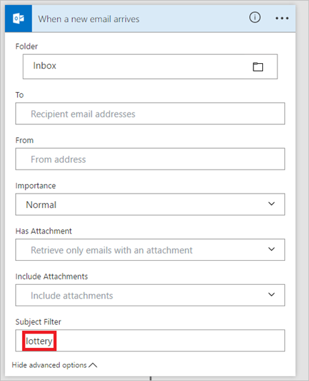
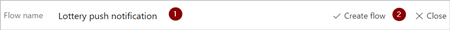
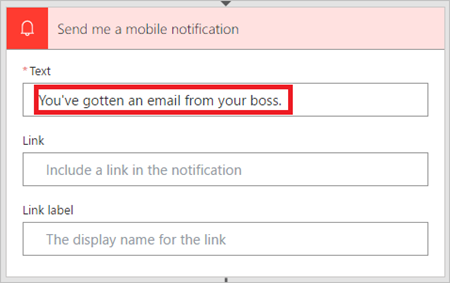
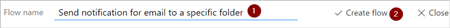

# Attivare un flusso in base alle proprietà del messaggio di posta elettronica
Usare il trigger **All'arrivo di un nuovo messaggio di posta elettronica** per creare un flusso che venga eseguito quando una o più proprietà seguenti del messaggio di posta elettronica corrispondono ai criteri forniti:

| Proprietà | Quando usarla |
| --- | --- |
| Cartella |Attivare un flusso ogni volta che si ricevono messaggi di posta elettronica in una cartella specifica. Questa proprietà può essere utile se ci sono regole che indirizzano i messaggi di posta elettronica a cartelle diverse. |
| A |Attivare un flusso in base all'indirizzo a cui è stato inviato un messaggio di posta elettronica. Questa proprietà può essere utile se si riceve posta elettronica che è stata inviata a diversi indirizzi di posta elettronica nella stessa cartella Posta in arrivo. |
| Da |Attivare un flusso in base all'indirizzo e-mail del mittente. |
| Priorità |Attivare un flusso in base alla priorità con cui sono stati inviati i messaggi di posta elettronica. I messaggi di posta elettronica possono essere inviati con priorità alta, normale o bassa. |
| Con allegato |Attivare un flusso in base alla presenza di allegati nei messaggi di posta elettronica in arrivo. |
| Filtro oggetto |Cercare la presenza di parole specifiche nell'oggetto di un messaggio di posta elettronica. Il flusso esegue quindi le *azioni* in base ai risultati della ricerca. |

> [!IMPORTANT]
> Ogni [piano di Microsoft Flow](https://flow.microsoft.com/pricing/) include una quota di esecuzione. Controllare sempre le proprietà nel trigger del flusso, quando possibile. In questo modo si eviterà di usare inutilmente la quota di esecuzione. Se si seleziona una proprietà in una condizione, ogni esecuzione viene conteggiata nella quota di esecuzione del piano, anche se non viene soddisfatta la condizione di filtro definita. 

Ad esempio, se si seleziona l'indirizzo *da* di un messaggio di posta elettronica in una condizione, ogni esecuzione concorre alla quota di esecuzione del piano, anche se non *proviene* dall'indirizzo del mittente desiderato.
> 
> 

Nella procedure dettagliate seguenti si selezionano tutte le proprietà nel trigger **All'arrivo di un nuovo messaggio di posta elettronica**. Per altre informazioni, visitare le pagine dedicate alle [domande frequenti sulla fatturazione ](billing-questions.md#what-counts-as-a-run) e ai [prezzi](https://ms.flow.microsoft.com/pricing/).

## Prerequisiti
* Un account con accesso a [Microsoft Flow](https://flow.microsoft.com)
* Un account Office 365 Outlook
* L'app per dispositivi mobili Microsoft Flow per [Android](https://aka.ms/flowmobiledocsandroid), [iOS](https://aka.ms/flowmobiledocsios) o [Windows Phone](https://aka.ms/flowmobilewindows)
* Connessioni a Office, Outlook e al servizio di notifica push

## Attivare un flusso in base all'oggetto di un messaggio di posta elettronica
In questa procedura dettagliata, viene creato un flusso che invia una notifica push al telefono cellulare se l'oggetto di qualsiasi nuovo messaggio di posta elettronica contiene la parola "lotteria". Il flusso contrassegna quindi qualsiasi messaggio simile come *letto*.

>[!NOTE]
>Anche se questa procedura dettagliata invia una notifica push, è possibile usare qualsiasi altra azione adatta alle esigenze del flusso di lavoro. Ad esempio, è possibile archiviare il contenuto di posta elettronica in un altro archivio, ad esempio Fogli di Google o un file di Microsoft Excel archiviato in Dropbox.

Ora si può iniziare:

[!INCLUDE [sign-in-use-blank-select-email-trigger-and-inbox-folder](includes/sign-in-use-blank-select-email-trigger-and-inbox-folder.md)]

1. Nella casella **Filtro oggetto** immettere il testo che il flusso usa per filtrare i messaggi in arrivo.
   
     In questo esempio verranno presi in considerazione i messaggi contenenti la parola "lottery" nell'oggetto.
   
    

    [!INCLUDE [add-mobile-notification-action](includes/add-mobile-notification-action.md)]

1. Immettere i dettagli per la notifica per dispositivi mobili che si vuole ricevere quando si riceve un messaggio di posta elettronica corrispondente al **Filtro oggetto** specificato in precedenza.
   
    

    [!INCLUDE [add-mark-as-read-action](includes/add-mark-as-read-action.md)]

1. Assegnare un nome al flusso. Salvare quindi il flusso selezionando **Crea flusso** nella parte superiore della pagina.
   
    

Congratulazioni. Si riceverà ora una notifica push ogni volta che si riceve un messaggio di posta elettronica il cui oggetto contiene la parola "lottery".

## Attivare un flusso in base al mittente di un messaggio di posta elettronica
In questa procedura dettagliata, viene creato un flusso che invia una notifica push al telefono cellulare se si riceve un nuovo messaggio di posta elettronica da un mittente (indirizzo e-mail) specifico. Il flusso contrassegna anche qualsiasi messaggio simile come *letto*.

[!INCLUDE [sign-in-use-blank-select-email-trigger-and-inbox-folder](includes/sign-in-use-blank-select-email-trigger-and-inbox-folder.md)]

1. Nella casella **Da** immettere l'indirizzo di posta elettronica del mittente. 
   
     Il flusso interviene su eventuali messaggi di posta elettronica inviati da questo indirizzo.
   
    

    [!INCLUDE [add-mobile-notification-action](includes/add-mobile-notification-action.md)]

1. Immettere i dettagli per la notifica per dispositivi mobili che si vuole ricevere ogni volta che si riceve un messaggio di posta elettronica inviato dall'indirizzo di posta elettronica specificato in precedenza.
   
    

    [!INCLUDE [add-mark-as-read-action](includes/add-mark-as-read-action.md)]

1. Assegnare un nome al flusso e quindi salvarlo selezionando **Crea flusso** nella parte superiore della pagina.
   
    

## Attivare un flusso quando si ricevono messaggi di posta elettronica in una cartella specifica
Se esistono regole che indirizzano la posta elettronica in cartelle diverse in base a determinate proprietà, ad esempio l'indirizzo, è consigliabile questo tipo di flusso.

Ora si può iniziare:

> [!NOTE]
> Se non è già presente una regola che indirizza i messaggi di posta elettronica a una cartella diversa dalla cartella Posta in arrivo, creare tale regola e verificarne il funzionamento inviando un messaggio di posta elettronica di test.
> 
> 

[!INCLUDE [sign-in-use-blank-select-email-trigger-and-specific-folder](includes/sign-in-use-blank-select-email-trigger-and-specific-folder.md)]

1. Selezionare la cartella a cui vengono indirizzati messaggi di posta elettronica specifica. Per visualizzare tutte le cartelle di posta elettronica, selezionare prima l'icona **Mostra selezione**, che si trova sul lato destro della casella **Cartella** nella scheda **All'arrivo di un nuovo messaggio di posta elettronica**.
   
    

    [!INCLUDE [add-mobile-notification-action](includes/add-mobile-notification-action.md)]

1. Immettere i dettagli per la notifica per dispositivi mobili che si vuole ricevere quando si riceve un messaggio di posta elettronica nella cartella selezionata in precedenza. Se non è già stato fatto, immettere le credenziali per il servizio di notifica.
   
    

    [!INCLUDE [add-mark-as-read-action](includes/add-mark-as-read-action.md)]

1. Assegnare un nome al flusso e quindi salvarlo selezionando **Crea flusso** nella parte superiore della pagina.
   
    

Testare il flusso inviando un messaggio di posta elettronica che verrà indirizzato alla cartella selezionata in precedenza in questa procedura dettagliata.

