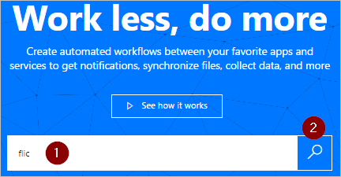

# Eseguire i flussi premendo un pulsante Smart Flic (anteprima)
[!INCLUDE [view-pending-approvals](includes/cc-rebrand.md)]
Attivare i flussi premendo un pulsante fisico, noto come Flic, da Shortcut Labs. Ad esempio, premere un Flic per tenere traccia delle ore lavorative, bloccare il calendario, contare i visitatori a un evento o salvare le località geografiche.

> [!IMPORTANT]
> Configurare tutte le proprietà Flic usando l'app per dispositivi mobili di Flic per [Android](https://play.google.com/store/apps/details?id=io.flic.app) o [iOS](https://itunes.apple.com/us/app/flic-app/id977593793?ls=1&mt=8) prima di creare il flusso.
> 
> 

## Prerequisiti
Per usare flics con Microsoft Flow, è necessario disporre di:

* Accesso a [Microsoft Flow](https://flow.microsoft.com).
* È stata scaricata l'app per dispositivi mobili [Android](https://play.google.com/store/apps/details?id=io.flic.app) o [iOS](https://itunes.apple.com/us/app/flic-app/id977593793?ls=1&mt=8) di Flic, che è stata usata per associare uno o più Flic.

## Configurare le proprietà di Flic
Usare l'app per dispositivi mobili di Flic per programmare gli eventi di Flic. Gli eventi sono:

* clic (una pressione rapida)
* doppio clic (due presse rapide)
* tenere premuto (premere uno lungo)

Questo screenshot mostra un esempio di come potrebbe essere il processo di configurazione di Flic:

Dopo aver collegato un evento Flic a Microsoft Flow, è possibile selezionare Flic come trigger per i flussi. I trigger vengono selezionati più avanti in questa procedura dettagliata.

## Creare un flusso che viene attivato da un Flic
In questa procedura dettagliata viene usato un Flic per eseguire un flusso che registra il tempo impiegato da un consulente in ogni client. Il consulente preme il Flic una volta all'arrivo e quindi lo preme nuovamente, immediatamente prima della partenza dal client. Ogni pressione di Flic avvia un'esecuzione del flusso a cui è connessa. Il flusso Salva l'ora corrente nei fogli Google e invia una notifica tramite posta elettronica. Il messaggio di posta elettronica contiene i dettagli sull'esecuzione del flusso.

Nota: assicurarsi di aver usato l'app Flic per dispositivi mobili per la coppia e configurare almeno un'azione di **clic** per attivare Microsoft Flow. In questa schermata, ho configurato l'azione **Click** per attivare Microsoft Flow. Più avanti in questa procedura dettagliata verrà configurato il flusso per l'attivazione quando il Flic viene premuto una volta (clic).

   

Si inizia a creare il flusso.

### Iniziare con un modello
1. Accedere [Microsoft Flow](https://flow.microsoft.com).
   
    
2. Immettere **Flic** nella casella di ricerca e quindi selezionare l'icona di ricerca.
   
    
3. Selezionare il modello **Tieni traccia delle ore di lavoro con il pulsante Smart Flic** .
   
    

### Creare un foglio di calcolo in fogli Google
1. Esaminare i dettagli del modello. si noti che questo modello richiede un foglio di calcolo in fogli Google.
   
   
2. In fogli Google creare un foglio di calcolo contenente un foglio con le colonne denominate **ClickType** e **timestamp**.
   
      Suggerimento: per assegnare un nome alle colonne in fogli Google, immettere il nome della colonna nella parte superiore della colonna. Quindi, il foglio dovrebbe apparire come lo screenshot seguente:
   
   
   
   Nota: questo foglio verrà usato più avanti in questa procedura dettagliata.

### Aggiungere il trigger Flic al flusso
1. Accedere ai servizi del modello e quindi selezionare **continue (continua**).
   
     **Continua** è abilitato dopo l'accesso a tutti i servizi necessari per il modello.
   
    
2. Immettere **Flic** nella casella di ricerca e quindi selezionare il trigger **Flic-when a Flic is pressed** .
   
    
3. Selezionare il Flic che si vuole usare dall'elenco dei **pulsanti Flic** nella scheda **Flic-when a Flic is pressed** .
4. Selezionare **fare clic** nell'elenco **eventi** per indicare che si vuole attivare il flusso quando il Flic viene premuto una volta.
   
    
   
   Facoltativamente, è possibile selezionare **any** per indicare che ogni evento Flic (clic, doppio clic o in attesa) attiva il flusso.
   
   **Doppio clic** indica che il flusso viene attivato quando il Flic viene premuto rapidamente due volte. **Tenere premuto** indica che una pressione propagata sul Flic attiva il flusso.
   
   È possibile creare altri flussi e attivarli usando gli altri eventi nell'elenco **degli eventi** . Ad esempio, è possibile utilizzare l'evento **doppio clic** per registrare l'ora in cui si lascia un client.

### Configurare il foglio
   Nella scheda **Inserisci riga** :

1. Selezionare il foglio di calcolo creato in precedenza dall'elenco **file** .
2. Selezionare il foglio dall'elenco dei **fogli** di dati.
   
   Nota: dopo aver selezionato il foglio, nella scheda **Inserisci riga** vengono visualizzate due caselle aggiuntive. Queste caselle rappresentano le due colonne nel foglio creato in precedenza.
3. Selezionare la casella **ClickType** , quindi selezionare il token di **tipo fare clic su** .
4. Selezionare la casella **timestamp** , quindi selezionare il token **Click time** .
   
    

### Verificare che le impostazioni di posta elettronica siano corrette
1. Verificare che la scheda **Invia una notifica di posta elettronica abbia un** aspetto simile a questa schermata.
   
    

### Salvare il flusso e testarlo
1. Assegnare un nome al flusso e quindi salvarlo.
   
    

Se è stata eseguita la continuazione, premendo il pulsante Flic una volta attiva il flusso. Il flusso registra quindi il tipo di clic e l'ora corrente nel foglio, quindi Invia un messaggio di posta elettronica all'utente.

1. Premere il Flic una sola volta.
2. Aprire il foglio di lavoro in fogli Google. Verranno visualizzate le colonne **ClickType** e **timestamp** popolate rispettivamente con "click" e con l'ora.
   
    
3. È anche possibile visualizzare i risultati dell'esecuzione dal sito Web Microsoft Flow o dall'app Microsoft Flow per dispositivi mobili. Ecco una schermata dell'esecuzione dei test.
   
    
4. Ecco il corpo del messaggio di posta elettronica di notifica ricevuto dall'esecuzione del flusso.
   
    

Per un credito aggiuntivo, provare a estendere il flusso per registrare automaticamente il percorso (Latitudine e longitudine) quando si preme il Flic.

## Ulteriori informazioni
* [Condividere i flussi](share-buttons.md)di un pulsante.
* Informazioni su come usare i [token per attivare i pulsanti](introduction-to-button-trigger-tokens.md) per inviare dati correnti quando vengono eseguiti i flussi dei pulsanti.
* Installare l'app per dispositivi mobili Microsoft Flow per [Android](https://aka.ms/flowmobiledocsandroid), [iOS](https://aka.ms/flowmobiledocsios)o [Windows Phone](https://aka.ms/flowmobilewindows).

