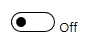
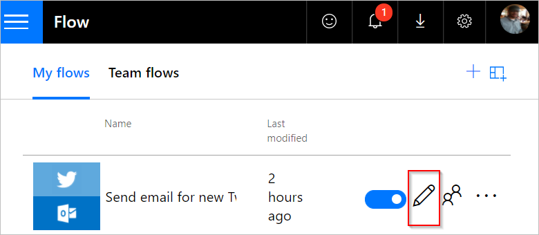

# Creare un flusso in Microsoft Flow

> [!VIDEO https://www.youtube.com/embed/Gt3CMhLAQqE?list=PL8nfc9haGeb55I9wL9QnWyHp3ctU2_ThF]

Creare un flusso che esegue automaticamente una o più attività dopo che viene attivato da un evento. Ad esempio, creare un flusso di notifica via posta elettronica quando un utente invia un tweet che contiene una parola chiave specificata. In questo esempio, l'invio di un tweet è l'evento e l'invio di posta elettronica è l'azione.

## Prerequisiti

* Un account in [flow.microsoft.com](https://flow.microsoft.com)
* Un account Twitter
* Credenziali di Office 365

## Specificare un evento per avviare il flusso

Prima di tutto, è necessario selezionare quale evento, o *trigger*, avvia il flusso.

1. In [flow.microsoft.com](https://flow.microsoft.com) selezionare **Flussi personali** nella barra di spostamento in alto e quindi scegliere **Crea da zero**.

    
1. Selezionare la casella **Cerca tra centinaia di connettori e trigger** nella parte inferiore della schermata, immettere **Twitter** nella casella **Cerca tutti i connettori e i trigger** e quindi selezionare **Twitter - Quando viene pubblicato un nuovo tweet**.

    

1. Se il proprio account Twitter non è stato ancora connesso a Microsoft Flow, selezionare **Eseguire l'accesso per creare una connessione a Twitter.**, quindi fornire le credenziali.

1. Nella casella **Cerca testo** digitare la parola chiave da cercare.

    

## Specificare un'azione

1. Selezionare **Nuovo passaggio**, quindi scegliere **Aggiungi un'azione**.

    

1. Nella finestra **Cerca tutti i connettori e le azioni** digitare o incollare **invia e-mail**, quindi selezionare **Office 365 Outlook - Invia un messaggio di posta elettronica**.

    

1. Se richiesto, selezionare il pulsante di accesso e quindi fornire le credenziali.

1. Nel modulo visualizzato, digitare o incollare l'indirizzo di posta elettronica nella casella **A**, quindi selezionare il nome dall'elenco dei contatti visualizzato.

    
1. Nella casella **Oggetto** digitare o incollare **Nuovo tweet da:**, quindi digitare uno spazio.

    
1. Nell'elenco dei token selezionare **Twittato da** per aggiungere un segnaposto a questo token.

    
1. Selezionare la casella **Corpo** e quindi selezionare il token **Testo tweet** per aggiungere un segnaposto a questo token.
1. (Facoltativo) Aggiungere altri token e/o altri contenuti al corpo del messaggio e-mail.
1. Nella parte superiore della schermata, assegnare un nome al flusso e selezionare **Crea flusso**.

    
1. Selezionare **Fine** per aggiornare l'elenco dei flussi.

     
1. Inviare un tweet con la parola chiave indicata o attendere che qualcun altro lo pubblichi.

     Entro un minuto dalla pubblicazione del tweet, un messaggio di posta elettronica notificherà il nuovo tweet.

## Gestire un flusso

1. In [flow.microsoft.com](https://flow.microsoft.com), selezionare **Flussi personali** nella barra di spostamento in alto.
1. Nell'elenco dei flussi, effettuare una delle operazioni seguenti:

   * Per sospendere un flusso, impostarlo su **Off**.

       
   * Per riprendere un flusso, impostarlo su **On**.

       
   * Per modificare un flusso, selezionare l'icona della matita corrispondente al flusso che si vuole modificare.

       
   * Per eliminare un flusso, selezionare l'icona **...**, selezionare **Elimina**, quindi selezionare **Elimina** nella finestra del messaggio visualizzata.

       
   * Per visualizzare la cronologia di esecuzione di un flusso, selezionare il flusso dalla pagina **Flussi personali** e quindi visualizzare la cronologia nella sezione **Cronologia di esecuzione** della pagina che viene aperta.

       

     Selezionare un'esecuzione del flusso dall'elenco delle esecuzioni per visualizzare gli input e output di ogni passaggio.

> [!NOTE]
> È possibile avere fino a 50 flussi nel proprio account. Se si hanno già 50 flussi, eliminarne uno prima di poterne creare un altro.
>
>

## Passaggi successivi

* [Aggiungere dei passaggi](multi-step-logic-flow.md), ad esempio diversi modi per ricevere una notifica, al flusso.
* [Eseguire attività in una pianificazione](run-scheduled-tasks.md), quando si vuole che un'azione sia eseguita ogni giorno, in una determinata data o dopo un certo numero di minuti.
* [Aggiungere un flusso a un'app](https://powerapps.microsoft.com/tutorials/using-logic-flows/) per consentire all'app di avviare la logica nel cloud.
* [Introduzione ai flussi del team](create-team-flows.md) e invio di inviti ad altri utenti per collaborare alla progettazione dei flussi.
