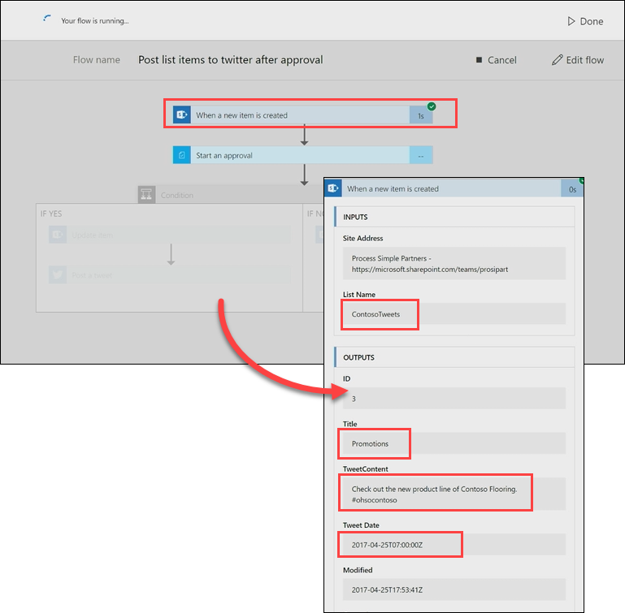

# Elaborare una richiesta di approvazione
In un argomento precedente, è stato illustrato come creare un processo di approvazione intorno ai tweet archiviati in un elenco SharePoint.  In questo argomento successivo, si vedrà cosa succede quando un responsabile approvazione riceve una nuova richiesta di approvazione. 

## Creare ed elaborare una richiesta
Prima di tutto è necessario aggiungere un elemento all'elenco di SharePoint, quindi è possibile elaborare una richiesta di approvazione per quell'elemento.

1. Aprire l'elenco di SharePoint **TweetDiContoso**, che è stato configurato in un argomento precedente.  Selezionare **Nuovo** per creare un nuovo tweet. 
   
    
2. Aggiungere i seguenti valori ai campi e selezionare **Salva**.
   
   * **Titolo** – Promozioni
   * **ContenutoTweet**: Date un'occhiata alla nuova linea di Contoso Flooring #ohsocontoso
   * **DataTweet**: la data di oggi
     
     
3. In **Microsoft Flow**, selezionare **Flussi personali**. 
4. Selezionare il flusso **Pubblica gli elementi elenco in Twitter dopo l'approvazione** che è stato configurato nell'argomento precedente, quindi selezionare il flusso in esecuzione nella sezione **CRONOLOGIA DI ESECUZIONE**.
   
    
5. Selezionare il trigger **Quando viene creato un nuovo elemento**. Verificare che le informazioni per l'elemento di elenco appena creato siano visualizzate.
   
    
6. In **Outlook**, aprire il messaggio di approvazione automatica nella posta in arrivo e quindi selezionare **Approva**. 
   
    
7. Nel **Centro approvazioni**, visualizzare i dettagli della richiesta, aggiungere un commento e selezionare **Conferma**. 
   
    
8. In **SharePoint**, aggiornare l'elenco **TweetDiContoso** e verificare che **StatoApprovazione** sia **Sì**e che il commento immesso sia visualizzato. 
   
    

In questo argomento si è analizzata l'esperienza dal punto di vista del responsabile approvazione, dalla ricezione di un messaggio di richiesta di approvazione all'elaborazione della richiesta nel Centro approvazioni.

