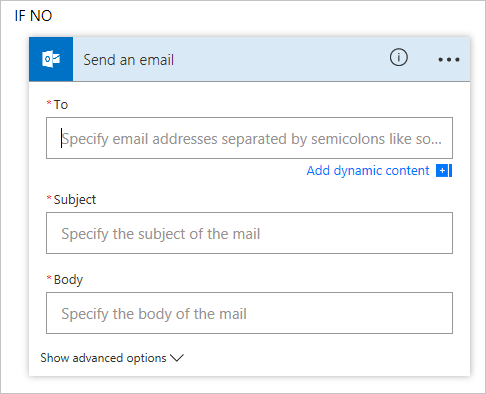

# Richieste di approvazione
Oltre alla possibilità di **ricevere notifiche**, **copiare i file** e **raccogliere i dati**, Microsoft Flow offre anche la possibilità di **ottimizzare i processi di approvazione**.

## Scenario relativo alle ferie
Immaginare di essere il **responsabile** di un team e di chiedere ai propri dipendenti di creare **richieste di ferie** in un **elenco SharePoint**. A questo punto si desidera realizzare un **processo di approvazione** attorno a questi elementi in elenco in modo che le nuove richieste di ferie vengano **elaborate rapidamente** e il richiedente riceva **una notifica automatica**.  

## SharePoint e Microsoft Flow
Microsoft Flow è **integrato** in **SharePoint**.  Dall'**elenco di SharePoint** fare clic sul menu a discesa **Flusso** e selezionare **Create a flow** (Creare un flusso).

   

Nel **menu a destra** cercare un **modello** come questo.

## Uso del modello
Il trigger **SharePoint** nel modello viene **pre-popolato** con le informazioni dell'elenco.  È sufficiente aggiungere un **indirizzo e-mail** per il **responsabile approvazione**.  Si noti che  **l'elemento di SharePoint originale non viene modificato**.  Per farlo è necessario aggiungere l'azione **SharePoint - Aggiorna elemento**.

Per impostazione predefinita, il ramo **Se no** di *Inviare emailScope*  non esegue alcuna operazione.  Si potrebbe voler aggiungere un'azione per inviare un messaggio all'autore della richiesta per informarlo che la sua richiesta è stata respinta. 

## Lezione successiva
Ora è tempo di ripassare quanto appreso in questa sezione.

