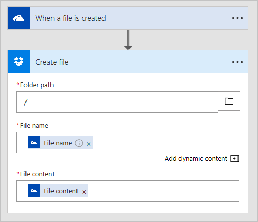

# Copiare i file
Oggi è molto comune usare un **servizio di archiviazione file**, ad esempio **OneDrive** o **Google Drive**.  C'è mai stato bisogno di **copiare i file da un servizio di archiviazione a un altro**?  Microsoft Flow rende più facile spostare e copiare automaticamente i file tra due servizi.

## Creazione di flussi che copiano i file
È possibile **usare un modello**, come nel video precedente, oppure è possibile creare un flusso **da zero**.  Servizi differenti presentano dettagli e parametri differenti nelle loro **azioni**.  In questo video viene mostrata l'operazione di copia di un file da **OneDrive** a **OneDrive for Business**.  Ecco un altro esempio creato da zero per eseguire l'operazione di copia da **OneDrive a DropBox**.

.

## Passaggi successivi
Successivamente, si scoprirà com'è possibile **raccogliere i dati** dai servizi.

