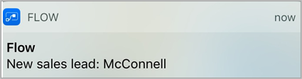
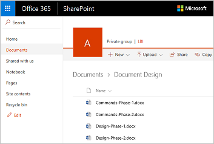

# Formazione interattiva su Microsoft Flow
Benvenuto nella Formazione interattiva su Microsoft Flow. Questo **corso online** illustra Microsoft Flow andando per ordine, per consentire di acquisire le conoscenze in modo graduale. Il corso è pensato per fornire **indicazioni con argomenti organizzati in modo chiaro**, con molti **oggetti visivi ed esempi**, seguendo un'evoluzione logica, utile per apprendere principi e dettagli.

In questo corso, si apprenderà di Microsoft Flow e dei relativi concetti, si scoprirà come **creare flussi**, **gestirli** e **amministrarli** nel proprio ambiente. Verranno fornite informazioni e scenari per una società fittizia denominata Contoso Flooring, ma si apprenderà come usare gli stessi scenari nella propria azienda o in quelle dei clienti.

Con questo corso, i principianti di Microsoft Flow inizieranno a usarlo, mentre gli esperti si faranno un quadro completo e andranno a colmare le lacune. Questo corso è ancora in fase di elaborazione, perciò gli utenti sono **invitati a fornire un feedback sul nostro operato** e su altri argomenti che vorrebbero fossero trattati in questo corso.

## Che cos'è Microsoft Flow?
Microsoft Flow è un **servizio di flusso di lavoro** online che consente di lavorare in modo più semplice ed efficiente **automatizzando i flussi di lavoro** tra i servizi e le app più comuni. Ad esempio, è possibile creare un flusso che aggiunga un cliente potenziale a **Dynamics 365** e un record in **MailChimp** ogni volta che un utente con più di 100 follower invia un nuovo tweet sulla propria azienda.

Quando ci si iscrive, è possibile **connettersi a più di 100 servizi** e **gestire dati nel cloud o in origini locali**, ad esempio SharePoint e SQL Server. L'elenco di applicazioni e servizi utilizzabili con Microsoft Flow è in costante espansione.

## Operazioni eseguibili con Microsoft Flow
Microsoft Flow permette di **automatizzare i flussi di lavoro** tra le **app e i servizi** preferiti, sincronizzare file, ricevere notifiche, raccogliere dati e altro ancora. 

Ad esempio, è possibile **automatizzare** queste attività:

* Rispondere istantaneamente a notifiche o messaggi e-mail ad alta priorità.
* Acquisire, monitorare e seguire i nuovi clienti potenziali.
* Copiare i file da un servizio a un altro.
* Raccogliere i dati relativi all'azienda e condividere informazioni con il team.
* Automatizzare i flussi di lavoro di approvazione.

Microsoft Flow viene usato comunemente per **ricevere notifiche**. Ad esempio, è possibile ricevere immediatamente un messaggio di posta elettronica o una notifica push sul telefono ogni volta che un cliente potenziale viene aggiunto a Dynamics 365 o Salesforce.

È anche possibile **usare Microsoft Flow per copiare file**. Ad esempio, ci si può accertare che qualsiasi file aggiunto a Dropbox venga **automaticamente copiato** in SharePoint, dove il team potrà trovarlo.

 

 

È possibile **monitorare le opinioni della gente** sull'azienda tramite creando un flusso che viene eseguito ogni volta che **qualcuno invia un tweet** con un determinato hashtag. Il flusso potrebbe inserire informazioni dettagliate su tale tweet in un database di SQL Server, un elenco di SharePoint o anche un file di Excel ospitato in OneDrive, a seconda del servizio più adeguato alle proprie esigenze. Con i dati raccolti, è possibile creare azioni per connetterli a Power BI, individuare tendenze e porre domande sui dati.

E, infine, **è possibile automatizzare i cicli di approvazione**, ad esempio, per le richieste di ferie in un elenco di SharePoint.

Per altre idee, **esaminare l'elenco dei modelli**, che consentono di creare flussi in pochi passaggi. Ad esempio, è possibile creare facilmente flussi per **inviare a se stessi previsioni meteorologiche**, promemoria a intervalli regolari o notifiche telefoniche ogni volta che il manager invia posta.

Se serve un flusso che non è tra quelli visualizzati nell'elenco, è possibile crearne uno personalizzato da zero e, se si vuole, condividerlo con la community.

## Dove è possibile creare e amministrare un flusso?
È possibile creare un flusso ed eseguire attività amministrative **in un browser** o **sul telefono**, scaricando l'app per dispositivi mobili per Microsoft Flow.

  

È possibile eseguire queste attività, tra le altre:

* Attivare o disattivare i flussi ovunque ci si trovi.
* Vedere quando un flusso non è riuscito.
* Controllare i rapporti dettagliati sulla cronologia di esecuzione.
* Visualizzare e filtrare le esecuzioni in base al tipo di notifica.

## Una breve panoramica su Microsoft Flow
Verrà ora illustrato brevemente lo strumento. Sono disponibili tantissime informazioni su come usare Microsoft Flow.

Nella home page, sono disponibili i seguenti menu:

* **Flussi personali**, dove risiedono i flussi.
* **Modelli**, un ottimo punto di partenza.
* **Approvazioni**, dove è possibile automatizzare e semplificare il processo di approvazione.
* **Connettori** (in precedenza **Servizi**), dove è possibile connettersi da un servizio a un altro.
* **Informazioni**, dove è possibile acquisire informazioni che consentiranno di imparare rapidamente a usare Microsoft Flow.

Per il momento, concentriamoci sul menu **Informazioni**, che contiene:

* **Apprendimento guidato**, che illustra come usare Microsoft Flow, dalle tecniche iniziali agli scenari più avanzati.
* **Documentazione**, dove si trovano gli argomenti avanzati. Se si vuole effettivamente comprendere una funzionalità o una funzione, qui è possibile eseguirne un'analisi approfondita per capire come procedere.
* **Supporto** è la pagina ideale in cui trovare assistenza.
* **Community** è la pagina in cui scoprire in che modo gli altri usano Microsoft Flow.
* **Commenti e suggerimenti** attinge a una community di utenti avanzati e permette di **inviare commenti e domande** a sviluppatori e altri utenti.
* **Blog** mantiene aggiornati sugli sviluppi e sulle versioni più recenti all'interno dell'ecosistema di Microsoft Flow.
* **Prezzi** consente di scegliere il piano giusto per se stessi o l'azienda.

Nella pagina **Modelli** si può dare un'occhiata ad alcuni dei modelli più diffusi, che dovrebbero suggerire ottime idee per flussi da provare.

## Lezione successiva
Ora che si sa cos'è Microsoft Flow e a cosa serve, diamo un'occhiata ai flussi.

