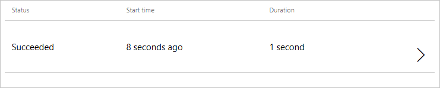

# Gestire i flussi con il portale Web
Il portale Web di **Microsoft Flow** si trova all'indirizzo **flow.microsoft.com** e offre tutto ciò che serve per amministrare i flussi in un **Web browser**.  Il portale funziona sia con i browser **desktop** che con quelli **per dispositivi mobili**, anche se per avere la migliore **esperienza mobile** si consiglia di usare l'**app per dispositivi mobili**.

## Introduzione al portale Web
Se si visita **flow.microsoft.com** e si esegue l'accesso al portale, è possibile visualizzare l'elenco dei flussi facendo clic su **Flussi personali** nella parte superiore della pagina.

## Gestione dei flussi
A destra del nome del flusso e dell'ora dell'ultima modifica, verranno visualizzati alcuni **interruttori Attiva/Disattiva** e alcune **icone**.

L'**interruttore Attiva/Disattiva** consente di disabilitare o abilitare un flusso senza eliminarlo.

Fare clic sull'**icona matita** per accedere alla finestra di progettazione del flusso in cui apportare le modifiche al flusso.

Con l'**icona cestino** si elimina il flusso.  Dopo averlo eliminato, il flusso non può più essere recuperato.

Infine, l'**icona informazioni** consente di visualizzare la **cronologia delle esecuzioni** del flusso.  Nella **cronologia delle esecuzioni** sarà presente un log con **tutte le esecuzioni del flusso**, comprese quelle **con esito positivo**. 

Selezionando una voce della cronologia si accede a un **log dettagliato** dove è possibile visualizzare quali passaggi nel flusso hanno avuto **esito positivo o negativo**.  Se si seleziona un passaggio in questo log vengono visualizzate le **informazioni di debug** che possono essere utili per la **risoluzione dei problemi** relativi a un flusso che non si comporta come previsto.

## Lezione successiva
Dopo aver acquisito familiarità con il **portale Web di Microsoft Flow** è possibile scoprire in che modo gestire i flussi con l'**app per dispositivi mobili**.

