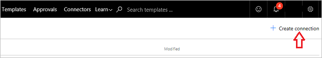
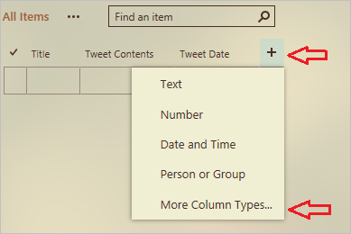
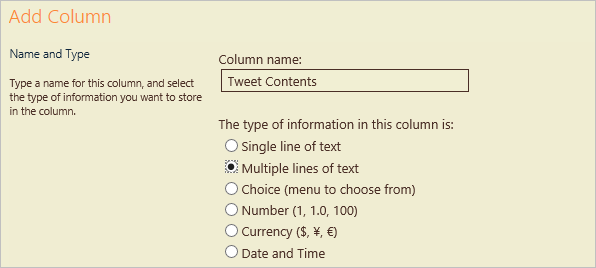
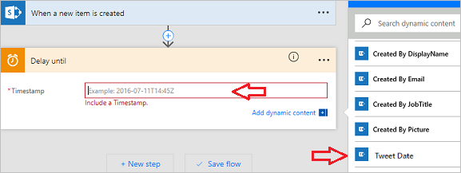
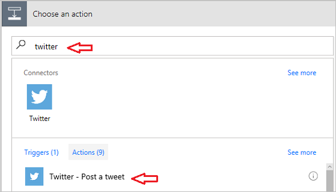
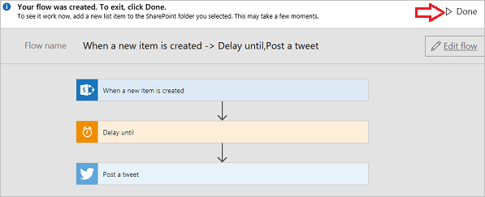

# Pubblicare tweet da un flusso
Per questo flusso, sarà necessario creare un elenco di **SharePoint** in cui il team di marketing di **Contoso Flooring** archivia i **post di Twitter** e le date di pubblicazione. Da qui, si creerà un flusso che invierà automaticamente tweet basati sul contenuto di tali post. 

## Connettere i servizi di Microsoft Flow
In questo argomento, si useranno i servizi **SharePoint** e **Twitter**. Se si usa un servizio con cui non si ha familiarità, è prima di tutto necessario connettersi al nuovo servizio. 

1. In Microsoft Flow, selezionare l'**icona dell'ingranaggio**, quindi **Connessioni**.
   
     
2. Selezionare **+ Crea connessione**.
   
     
3. Scorrere verso il basso nell'elenco, trovare Twitter e selezionare **+**.
   
    
4. Per autorizzare un account di Twitter, immettere il nome utente o l'indirizzo di posta elettronica e la password, quindi selezionare **Autorizza app**.
   
    
5. Per verificare le connessioni, selezionare l'**icona dell'ingranaggio** e **Connessioni**.
   
    
   
    La nuova connessione a Twitter dovrebbe essere visibile assieme alle altre connessioni create 
   
    

## Creare un elenco di SharePoint
La prima cosa da fare è creare un nuovo elenco di SharePoint Online per Contoso Flooring. 

1. In SharePoint Online, selezionare **Nuovo** e quindi **Elenco**.
   
    
2. Denominare l'elenco **Tweet di Contoso**. 
3. Deselezionare la casella di controllo **Visualizza nella struttura del sito** e selezionare **Crea**.
   
    
   
    Quando si seleziona **Crea**, SharePoint passa al nuovo elenco.
4. Per impostazione predefinita, l'elenco contiene una singola colonna, **Titolo**. Aggiungere un'altra colonna e denominarla **Contenuto Tweet**. Ciò che si scriverà nei tweet verrà archiviato in questa colonna. 
   
   1. Selezionare il segno più, quindi selezionare **Altro...**
      
       
   2. Selezionare **Più righe di testo**, quindi selezionare **OK**.
      
       
5. Aggiungere una colonna per la data e l'ora del tweet e denominarla **Data Tweet**.
   
   1. Come per **Contenuto Tweet**, selezionare il segno più, quindi selezionare **Altro...**
      
       
   2. Scorrere verso il basso **Formato data e ora**. Selezionare **Data e ora**, in modo da includerle entrambe.
      
       
   3. Selezionare **OK**. Nel sito di SharePoint verrà visualizzato l'elenco **Tweet di Contoso** a cui si potranno aggiungere nuovi elementi.

## Compilare il flusso
Una volta creato l'elenco, sarà possibile creare il flusso.

### Scegliere un trigger
1. In Microsoft Flow, passare a **Flussi personali**, quindi selezionare **Crea da zero**.
   
    
2. Selezionare **Quando viene creato un elemento**.
   
    
   
    Si vuole che il trigger venga attivato quando viene aggiunta una nuova riga con il contenuto di un tweet.
3. Selezionare il sito di SharePoint, quindi selezionare l'elenco che è impostato in precedenza, **Tweet di Contoso**.
   
    

Per il trigger è tutto.

### Aggiungere un'azione per ritardare la pubblicazione
1. Selezionare **+ Nuovo passaggio**, quindi scegliere **Aggiungi un'azione**. 
   
    
2. Nel servizio **Pianificazione** selezionare **Ritarda fino a**. 
   
      
3. Impostare il valore di ritardo.
   
   1. Fare clic o toccare il campo **Timestamp**. 
   2. Quando si apre la casella del contenuto dinamico, scorrere fino alla fine per visualizzare le tre colonne dell'elenco di SharePoint: **Titolo**, **Data Tweet** e **Contenuto Tweet**.
   3. Selezionare **Data Tweet**. 
      
       
      
       A questo punto, quando un utente aggiunge un elemento all'elenco di SharePoint, qualsiasi azione verrà ritardata fino alla data e all'ora impostate nella colonna **Data Tweet**.
      
       

### Aggiungere un'azione per pubblicare un Tweet
A questo punto si aggiungerà un'altra azione che il flusso eseguirà in corrispondenza della data e dell'ora specificate nella colonna **Data Tweet**.

1. Selezionare **+ Nuovo passaggio**, **Aggiungi un'azione** e infine cercare **Twitter**.
   
     
2. Scegliere l'azione, **Twitter - Pubblica un tweet**.
   
     
3. Fare clic o toccare il campo **Testo Tweet** e, nella casella del contenuto dinamico, selezionare **Contenuto Tweet**. Ecco la sequenza creata. 
   
    
4. Selezionare **Crea flusso...**.
   
     
5. Selezionare **Fine**.
   
    
   
    A questo punto il flusso è stato completato.
   
    
   
    Quando viene creato un nuovo elemento nell'elenco di SharePoint, la pubblicazione del tweet verrà ritardata fino alla data preimpostata. Quando giunge tale data, il flusso pubblicherà su Twitter il testo incluso nella colonna **Contenuto Tweet** nell'elenco.

## Lezione successiva
Nella lezione successiva si apprenderà come **eseguire i flussi in una pianificazione** usando un trigger chiamato **Ricorrenza**.

