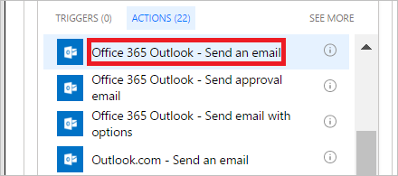

1. Selezionare **Aggiungi un'azione** nella diramazione della condizione **SE SÌ**.
   
    
2. Immettere **invia messaggio di posta elettronica** nella casella di ricerca della scheda **Scegliere un'azione**.
   
    
3. Selezionare l'azione **Office 365 Outlook - Invia un messaggio di posta elettronica**.
   
    
4. Configurare la scheda del messaggio di posta elettronica in base alle proprie esigenze.
   
     >[!NOTE]
     > I campi **A**, **Oggetto** e **Corpo** sono obbligatori.
     >
     >
   
     Questa scheda è un modello per il messaggio di posta elettronica che viene inviato quando lo stato delle richieste di ferie cambia.
   
     Nota: nella casella **Corpo** della scheda **Invia un messaggio di posta elettronica** usare il token **Commenti** dall'azione **Approvazioni - Avviare un'approvazione**.

