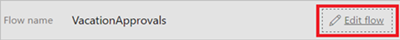
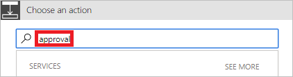
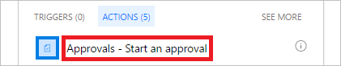

1. Selezionare **Modifica flusso**.
   
    
2. Selezionare **Nuovo passaggio**, quindi scegliere **Aggiungi un'azione**.
   
    
3. Immettere **approvazione** nella casella di ricerca **Scegliere un'azione**.
   
    
4. Selezionare l'azione **Approvals - Start an approval** (Approvazioni - Avviare un'approvazione).
   
    
5. Configurare la scheda **Avviare un'approvazione** in base alle proprie esigenze.
   
     Nota: i campi **Titolo** e **Assegnato a** sono obbligatori.
   
    

