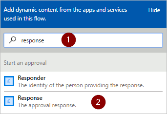
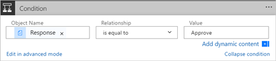

1. Selezionare **Nuovo passaggio** e **Aggiungi una condizione**.
   
    
2. Selezionare la casella **Nome oggetto** e digitare **risposta** nella casella di ricerca della scheda **Aggiunge il contenuto dinamico dalle app e dai servizi usati in questo flusso**.
3. Selezionare il token **Risposta**.
   
    
4. Selezionare la casella **Valore** e digitare **Approva** nella casella.
   
   > [!NOTE]
   > Le risposte valide all'azione **Approvals - Start an approval** sono "Approva" e "Rifiuta". Queste risposte fanno distinzione tra maiuscole e minuscole.
   > 
   > 
5. Ora la scheda **Condizione** dovrebbe essere simile all'immagine seguente:
   
    

