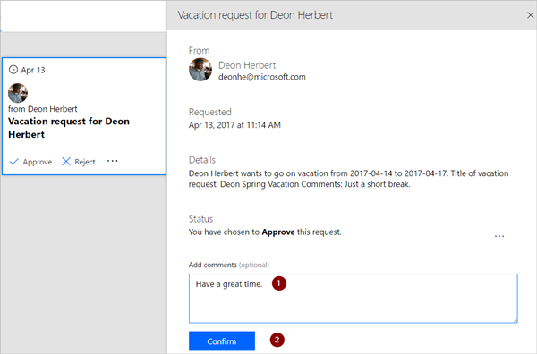
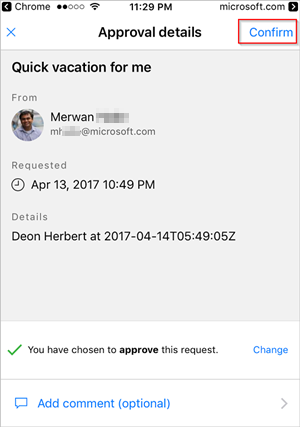
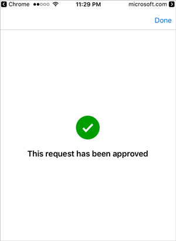

Se un utente svolge il ruolo di approvatore in un flusso di lavoro, riceverà un messaggio di posta elettronica ogni volta che un utente crea una richiesta. La richiesta di approvazione viene inviata anche al Centro approvazioni. È possibile quindi approvare o rifiutare le richieste ricevute tramite posta elettronica, il Centro approvazioni o l'app Microsoft Flow.

Per approvare una richiesta:

### Dal messaggio di posta elettronica
1. Selezionare **Approva** dal messaggio di posta elettronica ricevuto quando un elemento viene aggiunto all'elenco di SharePoint Online.
   
     Nota: se si usa un dispositivo mobile in cui è stata installata l'app di Microsoft Flow, quest'ultima si avvia. In caso contrario, il centro approvazioni si apre nel browser.
   
    
2. Immettere un commento e selezionare il pulsante **Conferma**.
   
    

### Dal Centro approvazioni
1. Eseguire l'accesso a [Microsoft Flow](https://flow.microsoft.com).
   
    
2. Selezionare la scheda **Approvazioni**.
   
    
3. Selezionare **Approva** nella richiesta che si desidera approvare.
   
    
4. Aggiungere una nota, quindi selezionare il pulsante **Conferma**.
   
    

### Dall'app di Microsoft Flow
1. Sul telefono cellulare con installata l'app di Microsoft Flow, selezionare **Approva** dal messaggio di posta elettronica per l'approvazione della richiesta.
2. Selezionare **Conferma** nell'angolo superiore destro della schermata.
   
    
3. Si apre la pagina di operazione riuscita, che conferma l'avvenuta registrazione dell'approvazione.
   
    

Nota: le schermate in Android, iOS e Windows Phone possono differire leggermente. Tuttavia, la funzionalità è la stessa in tutti i dispositivi.

