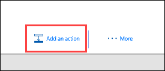

In un argomento precedente, è stato illustrato come potenziare i feed di Twitter in un modo semplice con un elenco di SharePoint. In questo argomento si apprenderà come creare uno scenario più efficiente usando le approvazioni. In questo modo, chiunque abbia accesso all'elenco di SharePoint può contribuire con i tweet e il team di social networking potrà approvare o rifiutare tali tweet. Il team mantiene il controllo dell'account e del contenuto che viene pubblicato per i clienti. 

## Creare un flusso di richiesta di approvazione
1. Nella home page di **Microsoft Flow**, selezionare **Approvazioni**, selezionare **Crea flusso di lavoro** e quindi scorrere verso il basso e selezionare il modello **Pubblica gli elementi elenco in Twitter dopo l'approvazione**. 
   
    
2. Verificare le credenziali dell'account per **SharePoint**, **Approvazioni** e **Twitter**, quindi selezionare **Continua**. 
   
    

Per impostazione predefinita, questo modello avvia un processo di approvazione quando viene creato un nuovo elemento in un elenco specifico e, se questo viene approvato, pubblica un tweet su Twitter. In questo argomento si modificherà questo processo aggiungendo i passaggi per aggiornare l'elenco di SharePoint con la risposta di approvazione, indicare se è stata approvata o no e aggiungere eventuali commenti del responsabile approvazione al tweet proposto. 

1. Nell'elenco **Tweet di Contoso** creato in precedenza, aggiungere due nuove colonne:
   
   1. Selezionare il segno più "**+**", quindi selezionare **Sì/No**
   2. Immettere **StatoApprovazione** e selezionare **Crea**
   3. Selezionare il segno più "**+**", quindi selezionare **Singola riga di testo**
   4. Immettere **CommentiResponsabile** e selezionare **Salva**
      
      
2. Tornando a **Microsoft Flow**, nell'azione **Quando viene creato un nuovo elemento**, immettere i valori seguenti:
   
   * **Indirizzo sito**: l'URL del team di SharePoint
   * **Nome elenco**: ContosoTweets
     
     
3. Nell'azione **Avviare un'approvazione**, selezionare **Modifica** per visualizzare tutti i campi. 
   
    
4. In **Titolo**, immettere **Nuovo tweet per** e selezionare **Titolo** dall'elenco del contenuto dinamico. 
   
    
5. In **Assegnato a**, immettere e selezionare il proprio nome o un nome utente di test. 
   
    
6. In **Dettagli**, rimuovere gli elementi predefiniti e aggiungere **ContenutoTweet**, **DataTweet** e **Creato da NomeVisualizzato** dall'elenco del contenuto dinamico, connesso delle parole **il** e **da**. 
   
    
7. In **Collegamento all'elemento** copiare e incollare l'URL dell'elenco di SharePoint e immettere **Elenco tweet di Contoso** in **Descrizione collegamento all'elemento**. 
   
    
8. Nell'azione **Condizione** passare con il mouse sopra la casella **SE SÌ**, selezionare il segno più "**+**" e infine selezionare **Aggiungi un'azione**. 
   
    
9. Cercare **Aggiorna elemento**, selezionare il connettore **SharePoint**, quindi selezionare l'azione **SharePoint - Aggiorna elemento**.
   
    
10. In **Indirizzo sito** e **Nome elenco** immettere di nuovo l'URL del sito e l'elenco **TweetDiContoso**, quindi immettere **ID** in **ID** dall'elenco del contenuto dinamico. 
    
     
11. Selezionare il campo **Titolo** e, nell'elenco del contenuto dinamico, cercare **Titolo**. Aggiungere l'elemento **Titolo** dall'azione **Quando viene creato un nuovo elemento**. 
    
     
12. Selezionare **StatoApprovazione** e impostare il valore su **Sì**, quindi selezionare **CommentiResponsabile** e impostare il valore su **Commenti** dall'elenco del contenuto dinamico. 
    
     
13. Nella parte inferiore della casella **SE NO, NON FARE NULLA**, selezionare **Aggiungi un'azione**.
    
     
14. Usando la stessa procedura impiegata per la configurazione di **SE SÌ**, creare un'azione **SharePoint - Aggiorna elemento** e configurare i campi con gli stessi valori, ad eccezione dell'impostazione **StatoApprovazione** su **No**. 
    
     
15. Selezionare l'azione **Pubblica un tweet**, selezionare **Modifica** e impostare **Testo tweet** su **ContenutoTweet** dall'elenco del contenuto dinamico.  Nella parte superiore della pagina, selezionare **Crea flusso** per salvare il lavoro. 
    
     

Questo è solo uno dei modi in cui Microsoft Flow può incrementare la produttività del team. Il team può contribuire con idee, notizie pertinenti o materiale sussidiario sul prodotto ed è comunque possibile mantenere il controllo sul contenuto che viene pubblicato su Twitter per i clienti.

Nell'argomento successivo, si vedrà cosa succede quando un responsabile approvazione riceve una nuova richiesta per un tweet proposto. 

