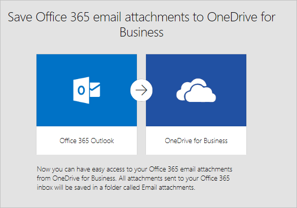
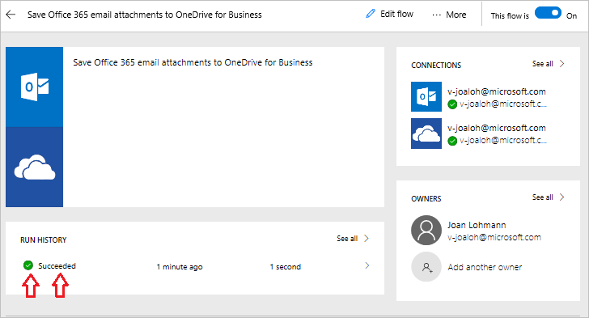

Bentornato nella Formazione interattiva su Microsoft Flow. In questa lezione, si scopriranno altre informazioni sull'ambiente di Microsoft Flow e si potrà **compilare il primo flusso**.

Iniziare a usare Microsoft Flow è facile, perché ci sono tantissimi **modelli tra cui scegliere**, che aiuteranno a connettere i servizi che si usano già in maniera più significativa.  

## Modelli di Microsoft Flow
Esaminare il [sito Web di Microsoft Flow](https://ms.flow.microsoft.com) e aprire il menu **Modelli**. Scorrendo l'elenco, si osserverà che Microsoft Flow permette di connettersi a molti servizi.

## Scegliere un modello
La **ricerca degli allegati** nella posta elettronica può essere un'attività onerosa e questo flusso consente di risparmiare tempo **archiviando tutti gli allegati di posta elettronica** in una cartella su OneDrive.

Selezionare il modello **Salva i nuovi allegati di posta elettronica di Office 365 in OneDrive for Business**.

## Creare e amministrare un flusso
Questo è uno dei modelli con **un singolo clic**, in cui si risponde solo alle domande pertinenti, **necessarie per creare il flusso**.

Nella grafica del modello, c'è una **descrizione** delle operazioni **eseguite o necessarie** per la buona riuscita del modello.

Viene richiesto di **fornire le credenziali** per i servizi **Office 365 Outlook** e **SharePoint**. Se si usano regolarmente entrambi i servizi, si è già connessi.

1. Selezionare **Crea flusso**.
   
    
   
    Verranno quindi visualizzati i risultati. 
   
    
   
    Flow ha **creato una cartella** in OneDrive, in cui ora verrà automaticamente inserito **ogni allegato** che si riceve via posta elettronica al lavoro.
2. Aprire **Flussi personali**.
   
    
3. Selezionare il **flusso appena creato** per verificarne il funzionamento.
   
    
4. Viene visualizzato un **segno di spunta verde**, a indicare che il **flusso ha avuto esito positivo**. Selezionare **Completato** per visualizzare la cronologia di esecuzione e i risultati.
   
    
   
    **Tutte le parti del flusso di** hanno avuto esito positivo. 
   
    

## Concetti importanti in Microsoft Flow
Alcuni aspetti da considerare durante la compilazione di flussi. Ogni flusso è costituito da due parti principali: un **trigger** e **una o più azioni**. 

È possibile considerare il **trigger** come l'azione che avvia il flusso, ad esempio **All'arrivo di nuovo messaggio di posta elettronica** oppure **Quando viene aggiunto un nuovo elemento**, se si stava usando SharePoint. Può anche trattarsi di una pianificazione fissa, se si usa un trigger denominato **Ricorrenza**, che verrà illustrato più avanti.

**Le azioni sono le attività** che devono essere eseguite quando **viene richiamato un trigger**. Ad esempio, **Crea file** ricrea il file in OneDrive.

Altre azioni potrebbero essere l'invio di un'**e-mail**, la pubblicazione di un **tweet**, l'avvio di un'**approvazione** o molte altre ancora.
Queste azioni entreranno in gioco in un secondo momento, durante la compilazione dei flussi personalizzati da zero. 

## Lezione successiva
Nella lezione successiva, si parlerà dell'app Microsoft Flow per dispositivi mobili e delle relative funzionalità. 

