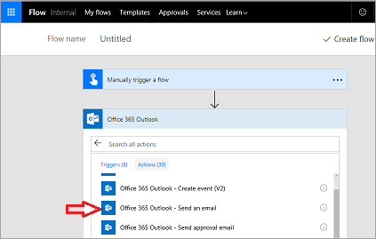
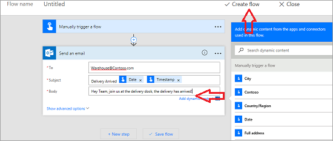
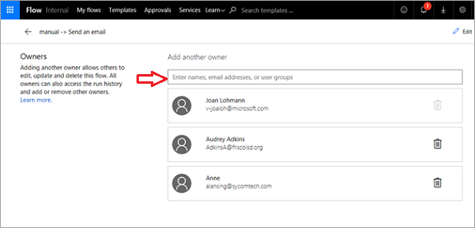
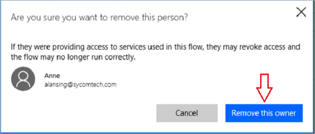

In questo argomento si apprenderà come **creare un flusso del pulsante** per la società Contoso Flooring Company. 

I flussi del pulsante servono a **inviare posta elettronica** a un team e **avvisarli delle attività** da eseguire. La **proprietà** dei flussi **può essere assegnata a un** solo operatore o **condivisa tra più** membri di un team.  

1. Prima di tutto, accedere al [sito Web di Microsoft Flow](https://ms.flow.microsoft.com).
2. Dopo aver eseguito l'accesso, selezionare **Flussi personali** e quindi **Crea da zero**.
   
    
   
    La prima cosa che serve è un trigger. Il flusso del pulsante è pratico da usare. 
3. Se non è presente nell'elenco, selezionare **Cerca tra centinaia di connettori e trigger** nella parte inferiore della pagina e immettere **pulsante** per visualizzarlo automaticamente. 
4. Selezionare **Pulsante Microsoft Flow per dispositivi mobili**.
   
     
5. Selezionare **Pulsante Microsoft Flow per dispositivi mobili - Attiva un flusso manualmente**.
   
    
6. Nella schermata di input, selezionare **Aggiungi input di testo**.
   
    
7. Immettere **Contoso Flooring** nella prima casella di testo e **Email di consegna magazzino** nella seconda casella di testo.
   
    
8. Selezionare **Nuovo passaggio**. 
   
    
9. Selezionare **Aggiungi un'azione**. 
   
    
10. Selezionare il connettore **Office 365 Outlook**. Se non è presente, cercare **outlook**.
    
     
11. Selezionare **Office 365 Outlook - Invia un messaggio di posta elettronica**.
    
     
    
     Quando viene premuto il pulsante, viene inviato un messaggio all'intero team del magazzino di Contoso, indipendentemente da dove si trova nell'edificio, per informarlo che è arrivata la consegna.
12. Espandere i campi e personalizzare il messaggio di posta elettronica per Contoso Flooring.
    
    1. Nel campo **A** immettere un indirizzo di posta elettronica valido all'interno dell'organizzazione.
    2. Nel campo **Oggetto** immettere **Consegna arrivata**. 
    3. A destra viene visualizzata la casella **Contenuto dinamico**. Per mostrare nella riga dell'oggetto la data e l'ora in cui è stato premuto il pulsante, selezionare **Data** e **Timestamp**. 
       
        
13. A questo punto, immettere un semplice **Corpo** per l'e-mail, ad esempio **Al team del magazzino: si prega di scaricare la piattaforma perché è arrivata la consegna odierna**.
14. Selezionare **Crea flusso** per salvare il flusso.
    
     

## Creare un flusso del team
È possibile usare questo flusso del pulsante come esempio di come creare un flusso del team. Cosa accade se l'autore di questo flusso è in congedo malattia? Cosa accade se tale utente lascia l'azienda? Ci si vorrà assicurare della continua esecuzione di questo flusso. A tale scopo, aggiungere dei comproprietari.

1. Selezionare l'**icona del team** nel flusso per aggiungere un comproprietario.
   
     
2. Immettere nomi, indirizzi di posta elettronica o gruppi utenti per aggiungere i comproprietari.
   
    
3. Per rimuovere i comproprietari, selezionare il Cestino a destra del relativo nome.
   
    
4. Selezionare **Rimuovi questo proprietario** per completare la rimozione.
   
    

## Riepilogo
In questa lezione, si è visto come **creare un flusso del pulsante**. 

In pochi minuti, il flusso ha permesso un operatore del magazzino la possibilità **avvisa il team** a un **arrivo recapito**, in modo che il team dovevi attendere, invano sprecare tempo prezioso che avrebbe potuto impiegare in altre attività . 

Il ruolo di lavoro quindi condiviso il pulsante con i team, in modo che altri potessero attivare lo stesso flusso se tale utente non è stata intorno.

## Lezione successiva
La lezione successiva illustrerà come creare un flusso che usa le **notifiche push**.

