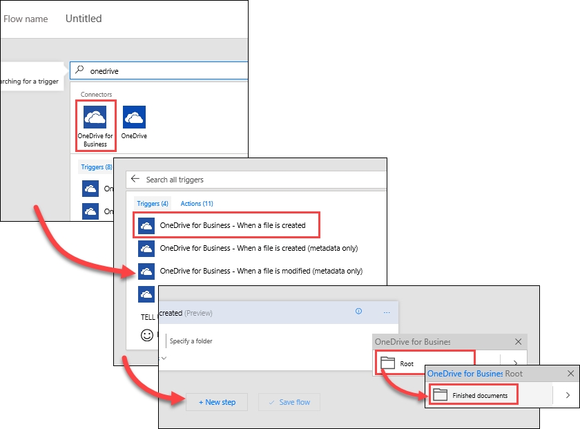
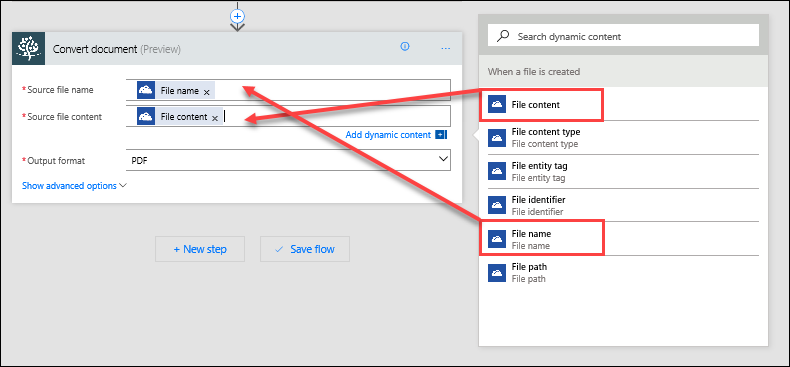

In questo argomento, si osserverà in che modo Contoso Flooring usa Microsoft Flow per convertire automaticamente i documenti in un formato standard e quindi archiviarli in SharePoint Online per maggiore sicurezza nel cloud. Verrà creato un flusso che rileva quando un nuovo file è stato aggiunto a una cartella di OneDrive for Business, quindi lo converte in formato PDF e lo archivia in una cartella di SharePoint Online. 

## Prerequisiti
Per questo scenario, è necessario un account di **Muhimbi**, un servizio di conversione PDF. Se non si ha già un account di Muhimbi, è possibile iscriversi per ottenere una [versione di valutazione gratuita di 30 giorni](http://www.muhimbi.com/Products/PDF-Converter-for-SharePoint/Products-PDF-Converter-for-SharePoint-Free-Trial.aspx). Seguire le istruzioni nella pagina per la distribuzione di app attraverso il sito di SharePoint Online. 

## Creare le cartelle di origine e di destinazione
È necessario prima di tutto creare le cartelle di origine e di destinazione in OneDrive for Business e SharePoint Online. 

1. In OneDrive for Business, in **File**, creare una cartella denominata **Documenti completati**. 
   
    
2. In SharePoint Online, in **Documenti condivisi**, creare una cartella denominata **PDF - File completati**. 
   
    

## Creare il flusso
1. In Microsoft Flow, selezionare **Flussi personali**, quindi selezionare **Crea da zero**. 
   
    
2. Selezionare **Cerca tra centinaia di connettori e trigger**.
3. Cercare **OneDrive**, selezionare **OneDrive for Business**, quindi selezionare il trigger **OneDrive for Business - Quando viene creato un file**. In **Cartella**, selezionare l'icona della cartella e selezionare la cartella **Documenti completati** creata nel passaggio precedente. 
   
    
4. Selezionare **Nuovo passaggio**, quindi scegliere **Aggiungi un'azione**. 
   
    
5. Cercare **Muhimbi**, selezionare il connettore **Muhimbi PDF** e selezionare l'azione **Muhimbi PDF – Convert document** (PDF Muhimbi - Converti documento).
   
    
6. A questo punto, Microsoft Flow potrebbe richiedere di eseguire l'autenticazione in Muhimbi. Per poter usare il servizio Muhimbi in Microsoft Flow sarà necessario registrare Muhimbi usando il proprio **ID tenant di SharePoint**. 
   
   1. Per trovare l'ID tenant, selezionare l'icona dell'ingranaggio **Impostazioni** in SharePoint Online e selezionare **Impostazioni sito**.
   2. In **Amministrazione raccolta siti** selezionare **Autorizzazioni app raccolta sito**. L'ID tenant è l'identificatore che segue il simbolo "**@**" in una qualsiasi delle app elencate. 
      
       
7. Nell'azione **Convert document** impostare i valori seguenti:
   
   * **Source file name**: dall'elenco di contenuto dinamico, selezionare **File name**.
   * **Source file content**: dall'elenco di contenuto dinamico, selezionare **File content**.
   * **Output format**: dall'elenco a discesa, selezionare **PDF**.
     
     

Finora, è stato configurato il flusso con la procedura seguente: 

1. Il flusso viene attivato ogni volta che viene aggiunto un nuovo file in una specifica cartella di OneDrive for Business 
2. Il servizio Muhimbi converte tale file in formato PDF. 

Per il passaggio finale, si aggiungerà un'azione che sposterà il documento PDF in una cartella di SharePoint Online in cui il team può accedervi.  

1. Selezionare **Nuovo passaggio**, quindi scegliere **Aggiungi un'azione**.  Cercare **SharePoint** e selezionare l'azione **SharePoint - Crea file**. 
   
    
2. Nell'azione **Crea file** impostare i valori seguenti:
   
   * **Indirizzo sito**: l'URL del sito di SharePoint.  
   * **Percorso cartella**: selezionare l'icona della cartella e passare alla cartella **PDF - File completati**.
   * **Nome file**: dall'elenco del contenuto dinamico per **Convert document** selezionare **Base file name**, quindi aggiungere "**.pdf**" in modo da salvarlo in SharePoint con tale estensione di file. 
   * **File content**: dall'elenco di contenuto dinamico per **Convert document**, selezionare **Processed file content**.
3. Selezionare **Crea flusso** nella parte superiore della pagina per salvare il lavoro.
   
    

## Testare il flusso
1. Per testare il flusso, aggiungere un nuovo file alla cartella **Documenti completati** in OneDrive for Business. 
2. In Flow, selezionare **Flussi personali**, quindi selezionare il nuovo flusso per visualizzare la cronologia di esecuzione. Per impostazione predefinita, il flusso è configurato per l'esecuzione ogni cinque minuti. 
3. Dopo aver eseguito il flusso, verificare che il file sia stato convertito in formato PDF e salvato nella cartella **PDF - File completati** di SharePoint. 
   
    

