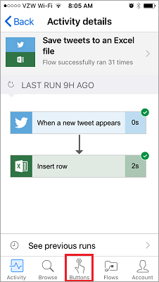

In questa lezione, si parlerà dell'app Microsoft Flow per dispositivi mobili e delle relative funzionalità. Dall'app per dispositivi mobili, è possibile accedere a queste funzionalità: **Feed attività**, **Browsing**, **pulsanti**, e **la gestione dei flussi**.

Prima di tutto, è necessario **scaricare** e **installare** l'app Microsoft Flow dall'app store.

Dopo averla installata, **aprirla** ed **accedere**. Quando si apre l'app, verrà visualizzato il **Feed attività**.

Il Feed attività è il luogo in cui vedere cosa accade nei flussi, **mentre si è in viaggio** e non si ha **accesso al computer**, per un'esperienza completa.

Ad esempio, se si seleziona uno di questi flussi, è possibile **ottenere informazioni dettagliate** riguardo l'**ultima attività**, se l'esecuzione è riuscita o no e, in caso di esito negativo, in quale passaggio si è verificato un errore.

Come si può notare, questo flusso è riuscito in entrambi i passaggi. Da qui, continuare e selezionare l'icona **Pulsanti**.

## Come vengono avviati i flussi
   I pulsanti sono flussi che vengono avviati con un'azione manuale. Ad esempio, si potrebbe creare un pulsante come **Invia un SMS " Lavoro da casa" al responsabile**.
Questo pulsante potrebbe essere utile se si vive lontano dall'ufficio e nei giorni di intenso traffico urbano.

Usare il pulsante **Esplora** per dare uno sguardo ai modelli per **altri flussi del pulsante** da aggiungere alla propria raccolta.

Per vedere come funziona, verrà usato il flusso del pulsante **Invia un promemoria a me stesso tra 10 minuti**.

1. Selezionare **Pulsanti**, quindi **Esplora modelli**.
2. Selezionare il flusso del pulsante promemoria.
3. Toccare **Usa questo modello**.
   
    
4. Toccare **Crea**.
   
    
   
    Il flusso viene **salvato**.
   
    
5. Toccare **Pulsanti** per visualizzare il nuovo flusso. 
   
    
6. Toccare il pulsante per **ricevere un promemoria** tra 10 minuti.
   
    

È un semplice aggiungere altri pulsanti alla raccolta.

## Modificare o eliminare un flusso
Qualora fosse necessario, sarà facile modificare o eliminare uno dei flussi.

1. Toccare il pulsante **Flussi**, che è essenzialmente l'area di gestione dei dispositivi mobili per i flussi.
   
    
2. A questo punto, toccare uno dei flussi.
   
    
   
    Si noterà che sono disponibili alcune opzioni:
   
   * Per abilitare o disabilitare il flusso, toccare l'interruttore **Abilita flusso**.
   * È sempre possibile modificare il flusso, nel caso in cui si voglia renderlo di nuovo utile a se stessi. 
   * Sarà quindi possibile visualizzare la cronologia di esecuzione del flusso per farsi un'idea delle esecuzioni riuscite e non riuscite.
   * È anche possibile eliminare il flusso toccando il pulsante **Elimina flusso**.
     
     
     
     Qui si può notare che il **flusso è stato eliminato**.
     
     

## Lezione successiva
La lezione successiva illustrerà **come creare un flusso del pulsante** per un team. 

