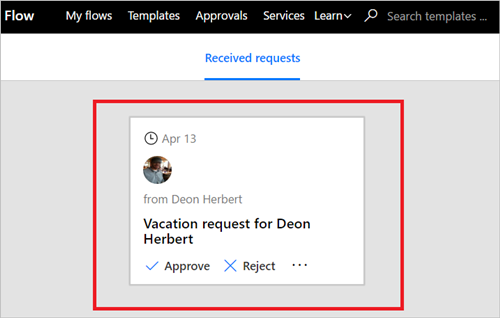

Per visualizzare tutte le richieste in attesa di approvazione , attenersi alla procedura seguente:

1. Accedere a [Microsoft Flow](https://flow.microsoft.com).
   
    
2. Selezionare la scheda **Approvazioni**.
   
    
3. Tutte le richieste in attesa di approvazione sono disponibili in **Richieste ricevute**.
   
    

