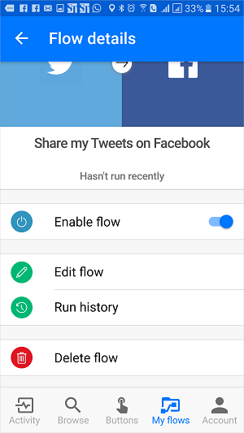

# Introduzione ai flussi di un pulsante
[!INCLUDE [view-pending-approvals](includes/cc-rebrand.md)]
## Che cosa sono i flussi di un pulsante?
Ci sono molte attività ripetitive che si desidera eseguire con un semplice tocco di un pulsante. Ad esempio, potrebbe essere necessario inviare rapidamente un messaggio di posta elettronica al team per ricordare di partecipare alla sincronizzazione del team giornaliera oppure è possibile avviare una nuova build di Visual Studio online della codebase dopo aver ricevuto una notifica che non ci sono più archiviazioni pianificati per la giornata. I flussi dei pulsanti consentono di eseguire queste e molte altre attività semplicemente toccando un pulsante del dispositivo mobile.

**Nota** È possibile creare flussi di pulsanti dal dispositivo mobile o dal portale di Flow.  
    

## Perché creare i pulsanti?
È possibile creare pulsanti che consentono di eseguire facilmente attività ripetitive da qualsiasi luogo, in qualsiasi momento tramite il dispositivo mobile. L'esecuzione dei pulsanti consente di risparmiare tempo e, dal momento che le attività eseguite vengono automatizzate, saranno presenti meno errori rispetto a quelle eseguite manualmente.  

## Creare un pulsante
### Prerequisiti
* Accesso a Flow. L'amministratore può fornire l'accesso.
* Un account con le autorizzazioni per usare i connettori per creare il pulsante. Ad esempio, è necessario un account Dropbox per poter creare un pulsante che accede a Dropbox.

### Dal portale
In questa procedura dettagliata verrà creato un pulsante che avvia una compilazione di Visual Studio online (VSO) e invia notifiche per informare l'utente all'avvio della compilazione:  

1. Selezionare l'elenco a discesa **Mostra** e scegliere la categoria **pulsante** . In questo modo l'elenco dei modelli viene filtrato solo in quelli che possono essere usati nei flussi di un pulsante.  
      
2. Selezionare il modello **trigger a New Build in VSO** dall'elenco di modelli.  
     
3. Selezionare il pulsante **Usa questo modello** nella pagina **attiva una nuova compilazione in VSO** .   
     
4. Se non è stato eseguito l'accesso, verrà richiesto di farlo a questo punto:  
     
5. Dopo aver effettuato l'accesso a Flow, verrà richiesto di accedere ai connettori usati nel modello selezionato. In questo esempio, nel passaggio 2 precedente è stato selezionato il modello **trigger a New Build in VSO** , quindi è necessario accedere a VSO (e a qualsiasi altro connettore che si sta usando), se non è già stato effettuato l'accesso:  
       
6. Selezionare il pulsante **Accept (Accetto** ) per autorizzare Flow ad accedere all'account VSO.  
      
   **Nota** È necessario autorizzare ogni connettore in modo analogo. La finestra di progettazione dovrebbe apparire come questa quando si è pronti per passare al passaggio successivo. Selezionare il pulsante **continua** per procedere:  
      
7. A questo punto è possibile configurare le proprietà per la compilazione che si desidera avviare:    
     
8. Selezionare o immettere il **nome dell'account**, il **nome del progetto**, l'ID della definizione di **compilazione**, il **ramo di origine** e, facoltativamente, i **parametri**nella **coda di una nuova** scheda di compilazione:    
     
9. Configurare quindi le proprietà della notifica push nella scheda **Invia una notifica push** . Per impostazione predefinita, questa notifica push è configurata per l'invio di un collegamento HTML a una pagina Web che visualizza lo stato della compilazione:  
     
10. Selezionare il pulsante **Crea flusso** per salvare il flusso del pulsante:   
11. Questo messaggio di esito positivo dovrebbe essere visualizzato entro pochi istanti:  
      

Congratulazioni, è stato creato un flusso di un pulsante. È ora possibile eseguire il flusso di questo pulsante in qualsiasi momento, dalla scheda **pulsanti** dell'app Microsoft Flow. È sufficiente premere il pulsante che verrà eseguito. L'app per dispositivi mobili Microsoft Flow è disponibile per [Android](https://aka.ms/flowmobiledocsandroid), [iOS](https://aka.ms/flowmobiledocsios)o [Windows Phone](https://aka.ms/flowmobilewindows).

### Dal dispositivo mobile
**Nota**: mentre in questa procedura dettagliata vengono visualizzate le schermate di un dispositivo Android, le schermate e l'esperienza in un dispositivo iOS sono simili.

Nell'app Microsoft Flow:

1. Selezionare la scheda **Sfoglia** e scorrere fino alla categoria **pulsante** .  
     
2. Selezionare il collegamento **Visualizza tutto** . Verranno visualizzati tutti i modelli di pulsante pronti per l'uso.     
     
3. Selezionare **Invia un messaggio di posta elettronica per ricordare al team di partecipare a un modello di riunione**    
     
4. Selezionare il collegamento **utilizza questo modello** nella parte inferiore della pagina.    
     
5. È necessario accedere a tutti i servizi usati da questo modello:    
     
6. Dopo aver effettuato l'accesso a tutti i servizi, selezionare il collegamento **successivo** .      
     
7. Selezionare il collegamento **Crea** . Qui è anche possibile esaminare il flusso e apportare le modifiche necessarie per personalizzare il messaggio di posta elettronica, ad esempio.        
     
8. Dopo alcuni istanti, viene creato il flusso del pulsante. Selezionare **vedere il flusso**:   
     
9. Visualizzare tutti i flussi nella scheda **flussi personali**  
     

Congratulazioni, è stato creato un flusso di un pulsante. È ora possibile eseguire il flusso di questo pulsante in qualsiasi momento, dalla scheda **pulsanti** dell'app Microsoft Flow. È sufficiente premere il pulsante che verrà eseguito. L'app Microsoft Flow è attualmente disponibile nei dispositivi mobili Android e iOS.  

  

## Attivare un flusso di un pulsante
Ora che è stato creato il flusso di un pulsante, è possibile eseguirlo. Poiché è possibile eseguire solo i flussi dei pulsanti dall'app Microsoft Flow, assicurarsi di avere installato Flow sul dispositivo mobile Android o iOS.  

1. A questo punto, avviare l'app Flow, toccare la scheda **pulsanti** che si trova nella parte inferiore della pagina e toccare il *pulsante* che rappresenta il flusso del pulsante che si vuole attivare:  
      
2. Vedere lo stato di avanzamento durante l'esecuzione del flusso:  
      
3. Infine, la pagina viene aggiornata, a indicare che il flusso del pulsante è stato completato:  
      

Per eseguire un flusso, 

A questo punto si riceverà la notifica push, che indica che il messaggio di posta elettronica è stato inviato.  

## Monitorare le esecuzioni del flusso dei pulsanti
È possibile monitorare i flussi dei pulsanti dalla scheda **attività** dell'app Flow:   
  

**Nota**: toccare qualsiasi attività per esaminare i risultati dell'esecuzione per informazioni sull'esecuzione.  

  

## Gestisci flussi di pulsanti
Si ha il controllo completo sui flussi dei pulsanti in modo da poter abilitare o disabilitare, modificare o eliminare un pulsante in qualsiasi momento, ovunque. Dall'app per dispositivi mobili o dal portale di Flow selezionare **flussi personali** per iniziare a gestire i flussi.    

Nella scheda **flussi personali** dell'app Microsoft Flow:

1. Selezionare il flusso che si desidera gestire:    
      
2. È possibile toccare una qualsiasi di queste opzioni, in base a ciò che si desidera eseguire:    
     
3. Toccare **Delete Flow** per eliminare un flusso.  

**Nota** Tutta la cronologia di esecuzione viene eliminata quando si elimina un flusso:   
   

1. Toccare **Aggiorna** dopo aver completato la modifica del flusso di un pulsante per salvare le modifiche:   
      
2. Toccare **cronologia di esecuzione** per visualizzare i risultati di tutte le esecuzioni di un determinato flusso di un pulsante:    
     
3. Se si disabilita un flusso, non sarà più disponibile nella scheda **pulsanti** :    
     

## Passaggi successivi
* [Condividere i flussi](share-buttons.md)di un pulsante.
* Informazioni su come usare i [token per attivare i pulsanti](introduction-to-button-trigger-tokens.md) per inviare dati in tempo reale quando vengono eseguiti i flussi dei pulsanti.
* Installare l'app per dispositivi mobili Microsoft Flow per [Android](https://aka.ms/flowmobiledocsandroid), [iOS](https://aka.ms/flowmobiledocsios)o [Windows Phone](https://aka.ms/flowmobilewindows).

