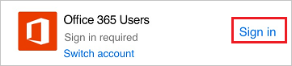

# Creare un flusso dal telefono usando Microsoft Flow
Creare un flusso dal telefono usando un modello che è possibile trovare cercando in un elenco di servizi, esplorando categorie o specificando parole chiave. Seguire i passaggi descritti in questo argomento per creare un flusso che invii una notifica push al telefono dell'utente quando si riceve posta dal responsabile.

Se non si ha familiarità con Microsoft Flow, [vedere una panoramica](getting-started.md).

## Prerequisiti
* Un [account per Microsoft Flow](sign-up-sign-in.md).
* L'app per dispositivi mobili Microsoft Flow per [Android](https://aka.ms/flowmobiledocsandroid), [iOS](https://aka.ms/flowmobiledocsios) o [Windows Phone](https://aka.ms/flowmobilewindows) in un [dispositivo supportato](getting-started.md#use-the-mobile-app). Le figure in questo argomento riflettono la versione dell'app per iPhone, ma l'interfaccia di un dispositivo Android o Windows Phone è simile.
* Per usare il modello illustrato in questo argomento, saranno anche necessari:
  
  * Credenziali di Office 365
  * Notifiche push abilitate sul telefono

## Trovare un modello
1. Aprire l'app per dispositivi mobili e quindi toccare **Sfoglia** nella parte inferiore della schermata.
   
    
   
    È possibile trovare un modello in uno dei modi seguenti:
   
   * Specificare una parola chiave nella casella di ricerca nella parte superiore della schermata.
   * Toccare un'opzione nell'elenco dei servizi.
   * Scorrere verso il basso per visualizzare un'ampia gamma di categorie e quindi toccare un modello in qualsiasi categoria.
     
       
     
     Per questa esercitazione, è necessario aprire il modello che invii una notifica push quando si riceve posta dal responsabile.
2. Nell'elenco dei servizi, toccare **Vedi tutto**.
   
    
3. Toccare l'icona per **Notifica push**.
   
    
4. Nella barra di ricerca, digitare **Posta elettronica** e quindi toccare il modello per inviare una notifica push quando si riceve un messaggio dal responsabile.
   
    
5. Nella schermata che fornisce informazioni dettagliate sul modello selezionato, toccare **Usa questo modello**.
   
    

## Terminare il flusso
1. Se richiesto, toccare **Accedi**, e fornire le credenziali per Office 365 Outlook, Utenti di Office 365 o entrambi.
   
    
   
    È possibile usare le stesse connessioni quando si creano altri flussi.
2. In alto a destra, toccare **Avanti**.
   
    
   
    La schermata successiva mostra l'evento trigger e tutte le azioni risultanti.
   
    
   
    Per questo modello, i nuovi messaggi di posta attivano il flusso, che recupera le informazioni (incluso l'indirizzo del responsabile) e invia una notifica push quando si riceve posta da tale indirizzo. Determinati modelli richiedono alcune personalizzazioni per il corretto funzionamento, ma non questo modello.
3. (facoltativo) Nella parte superiore della schermata, digitare un nome diverso per il flusso.
   
    
4. In alto a destra, toccare **Crea**.
   
    
   
    Il flusso è stato creato e controllerà la posta elettronica dal responsabile finché non si sospende o elimina il flusso.

## Passaggi successivi
* [Monitorare l'attività del flusso](mobile-monitor-activity.md).
* [Gestire i flussi](mobile-manage-flows.md).

