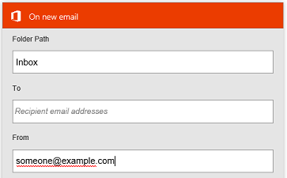

# Monitorare l'attività in Microsoft Flow dal telefono
Visualizzare un riepilogo di quante volte ogni flusso è riuscito o no oggi, ieri e nei giorni precedenti. Esplorare i dettagli relativi a ogni esecuzione, ad esempio quando si è verificata, il tempo impiegato per ogni passaggio e perché eventualmente non è riuscita.

**Prerequisiti**

<iframe width="560" height="315" src="https://www.youtube.com/embed/vZuYZ64K3tI?list=PL8nfc9haGeb55I9wL9QnWyHp3ctU2_ThF" frameborder="0" allowfullscreen></iframe>

* Installare l'app per dispositivi mobili Microsoft Flow per [Android](https://aka.ms/flowmobiledocsandroid), [iOS](https://aka.ms/flowmobiledocsios) o [Windows Phone](https://aka.ms/flowmobilewindows) in un [dispositivo supportato](getting-started.md#use-the-mobile-app). Le immagini in questo argomento riflettono la versione dell'app per iPhone, ma sono simili a quelle per Android e Windows Phone.
* Se non si ha già un flusso, crearne uno nel [sito Web per Microsoft Flow](https://flow.microsoft.com/). Per semplificare il test, usarne uno che sia possibile attivare manualmente anziché attendere un evento esterno.

Il flusso in questa esercitazione viene eseguito quando si riceve posta da un indirizzo specifico:

È possibile configurare un flusso di questo tipo con l'indirizzo di posta elettronica personale per il test e un indirizzo diverso (ad esempio, quello del responsabile) quando il flusso è pronto per l'uso reale.

Quando viene eseguito il flusso, invia una notifica push personalizzata, con questa sintassi, al telefono:

**Nota:** è anche possibile [gestire i flussi](mobile-manage-flows.md) dall'app per dispositivi mobili.

## Visualizzare un riepilogo dell'attività
<iframe width="560" height="315" src="https://www.youtube.com/embed/nVCGJamOw6s?list=PL8nfc9haGeb55I9wL9QnWyHp3ctU2_ThF" frameborder="0" allowfullscreen></iframe>

1. Se il flusso non è stato eseguito prima, attivare un'esecuzione per generare dati.
   
    La visualizzazione dei dati nell'app potrebbe richiedere del tempo.
2. Aprire l'app per dispositivi mobili, con la scheda **Attività** visualizzata per impostazione predefinita.
   
    Questa scheda organizza i dati per giorno, con la data odierna visualizzata per prima.
   
    
   
    Ogni voce indica il nome di un flusso con le icone che corrispondono ai relativi eventi di attivazione e azioni.
   
    
   
    Se almeno un'esecuzione è riuscita in un giorno, una voce mostra il numero di esiti positivi e l'ora dell'ultimo esito positivo. Una voce diversa mostra informazioni simili se un flusso non è riuscito.
   
    
   
    Se un flusso invia una notifica push, il testo della notifica più recente viene visualizzato nella parte inferiore della voce per le esecuzioni riuscite.
   
    
3. Se sono state inviate più notifiche di push in un giorno, scorrere rapidamente verso sinistra sulla notifica per visualizzare le notifiche da un massimo di tre esecuzioni precedenti. Se sono state inviate più di quattro notifiche in un giorno, scorrere rapidamente verso sinistra fino a visualizzare **Vedi altro** e quindi toccare il pulsante per visualizzare un elenco di tutte le notifiche.
   
    
4. Toccare **Indietro** per tornare al riepilogo dell'attività.
5. Per filtrare il riepilogo dell'attività, toccare l'icona in alto a destra.
   
    È possibile visualizzare tutte le voci, solo le voci di errore o solo le voci che includono le notifiche push.
   
    

## Mostrare i dettagli di un'esecuzione
1. Nel riepilogo dell'attività, toccare una voce per mostrare i dettagli relativi all'esecuzione più recente.
   
     Ogni evento e azione viene visualizzato con un'icona che indica se l'evento o l'azione ha avuto esito positivo o negativo. Se ha avuto esito positivo, viene visualizzata anche la quantità di tempo impiegato (in secondi).
   
    
2. Nella parte inferiore dello schermo, toccare **Vedi esecuzioni precedenti** per elencare tutte le esecuzioni del flusso e quindi toccare un'esecuzione per mostrare i dettagli.
   
    

