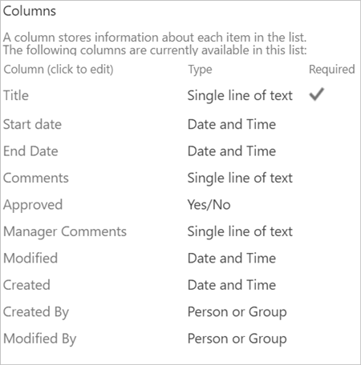
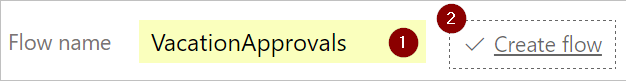

# Creare e testare un flusso di lavoro di approvazione con Microsoft Flow

Con Microsoft Flow, è possibile gestire l'approvazione dei documenti o dei processi in diversi servizi, inclusi SharePoint, Dynamics CRM, Salesforce, OneDrive for Business, Zendesk o WordPress.

Per creare un flusso di lavoro di approvazione, aggiungere l'azione **Approvals - Start an approval** (Approvazioni - Avvia un'approvazione) a qualsiasi flusso. Dopo l'aggiunta di questa azione, il flusso può gestire l'approvazione di documenti o processi. Ad esempio, è possibile creare un flusso di approvazione documenti che approva fatture, ordini di lavoro oppure preventivi di vendita. È anche possibile creare un flusso di approvazione processi che approva richieste di ferie, lavoro straordinario o piani di viaggio.

Gli approvatori possono rispondere alle richieste dalla propria cartella di posta in arrivo, dal [centro approvazioni](https://flow.microsoft.com/manage/approvals/received/) nel sito Web di Microsoft Flow o dall'app di Microsoft Flow.

## Creare un flusso di approvazione
Ecco una panoramica del flusso che verrà creato e testato:

   

Il flusso esegue i passaggi seguenti:

1. Inizia quando un utente crea una richiesta di ferie in un elenco di SharePoint Online.
2. Aggiunge la richiesta di ferie al Centro approvazioni, quindi la invia tramite posta elettronica al responsabile approvazione.
3. Invia un messaggio di posta elettronica con la decisione del responsabile approvazione all'utente che ha richiesto le ferie.
4. Aggiorna l'elenco di SharePoint Online con i commenti relativi alla decisione del responsabile approvazione.

## Prerequisiti
Per completare questa procedura dettagliata, è necessario avere accesso a:

[!INCLUDE [prerequisites-for-modern-approvals](includes/prerequisites-for-modern-approvals.md)]

Creare queste colonne nell'elenco di SharePoint Online:

   

Annotare il nome e l'URL dell'elenco di SharePoint Online. Questi elementi serviranno in un secondo momento per configurare il trigger**SharePoint - Quando viene creato un elemento**.

## Creare il flusso dal modello vuoto
[!INCLUDE [sign-in-and-create-flow-from-blank-template](includes/sign-in-and-create-flow-from-blank-template.md)]

## Aggiungere un trigger

[!INCLUDE [add-trigger-when-sharepoint-item-created](includes/add-trigger-when-sharepoint-item-created.md)]

**Indirizzo sito** e **Nome elenco** sono le voci annotate in precedenza.

## Aggiungere un'azione profilo

1. Selezionare **Nuovo passaggio**, quindi scegliere **Aggiungi un'azione**.
   
    
2. Immettere **profilo** nella casella di ricerca **Scegliere un'azione**.
   
    
3. Trovare e selezionare l'azione **Office 365 Users - Get my profile** (Utenti di Office 365 - Ottieni profilo personale)
   
    
4. Specificare un nome per il flusso e selezionare **Crea flusso** per salvare il lavoro svolto finora.
   
    

## Aggiungere un'azione di approvazione

[!INCLUDE [add-an-approval-action](includes/add-an-approval-action.md)]

> [!NOTE]
> Questa azione invia la richiesta di approvazione all'indirizzo di posta elettronica indicato nella casella **Assegnato a**.
>
>

## Aggiungere una condizione

[!INCLUDE [add-approval-condition-response](includes/add-approval-condition-response.md)]

## Aggiungere un'azione di posta elettronica per le approvazioni

Seguire questa procedura per inviare un messaggio di posta elettronica in caso di approvazione della richiesta di ferie:

[!INCLUDE [add-action-to-send-email-when-vacation-approved](includes/add-action-to-send-email-when-vacation-approved.md)]

   

## Aggiungere un'azione di aggiornamento per le richieste approvate

[!INCLUDE [add-action-to-update-sharepoint-with-approval](includes/add-action-to-update-sharepoint-with-approval.md)]

> [!NOTE]
> I campi **Indirizzo del sito**, **Nome lista**, **ID** e **Titolo** sono obbligatori.
>
>

## Aggiungere un'azione di posta elettronica per le richieste rifiutate

[!INCLUDE [add-action-to-send-email-when-vacation-rejected](includes/add-action-to-send-email-when-vacation-rejected.md)]

## Aggiungere l'azione di aggiornamento per le richieste rifiutate

[!INCLUDE [add-action-to-update-sharepoint-with-rejection](includes/add-action-to-update-sharepoint-with-rejection.md)]

   > [!NOTE]
   > I campi **Indirizzo del sito**, **Nome lista**, **ID** e **Titolo** sono obbligatori.
   >
   >

1. Selezionare **Aggiorna flusso** per salvare il lavoro svolto.
   
    

Se tutti i passaggi sono stati eseguiti correttamente, il flusso sarà simile alla schermata seguente:

Dopo aver creato il flusso, è opportuno testarlo.

## Richiedere un'approvazione

[!INCLUDE [request-vacation-approval](includes/request-vacation-approval.md)]

Dopo avere creato e testato il flusso, occorre assicurarsi di illustrarne il funzionamento agli altri utenti.

## Altre informazioni

* Visualizzare e gestire le [richieste di approvazione in sospeso](approve-reject-requests.md)
* Creare [flussi di approvazione sequenziali](sequential-modern-approvals.md).
* Creare [flussi di approvazione paralleli](parallel-modern-approvals.md).
* Installare l'app per dispositivi mobili Microsoft Flow per [Android](https://aka.ms/flowmobiledocsandroid), [iOS](https://aka.ms/flowmobiledocsios) o [Windows Phone](https://aka.ms/flowmobilewindows).
