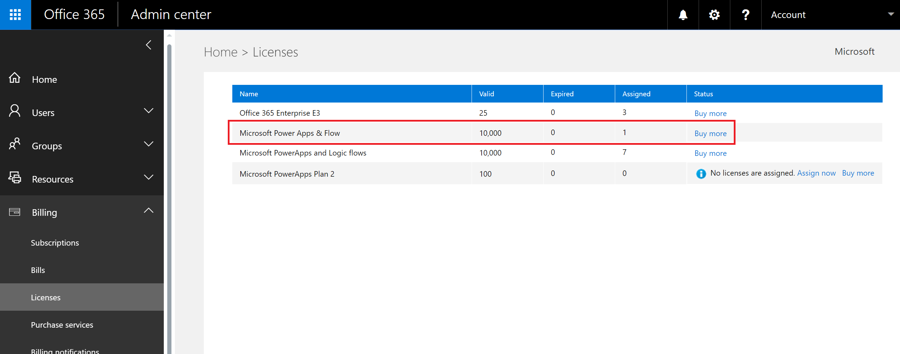

# Domande e risposte riguardo alla registrazione a Microsoft Flow nell'organizzazione
L'argomento descrive il modo in cui Microsoft Flow può essere usato dagli utenti nell'organizzazione e la modalità di controllo del servizio di Microsoft Flow.

## Iscriversi a Flow
### Che cos'è Microsoft Flow?
Microsoft Flow è servizio cloud pubblico progettato per consentire a singoli utenti e team di configurare flussi di lavoro automatizzati tra le app e i servizi preferiti per sincronizzare dati, ricevere notifiche, raccogliere dati e altro ancora. 

### Qual è la procedura per iscriversi a Flow?
I singoli utenti possono iscriversi a Flow tramite il portale Web in due modi:

#### Opzione 1
Per iscriversi, chiunque deve visitare la pagina [flow.microsoft.com](https://flow.microsoft.com), fare clic su **Iscrizione gratuita** e quindi completare la procedura di iscrizione a Flow tramite [admin.microsoft.com](https://admin.microsoft.com/Start?sku=flow_free) o [signup.live.com](https://signup.live.com).

#### Opzione 2
Per iscriversi, chiunque deve visitare la pagina [flow.microsoft.com](https://flow.microsoft.com), fare clic su **Accedi**, effettuare l'accesso con il proprio account aziendale o dell'istituto di istruzione oppure l'indirizzo di posta elettronica personale e accettare le condizioni per l'utilizzo di Flow.    

Quando un utente dell'organizzazione si iscrive a Flow con l'opzione 2, a tale utente viene assegnata automaticamente una licenza gratuita per Microsoft Flow.

Altre informazioni sono disponibili nell'argomento [Sign up for Flow](sign-up-sign-in.md) (Iscriversi a Flow).

### Che cos'è il piano Microsoft Flow Gratuito?

Il piano Microsoft Flow Gratuito viene usato solo per scopi di rilevamento. L'abilitazione o disabilitazione di questo piano non ha alcun effetto sulla capacità di un utente di creare flussi. Se si disabilita il piano Microsoft Flow Gratuito, questo viene abilitato di nuovo quando un utente effettua l'accesso. Si tratta del comportamento previsto.

### È possibile impedire a un'altra persona di iscriversi a Flow?
Microsoft Flow è un servizio cloud totalmente pubblico, quindi chiunque può iscriversi e usare Microsoft Flow in ogni parte del mondo per automatizzare le attività quotidiane. Per usare Microsoft Flow non è necessario avere o usare un account di Office 365. Per questo motivo, al momento non esiste alcun meccanismo per impedire a una persona di usare Flow: tutti gli utenti in ogni parte del mondo possono farlo, indipendentemente dall'indirizzo di posta elettronica.

Tuttavia, se un utente si iscrive a Microsoft Flow e si sceglie di non supportarlo all'interno dell'organizzazione, tale utente non può in alcun modo generare costi per l'azienda. Quando un utente effettua l'iscrizione a Microsoft Flow, si instaura una relazione tra l'utente e Microsoft, come per molti altri servizi di cloud di Microsoft, ad esempio Bing, Wunderlist, OneDrive o Outlook.com. L'uso di Microsoft Flow da parte di un individuo non implica in alcun modo che il servizio sia fornito dall'organizzazione.

Infine, se l'azienda desidera limitare l'uso dei dati dell'organizzazione all'interno di Microsoft Flow, ciò è possibile tramite i criteri di prevenzione della perdita dei dati (DLP).

### In che modo gli utenti possono accedere alle funzionalità di Microsoft Flow a pagamento?
I singoli utenti possono ottenere l'accesso alle funzionalità a pagamento di Microsoft Flow in tre modi diversi:

1. Possono iscriversi personalmente per una versione di valutazione gratuita per 90 giorni di Flow Plan 1 o Flow Plan 2
2. È possibile assegnare una licenza di Flow agli utenti dal portale di amministrazione di Office 365.
3. All'utente viene assegnato un piano di Office 365 e Dynamics 365 che include l'accesso al servizio Flow. Vedere la [pagina dei prezzi di Flow](https://flow.microsoft.com/pricing/) per l'elenco dei piani di Office 365 e Dynamics 365 che includono funzionalità di Flow.

### È possibile impedire un'altra persona di usare le funzionalità a pagamento di Flow?
Un singolo utente può provare le funzionalità a pagamento di Microsoft Flow per 90 giorni, senza dover sostenere alcun costo. È comunque possibile gestire completamente l'assegnazione delle licenze a pagamento perpetue all'interno dell'organizzazione tramite il portale di amministrazione di Office 365.

Come per le offerte gratuite, se un utente sceglie di iscriversi per la versione di valutazione, si instaura una relazione diretta tra il singolo e Microsoft, non necessariamente avvallata dall'azienda.

## Amministrazione di Flow
### Perché l'icona di Flow è comparsa nell'icona di avvio delle app di Office 365?
Come annunciato in agosto, Microsoft Flow è ora una parte fondamentale della suite Office 365. Tre mesi dopo questo annuncio Microsoft Flow è stato abilitato come servizio incluso in tutti gli SKU esistenti di Office 365. Dato che gli utenti in tutto il mondo possono ora usare Microsoft Flow, è stato incluso nell'icona di avvio delle app.

Se si preferisce rimuovere il riquadro di Flow dall'icona di avvio delle app per impostazione predefinita, vedere la sezione seguente.

### Qual è la procedura per rimuovere Microsoft Flow dall'icona di avvio delle app per l'organizzazione?
Se a un utente è stata assegnata una licenza di tipo Flow Plan 1 o Flow Plan 2, è possibile seguire questa procedura per rimuovere la licenza di Flow per tale utente, rimuovendo così anche l'icona di Flow dall'icona di avvio delle app:

1. Passare al [portale di amministrazione di Office 365](https://portal.microsoftonline.com/).
2. Nella barra di spostamento a sinistra selezionare **Utente** e quindi **Utenti attivi**.
3. Trovare l'utente per cui si vuole rimuovere la licenza e quindi selezionarne il nome.
4. Nel riquadro dei dettagli dell'utente selezionare **Modifica** nella sezione **Licenze prodotti**.
5. Trovare la licenza chiamata **Microsoft Flow Plan 1** o **Microsoft Flow Plan 2**, impostare l'interruttore su **Disattivato** e quindi fare clic su **Salva**.
   
   

Se un utente ha accesso al flusso tramite una licenza per un piano di Office 365 e Dynamics 365, è possibile disabilitare l'accesso alle funzionalità aggiuntive incluse in questo piano seguendo questa procedura:

1. Passare al [portale di amministrazione di Office 365](https://portal.microsoftonline.com/).
2. Nella barra di spostamento a sinistra selezionare **Utente** e quindi **Utenti attivi**.
3. Trovare l'utente per cui si vuole rimuovere l'accesso e quindi selezionarne il nome.
4. Nel riquadro dei dettagli dell'utente selezionare **Modifica** nella sezione **Licenze prodotti**.
5. Espandere la licenza di Office 365 o Dynamics 365 dell'utente, disabilitare l'accesso al servizio chiamato **Flow for Office 365** o **Flow for Dynamics 365** e quindi selezionare **Salva**.
   
   

È anche possibile eseguire la rimozione in blocco delle licenze tramite PowerShell. Per un esempio dettagliato, vedere [Licenze di Office 365 e Windows PowerShell: rimozione di una licenza](https://technet.microsoft.com/library/dn771774.aspx).   Infine, è possibile trovare ulteriori indicazioni sulla rimozione in blocco dei servizi inclusi in una licenza in [Disattivare l'accesso ai servizi con PowerShell di Office 365](https://technet.microsoft.com/library/dn771769.aspx).

La rimozione della licenza o del servizio Flow per un utente nell'organizzazione comporta la rimozione dell'icona di Flow dalle posizioni seguenti per l'utente:

1. [Office.com](https://office.com)
   
   
2. Icona di avvio delle app di Office 365
   
   

Si noti che verrà rimosso solo il riquadro di Flow per impostazione predefinita. Un utente può ancora scegliere di usare Microsoft Flow come singolo.

### Perché nel tenant di Office 365 sono comparse 10.000 licenze per Microsoft Flow?
Chiunque può provare Microsoft Flow Piano 1 o Piano 2 per 90 giorni e queste licenze di valutazione rappresentano la capacità disponibile per i nuovi utenti di Flow nel tenant. Non sono previsti addebiti per queste licenze. In particolare, esistono due motivi possibili per cui potrebbe comparire una capacità di 10.000 licenze (di valutazione) per Flow nel portale di amministrazione di Office 365:

1. Se almeno un utente nel tenant ha partecipato all'anteprima pubblica di Flow da aprile 2016 a ottobre 2016, saranno visualizzate 10.000 licenze con etichetta "Microsoft PowerApps and Logic flows"
   
    
2. Se almeno un utente nel tenant si è iscritto per la versione di valutazione di Flow Plan 2 seguendo la procedura descritta nell'**opzione 1** della sezione [Come fanno gli utenti a iscriversi a Flow?](#how-do-people-sign-up-for-flow), verranno visualizzate 10.000 licenze con etichetta "Microsoft Power Apps & Flow"
   
    

È possibile scegliere di assegnare licenze aggiuntive agli utenti manualmente tramite il portale di amministrazione di Office 365, ma tenere presente che queste sono licenze di valutazione per Microsoft Flow Plan 2 e scadranno 90 giorni dopo l'assegnazione.

### È gratis? Oppure le licenze sono a pagamento?
Nessun utente potrà generare alcun costo per l'organizzazione senza il consenso esplicito di quest'ultima, quindi le licenze gratuite e quelle di valutazione non causano alcun addebito per l'organizzazione. Non è inoltre previsto l'uso di quote, ad esempio le quote di esecuzione.

### Dopo aver rimosso la licenza gratuita di Microsoft Flow, gli utenti possono ancora accedere a Flow?
La licenza di Microsoft Flow è inclusa esclusivamente per scopi di rilevamento. Come illustrato nella prima sezione, non è possibile impedire ad altri utenti di usare Microsoft Flow per scopi personali. La presenza di una licenza gratuita di Microsoft Flow attualmente non concede o rimuove quindi alcuna capacità.

### Perché non è possibile visualizzare tutte le licenze di Flow nel portale di amministrazione di Office 365?
Gli utenti possono usare Microsoft Flow come singoli individui o come parte della propria organizzazione. Le licenze a livello di organizzazione saranno sempre visibili nel portale di Office 365. Tuttavia, se un utente si iscrive a una versione di valutazione come individuo, questa non sarà gestita dall'amministratore di Office 365 e non verrà visualizzata nel portale.

### In che modo un individuo può scoprire a quale piano è iscritto?
Chiunque può visualizzare il piano a cui è iscritto visitando la pagina dei prezzi di Flow all'indirizzo [https://flow.microsoft.com/pricing](https://flow.microsoft.com/pricing). Il piano o la versione di valutazione a cui si è iscritti sarà visualizzato qui.

### L'iscrizione a Microsoft Flow ha effetti sulle identità dell'organizzazione?
Se l'organizzazione ha già un ambiente di Office 365 e tutti gli utenti hanno un account di Office 365, non ci sono effetti sulla gestione delle identità.

Se l'organizzazione ha già un ambiente di Office 365, ma non tutti gli utenti hanno un account di Office 365, si crea un utente nel tenant e si assegnano le licenze a seconda che l'indirizzo dell'utente sia di lavoro o dell'istituto di istruzione. Ciò significa che il numero di utenti gestiti in un determinato momento aumenterà man mano che al servizio si iscriveranno nuovi utenti.

Se l'organizzazione non dispone di un ambiente Office 365 connesso al dominio e-mail, la gestione delle identità avviene nello stesso modo di sempre. Gli utenti verranno aggiunti a una nuova directory presente solo nel cloud e sarà possibile gestirli assumendo il ruoldo di amministratore del tenant.

### È stato creato un nuovo tenant da Microsoft Flow. Come si deve gestirlo?
Se un nuovo tenant è stato creato da Microsoft Flow, con la procedura seguente è possibile richiederne la proprietà e gestirlo:

1. Accedere al tenant iscrivendosi a Flow con un dominio e-mail corrispondente al dominio del tenant che si desidera gestire. Ad esempio, se Microsoft ha creato il tenant contoso.com, accedere al tenant con un indirizzo e-mail che termini con @contoso.com.
2. Richiedere il controllo amministrativo comprovando la proprietà del dominio: una volta nel tenant, è possibile assumere il ruolo di amministratore comprovando la proprietà del dominio. A tale scopo, seguire questi passaggi:    
   
   1. Andare a [https://admin.microsoft.com](https://admin.microsoft.com/Start?sku=flow_free).
   2. Selezionare l'icona di avvio dell'app in alto a sinistra e scegliere Admin (Amministratore).
   3. Leggere le istruzioni sulla pagina **Become the admin** (Diventare amministratore), quindi fare clic su **Yes, I want to be the admin** (Sì, voglio essere l'amministratore).  
      
       **NOTA**: se questa opzione non viene visualizzata, significa che esiste già un amministratore di Office 365.

### Se si hanno più domini, è possibile controllare il tenant di Office 365 al quale vengono aggiunti gli utenti?
Se non si fa nulla, viene creato un tenant per il dominio e sottodominio e-mail di ogni utente.

Se si desidera avere tutti gli utenti nello stesso tenant indipendentemente dall'estensione dell'indirizzo e-mail di ognuno:  

* Creare anticipatamente un tenant di destinazione oppure usare un tenant esistente. Aggiungere tutti i domini e sottodomini da consolidare in questo tenant. Al momento dell'iscrizione, tutti gli utenti i cui indirizzi e-mail terminano con questi domini e sottodomini vengono aggiunti automaticamente al tenant di destinazione.

**IMPORTANTE**: non esiste alcun meccanismo automatizzato per trasferire gli utenti da un tenant all'altro. Per ulteriori informazioni sull'aggiunta di domini a un unico tenant di Office 365, vedere [Aggiungere utenti e domini in Office 365](https://support.office.com/article/Add-your-users-and-domain-to-Office-365-ffdb2216-330d-4d73-832b-3e31bcb5b2a7).

### Come è possibile limitare l'accesso degli utenti ai dati business dell'organizzazione?
Microsoft Flow consente di creare aree distinte per dati business e non business, come illustrato di seguito. Dopo aver implementato questi criteri di prevenzione della perdita dei dati, gli utenti non sono autorizzati a progettare o eseguire flussi che usano insieme dati business e non business. Per altri dettagli, vedere [Criteri di prevenzione della perdita dei dati (DLP)](prevent-data-loss.md).

  

