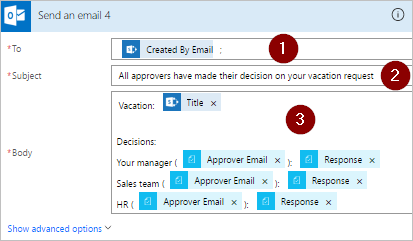

# Creare flussi di lavoro di approvazione paralleli con Microsoft Flow

In un flusso di lavoro di approvazione parallelo, più persone devono approvare gli elementi come fatture, ordini d'acquisto, richieste di ferie, e così via. L'approvazione di ogni persona è indipendente da tutti gli altri responsabili approvazione.

In questa procedura dettagliata, si userà Microsoft Flow per creare un flusso che automatizza un flusso di lavoro di approvazione parallelo. Questo flusso automatizza un processo di richiesta di ferie di un dipendente che richiede l'approvazione di tutte le persone (o dei team) che il dipendente supporta regolarmente. I dipendenti usano un [elenco SharePoint](https://support.office.com/article/Introduction-to-lists-0a1c3ace-def0-44af-b225-cfa8d92c52d7) per richiedere le ferie. È richiesta l'approvazione delle ferie da parte del responsabile diretto del dipendente, dal team di vendita e dal team delle risorse umane. Ogni richiesta di ferie viene indirizzata a ogni responsabile approvazione perché prenda una decisione. Il flusso invia un messaggio di posta elettronica con le modifiche dello stato e quindi aggiorna le decisioni in SharePoint.

## Prerequisiti

[!INCLUDE [prerequisites-for-modern-approvals](includes/prerequisites-for-modern-approvals.md)]

L'elenco di SharePoint Online creato dall'utente deve includere le colonne seguenti:

   

Annotare il nome e l'URL dell'elenco di SharePoint Online. Questi elementi verranno usati in un secondo momento per configurare il trigger **SharePoint - Quando viene creato un elemento**.

## Creare il flusso dal modello vuoto

[!INCLUDE [sign-in-and-create-flow-from-blank-template](includes/sign-in-and-create-flow-from-blank-template.md)]

## Aggiungere un trigger

[!INCLUDE [add-trigger-when-sharepoint-item-created](includes/add-trigger-when-sharepoint-item-created.md)]

   

## Recuperare il responsabile per la persona che ha creato la richiesta di ferie

[!INCLUDE [add-get-manager-action](includes/add-get-manager-action.md)]

## Assegnare un nome al flusso e salvarlo

1. Specificare un nome per il flusso e selezionare l'icona **Salva** per salvare il lavoro svolto finora.

   

> [!NOTE]
> Selezionare l'icona **Salva** periodicamente per salvare le modifiche del flusso.
> 
> 

## Aggiungere un'azione di approvazione per il responsabile diretto

[!INCLUDE [add-an-approval-action](includes/add-an-approval-action.md)]

> [!IMPORTANT]
> Questa azione invia la richiesta di ferie all'indirizzo di posta elettronica indicato nella casella **Assegnato a**. Inserire quindi il token **Posta elettronica**  dall'elenco **Recupera responsabile (V2)**.
> 
> 

## Inserire un'azione di approvazione del ramo parallelo per il team di vendita

1. Selezionare la freccia rivolta verso il basso che si trova tra la scheda **Recupera responsabile (V2)** e la scheda **Start an approval** (Avviare un'approvazione).
2. Selezionare il segno più che viene visualizzato sulla freccia rivolta verso il basso dopo averla selezionata.
3. Selezionare **Aggiungi un ramo parallelo**.
4. Selezionare **Aggiungi un'azione**.

    
5. Cercare, selezionare e quindi configurare un'azione **Avviare un'approvazione** che invii la richiesta di ferie al team di vendita. Vedere la [procedura usata per aggiungere un'azione di approvazione per il responsabile diretto](parallel-modern-approvals.md#add-an-approval-action-for-immediate-manager) se non si è sicuri su come aggiungere l'azione **Avviare un'approvazione**.

> [!IMPORTANT]
> Usare l'indirizzo di posta elettronica del team di vendita nella casella **Assegnato a** dell'azione **Start an approval 2** (Avviare un'approvazione 2).
> 
> 

## Inserire un'azione di approvazione del ramo parallelo per il team delle risorse umane

1. Ripetere i passaggi per [inserire un ramo parallelo per il team di vendita](parallel-modern-approvals.md#insert-a-parallel-branch-approval-action-for-the-sales-team) per aggiungere e quindi configurare un'azione **Avviare un'approvazione** per inviare le richieste di ferie alle risorse umane.

> [!IMPORTANT]
> Usare l'indirizzo di posta elettronica del team delle risorse umane nella casella **Assegnato a** dell'azione **Start an approval 3** (Avviare un'approvazione 3).
> 
> 

Se tutti i passaggi sono stati eseguiti correttamente, il flusso sarà simile all'esempio seguente:

   

## Opzioni dopo aver aggiunto i rami paralleli

Dopo aver aggiunto le azioni ai rami paralleli, sono disponibili due opzioni per l'aggiunta di altri passaggi al flusso:

1. Usare il piccolo pulsante **Inserire un nuovo passaggio** (il pulsante circolare con il segno più che viene visualizzato quando si seleziona uno spazio in un ramo o nell'area immediatamente sottostante). Questo pulsante aggiunge un passaggio a tale **ramo specifico**. I passaggi aggiunti con questo pulsante vengono eseguiti dopo il completamento di questo ramo specifico.
1. Usare il pulsante più grande **Nuovo passaggio** nella parte inferiore dell'intero flusso di lavoro. I passaggi aggiunti con questo pulsante vengono eseguiti dopo il completamento di tutti i rami.

Nelle sezioni seguenti verrà usato il piccolo pulsante **Inserire un nuovo passaggio** per eseguire i passaggi seguenti in ogni ramo:

* Aggiungere una condizione che controlli se la richiesta di ferie è stata approvata o rifiutata.
* Inviare un messaggio che informi il dipendente della decisione.
* Aggiornare la richiesta di ferie in SharePoint con la decisione di approvazione.

Quindi, si userà il pulsante più grande **Nuovo passaggio** per inviare un messaggio di posta elettronica che riepiloghi tutte le decisioni prese riguardo alla richiesta di ferie.

Continuando:

## Aggiungere una condizione a ogni ramo

1. Selezionare tutti gli spazi nel ramo **Avviare un'approvazione**.
2. Selezionare il piccolo pulsante **Inserire un nuovo passaggio** (il pulsante circolare con il segno più che viene visualizzato dopo aver selezionato lo spazio al passaggio precedente).
3. Selezionare **Aggiungere una condizione** dal menu visualizzato.
4. Selezionare la prima casella nella scheda **Condizione** e quindi selezionare il token **Risposta** dalla categoria **Avviare un'approvazione** nell'elenco del contenuto dinamico.

    
5. Verificare che l'elenco (al centro della **scheda Condizione**) sia impostato su **è uguale a**.
6. Immettere **Approva** (questo testo rispetta la distinzione maiuscole/minuscole) nell'ultima casella.
7. Ora la scheda Condizione dovrebbe essere simile all'esempio seguente:

    

   > [!NOTE]
   > Questa condizione controlla la risposta dell'azione **Avviare un'approvazione** che viene inviata al responsabile del dipendente.
   > 
   > 
8. Ripetere i passaggi precedenti nei rami **Avviare un'approvazione 2** (la richiesta di approvazione per le vendite) e **Avviare un'approvazione 3** (la richiesta di approvazione per le risorse umane).

## Aggiungere azioni di posta elettronica a ogni ramo

Eseguire la procedura seguente nella parte **Se sì** del ramo **Condizione**.

   Nota: il flusso usa questa procedura per inviare un messaggio di posta elettronica quando la richiesta viene approvata:

[!INCLUDE [add-action-to-send-email-when-vacation-approved](includes/add-action-to-send-email-when-vacation-approved.md)]

   

Per inviare un messaggio di posta elettronica quando una richiesta viene rifiutata, usare la parte **Se no** del ramo **Condizione** e ripetere i passaggi precedenti per aggiungere un modello per il messaggio di posta elettronica di rifiuto.

Ripetere i passaggi precedenti nei rami **Avviare un'approvazione 2** (la richiesta di approvazione per le vendite) e **Avviare un'approvazione 3** (la richiesta di approvazione per le risorse umane).

## Aggiornare la richiesta di ferie con la decisione

Eseguire la procedura seguente per aggiornare SharePoint quando vengono prese le decisioni.

   Nota: assicurarsi di eseguire questi passaggi su entrambe le estremità **Se SÌ** e **SE NO** del ramo.

[!INCLUDE [add-action-to-update-sharepoint-with-approval](includes/add-action-to-update-sharepoint-with-approval.md)]

   

Ripetere i passaggi precedenti sui rami **Avviare un'approvazione 2** e **Avviare un'approvazione 3**.

## Completare il flusso

1. Selezionare **Nuovo passaggio** > **Aggiungi un'azione**

    
1. Usare la procedura descritta in precedenza per inviare un messaggio di posta elettronica che riepiloghi i risultati di ogni approvazione. Inviare questo messaggio di posta elettronica al dipendente che richiesto le ferie. La scheda potrebbe essere simile a questo esempio:

   

## Altre informazioni sulle approvazioni moderne

[Introduzione alle approvazioni moderne](modern-approvals.md)

