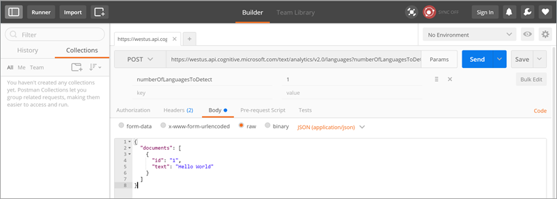

# Descrivere un connettore personalizzato con Postman
[Postman](https://www.getpostman.com/) è uno strumento che velocizza e semplifica lo sviluppo delle API. Questa esercitazione illustra come creare un file Postman Collection, che è quindi possibile usare per creare facilmente [connettori personalizzati](register-custom-api.md) in Microsoft Flow.

## Prerequisiti
* Installare l'[app Postman](https://www.getpostman.com/apps).

## Creare un file Postman Collection
Verrà ora creato un file Postman Collection per l'[API Analisi del testo](https://www.microsoft.com/cognitive-services/text-analytics-api) di Servizi cognitivi di Azure. Questa API identifica il linguaggio, la valutazione e le frasi chiave nel testo che le viene passato.

1. Il primo passaggio nella creazione di un file Postman Collection consiste nel creare una richiesta. Quando si crea la richiesta, è possibile impostare il verbo HTTP, l'URL della richiesta, query o parametri del percorso, intestazioni e corpo. Per altre informazioni, vedere [Invio di richieste](https://www.getpostman.com/docs/requests) nella documentazione di Postman. Per l'endpoint API Rileva lingua, impostare i valori come segue:
   
    
   
    Dettagli dei parametri e valori usati:
   
   | Parametro | Valore |
   | --- | --- |
   | Verbo |POST |
   | URL della richiesta |https://westus.api.cognitive.microsoft.com/text/analytics/v2.0/languages |
   | Parametri |numberOfLanguagesToDetect |
   | Autorizzazione |"No Auth" |
   | Intestazioni |Ocp-Apim-Subscription-Key = <your subscription key>  Content-Type = application/json |
   | Corpo |<code>{ &nbsp;&nbsp;&nbsp;"documents": [ &nbsp;&nbsp;&nbsp;&nbsp;&nbsp;{ &nbsp;&nbsp;&nbsp;&nbsp;&nbsp;&nbsp;&nbsp;&nbsp;"id": "1", &nbsp;&nbsp;&nbsp;&nbsp;&nbsp;&nbsp;&nbsp;&nbsp;"text": "Hello World" &nbsp;&nbsp;&nbsp;&nbsp;&nbsp;} &nbsp;&nbsp;] }<code> |
2. Fare clic su **Invia** per effettuare la richiesta e ottenere la risposta.
3. Fare clic su **Salva** per salvare la richiesta in un file Postman Collection.
   
    
4. Fornire un **Nome richiesta** e **Descrizione richiesta** nella finestra di dialogo **Salva richiesta**. Usare quindi questi valori nel connettore personalizzato.
   
    
   
    È anche possibile salvare la risposta alla richiesta. I connettori personalizzati supportano attualmente solo una singola risposta per ogni richiesta. Se si salvano più risposte per ogni richiesta, viene usata solo la prima.
   
    
5. Continuare a compilare il file Postman Collection creando e salvando altre richieste e risposte.
6. Dopo aver completato la creazione del file Postman Collection per tutte le richieste e risposte, esportarlo.
   
    
7. Scegliere **Collection v1** come formato di esportazione.
   
    

È ora possibile usare questo file Postman Collection per creare un connettore personalizzato in Microsoft Flow.

> [!IMPORTANT]
> Quando si crea un connettore personalizzato da un file Postman Collection, assicurarsi di rimuovere l'intestazione `Content-type` dalle azioni e dai trigger, perché verrà aggiunta automaticamente da Microsoft Flow. Le intestazioni di autenticazione, ad esempio `Ocp-Apim-Subscription-Key`, devono essere definite nella sezione **Security** e devono essere rimossi da azioni e trigger. 
> 
> 

Per altre informazioni, vedere [Registrare e usare i connettori personalizzati in Microsoft Flow](register-custom-api.md).

