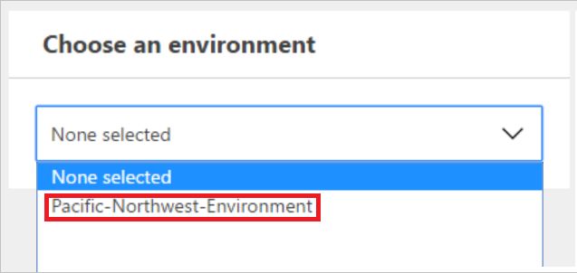
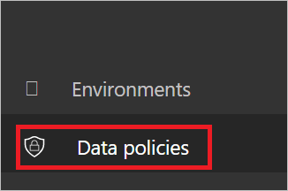

# Criteri di prevenzione della perdita dei dati (DLP)
[!INCLUDE [view-pending-approvals](includes/cc-rebrand.md)]

Questo documento presenta i criteri di prevenzione della perdita dei dati, che consentono di proteggere i dati dell'organizzazione dalla condivisione con un elenco di connettori definiti dall'utente.

## Che cos'è un criterio di prevenzione della perdita dei dati?

I dati di un'organizzazione sono fondamentali per il successo. I dati devono essere prontamente disponibili per il processo decisionale, ma devono essere protetti in modo che non vengano condivisi con i destinatari che non devono potervi accedere. Per proteggere questi dati, Microsoft Flow offre la possibilità di creare e applicare criteri che definiscono quali connettori consumer possono accedere ai dati di business e condividerli. Questi criteri che definiscono il modo in cui i dati possono essere condivisi vengono detti criteri di prevenzione della perdita dei dati (DLP).

## Perché creare un criterio DLP?

I criteri DLP vengono creati per definire chiaramente quali connettori consumer possono accedere e condividere i dati aziendali. Ad esempio, un'organizzazione che usa Microsoft Flow potrebbe non volere che i dati aziendali in SharePoint vengano pubblicati automaticamente nel proprio feed di Twitter. Per evitare questo problema, si crea un criterio DLP che blocca l'utilizzo dei dati di SharePoint come origine per i tweet.

## Vantaggi di un criterio DLP

* Garantisce che i dati vengano gestiti in modo uniforme nell'intera organizzazione.
* Impedisce che i dati aziendali importanti vengano accidentalmente pubblicati in connettori come i siti di social media.

## Gestione dei criteri DLP

### Prerequisiti per la gestione dei criteri DLP

* Autorizzazioni di amministratore dell'ambiente o di amministratore del tenant.

    Altre informazioni sulle autorizzazioni sono disponibili nell' [articolo sugli ambienti](environments-overview-admin.md).
* Una [licenza Microsoft Flow P2](billing-questions.md).

## Creare un criterio DLP

### Prerequisiti per la creazione di criteri DLP

Per creare un criterio DLP, è necessario disporre delle autorizzazioni per almeno un ambiente.

Seguire questa procedura per creare criteri DLP che impediscano la pubblicazione su Twitter dei dati nel sito di SharePoint aziendale:

1. Accedere al [centro di amministrazione di Microsoft Flow](https://admin.flow.microsoft.com) (interfaccia di amministrazione).

1. Selezionare la scheda criteri dati, quindi selezionare il collegamento **nuovo criterio** :

    
1. Selezionare la scheda **gruppi di dati** .

1. Immettere il nome del criterio DLP come *Secure Data Access per contoso* nell'etichetta **Nome criterio dati** nella parte superiore della pagina:

    

1. Selezionare l' [ambiente](environments-overview-admin.md) nella scheda **ambienti** .

    > [!NOTE]
    > In qualità di amministratore dell'ambiente, è possibile creare criteri che si applicano solo a un singolo ambiente. Come amministratore tenant, è possibile creare criteri applicabili a qualsiasi combinazione di ambienti:
    >
    >

    

1. Selezionare la scheda **gruppi di dati** :

    

1. Selezionare il collegamento **Aggiungi** contenuto nella casella di gruppo **Business Data Only (solo dati business** ):

    

1. Selezionare i connettori **SharePoint** e **Salesforce** nella pagina **Aggiungi connettori** :

   

1. Selezionare il pulsante **Aggiungi connettori** per aggiungere i connettori che possono condividere i dati aziendali.

1. Selezionare **Salva criterio** nell'angolo in alto a destra della schermata.

1. Dopo alcuni istanti, i nuovi criteri DLP verranno visualizzati nell'elenco dei criteri di prevenzione della perdita dei dati:

    

1. **Facoltativo** Inviare un messaggio di posta elettronica o altre comunicazioni al team, segnalando che è ora disponibile un nuovo criterio DLP.

A questo punto, è stato creato un criterio DLP che consente all'app di condividere i dati tra SharePoint e Salesforce e blocca la condivisione dei dati con altri servizi.

> [!NOTE]
> L'aggiunta di un servizio a un gruppo di dati ne comporta la rimozione automatica dall'altro gruppo di dati. Ad esempio, se Twitter si trova attualmente nel gruppo di dati **Business Data Only** e non si vuole consentire la condivisione dei dati aziendali con Twitter, è sufficiente aggiungere il servizio Twitter al gruppo di dati **No Business Data allowed** . Verrà rimosso Twitter dal gruppo di dati business data only.
>
>

## Violazioni della condivisione dei dati

Supponendo di aver creato i criteri DLP descritti in precedenza, se un utente crea un flusso che condivide i dati tra Salesforce (che si trova nel gruppo di dati **Business Data Only** ) e Twitter (che si trova nel gruppo di dati **Nessun dato business consentito** ), l'utente sarà informato che il flusso è **sospeso** a causa di un conflitto con i criteri di prevenzione della perdita dei dati creati.

Se gli utenti contattano i flussi sospesi, ecco alcuni aspetti da considerare:

1. In questo esempio, se esiste un motivo valido per condividere i dati di business tra SharePoint e Twitter, è possibile modificare i criteri DLP.

1. Richiedere all'utente di modificare il flusso per conformarsi ai criteri DLP.

1. Richiedere all'utente di lasciare il flusso nello stato Suspended fino a quando non viene presa una decisione sulla condivisione dei dati tra le due entità.

## Trovare un criterio DLP

### Amministratori

Gli amministratori possono usare la funzionalità di ricerca dell'interfaccia di amministrazione per trovare criteri DLP specifici.

> [!NOTE]
> Gli amministratori devono pubblicare tutti i criteri DLP in modo che gli utenti dell'organizzazione siano a conoscenza dei criteri prima di creare i flussi.
>
>

### Produttori

Se non si hanno le autorizzazioni di amministratore e si desidera ottenere altre informazioni sui criteri DLP nell'organizzazione, contattare l'amministratore. Per altre informazioni, vedere l' [articolo sugli ambienti Maker](environments-overview-maker.md)

> [!NOTE]
> Solo gli amministratori possono modificare o eliminare i criteri DLP.
>
>

## Modificare un criterio DLP

1. Avviare l'interfaccia di [Amministrazione](https://admin.flow.microsoft.com).

1. Nell'interfaccia di amministrazione che viene avviata selezionare il collegamento **criteri dati** sul lato sinistro.

    

1. Eseguire una ricerca nell'elenco dei criteri DLP esistenti e selezionare il pulsante modifica accanto al criterio che si intende modificare.

1. Apportare le modifiche necessarie ai criteri. È possibile, ad esempio, modificare l'ambiente o i servizi nei gruppi di dati.

1. Selezionare **Salva criterio** per salvare le modifiche.

> [!NOTE]
> I criteri DLP creati dagli amministratori tenant possono essere visualizzati dagli amministratori dell'ambiente ma non possono essere modificati dagli amministratori dell'ambiente.
>
>

## Eliminare un criterio DLP

1. Avviare l'interfaccia di [Amministrazione](https://admin.flow.microsoft.com).

1. Selezionare la scheda **criteri dati** sul lato sinistro.

    

1. Cercare nell'elenco dei criteri DLP esistenti, quindi selezionare il pulsante Elimina accanto al criterio da eliminare:

    

1. Confermare di voler eliminare il criterio selezionando il pulsante **Elimina** :

    

## Autorizzazioni dei criteri DLP

Solo gli amministratori dell'ambiente e del tenant possono creare e modificare i criteri DLP. Altre informazioni sulle autorizzazioni sono disponibili nell'articolo sugli [ambienti](environments-overview-admin.md) .

## Connettori personalizzati e HTTP

I connettori Custom e HTTP devono essere aggiunti a DLPs usando un modello di Microsoft Flow o PowerShell.

> [!TIP]
> Non è possibile effettuare il downgrade dalla versione dello schema 2018-11-01. Non è possibile rimuovere il supporto HTTP da un criterio. Se si tenta di rimuovere il supporto HTTP, i criteri DLP potrebbero essere danneggiati. Se, inoltre, un criterio DLP viene aggiornato per supportare i connettori HTTP, è possibile che i flussi correnti che usano queste funzionalità HTTP siano interrotti.

Ecco i connettori HTTP che è possibile aggiungere a un criterio:

- HTTP (e HTTP + spavalderia)
- Webhook HTTP
- Richiesta HTTP

## Aggiungere connettori personalizzati e connettori HTTP con i modelli

Per aggiungere un connettore personalizzato a un criterio usando un [modello](https://flow.microsoft.com/galleries/public/templates/ae9683086770420e902c043e5ed4b363/), immettere il nome del criterio, il gruppo a cui aggiungere il connettore e il nome, l'ID e il tipo del connettore. Eseguire il flusso una volta per aggiungere il connettore personalizzato al criterio e al gruppo specificati.

Per aggiungere i connettori HTTP a un criterio esistente tramite il [modello](https://flow.microsoft.com/galleries/public/templates/834eb1366aa54335a5f979014a9e0477/), immettere il nome del criterio a cui si vuole aggiungerlo, quindi eseguire il flusso.

## Aggiungere connettori personalizzati e HTTP con PowerShell

Per aggiungere il supporto per i connettori personalizzati e/o i connettori HTTP a un criterio usando PowerShell, [scaricare](https://docs.microsoft.com/powerapps/administrator/powerapps-powershell) e importare gli script di PowerShell di PowerApps più recenti e quindi usare questi cmdlet:' New-AdminDlpPolicy ',' set-AdminDlpPolicy ',' Add-CustomConnectorToPolicy ' è Remove-CustomConnectorFromPolicy ' per modificare il criterio. Usare il cmdlet "Get-Help-detailed" come riferimento.

> [!IMPORTANT]
> Usare la versione dello schema 2018-11-01 quando si crea o si aggiorna un criterio DLP per includere i connettori HTTP. L'aggiunta del supporto HTTP usando il modello o PowerShell influirà solo sui criteri specificati. I nuovi criteri creati tramite il centro di amministrazione non conterranno i connettori HTTP.

## Passaggi successivi

* [Altre informazioni sugli ambienti](environments-overview-admin.md)
* [Altre informazioni su Microsoft Flow](getting-started.md)
* [Altre informazioni sull'interfaccia di amministrazione](admin-center-introduction.md)
* [Altre informazioni sull'integrazione dei dati](https://docs.microsoft.com/common-data-service/entity-reference/dynamics-365-integration)
