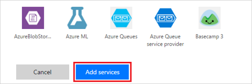

# Criteri di prevenzione della perdita dei dati (DLP)
## Che cos'è un criterio di prevenzione della perdita dei dati?
I dati di un'organizzazione sono fondamentali per il suo successo. Devono essere immediatamente disponibili per consentire di elaborare decisioni, ma vanno anche protetti per impedire che vengano condivisi con destinatari non autorizzati ad accedervi. Per proteggerli, Microsoft Flow (Flow) permette di creare e applicare criteri che stabiliscono con quali connettori/servizi consumer è possibile condividere determinati dati di business. Questi criteri che definiscono le modalità di condivisione dei dati sono detti "criteri di prevenzione della perdita dei dati" (DLP).

## Perché creare criteri di prevenzione della perdita dei dati DLP?
Lo scopo di creare criteri DLP è quello di definire chiaramente con quali servizi consumer è possibile condividere i dati di business. Ad esempio, un'organizzazione che usa Flow potrebbe non volere che i dati aziendali archiviati in SharePoint vengano pubblicati automaticamente nel proprio feed di Twitter. Per impedirlo, è possibile creare un criterio DLP che impedisca di usare i dati di SharePoint come origine per i tweet.

## I vantaggi dei criteri DLP
* Garantisce che i dati siano gestiti in modo uniforme in tutta l'organizzazione  
* Impedisce che importanti dati aziendali vengano accidentalmente pubblicati in servizi come i social media.   

## Gestione dei criteri DLP
**Prerequisiti**  
Per creare, modificare o eliminare criteri DLP, è necessario quando segue: 

* Autorizzazioni di amministratore dell'ambiente o del tenant. Altre informazioni sulle autorizzazioni sono disponibili nell'[argomento sugli ambienti](environments-overview-admin.md).  
* Una [licenza P2 per Flow](billing-questions.md).  

## Creare criteri DLP
**Prerequisiti**  
Per creare un criterio DLP, è necessario disporre delle autorizzazioni per almeno un ambiente.  

Eseguire la procedura di seguito per creare criteri DLP che impediscano la pubblicazione su Twitter dei dati archiviati nel sito di SharePoint aziendale:  

1. Nella scheda Data Policies (Criteri dati) fare clic sul collegamento **New policy** (Nuovi criteri):  
   Fare clic su  (Accedi)    
2. Nella pagina visualizzata immettere il nome del criterio DLP come *Secure Data Access for Contoso* (Accesso protetto ai dati Contoso) nell'etichetta **Data Policy Name** (Nome criterio dati) in alto:   
   Fare clic su  (Accedi)  
3. Selezionare l'[ambiente](environments-overview-admin.md) nella scheda **Applies to** (Applica a).  
   **Nota:** l'amministratore dell'ambiente può creare criteri applicabili a un ambiente solo, mentre l'amministratore tenant può creare un criterio che si applica a tutti gli ambienti, uno o più ambienti selezionati o tutti gli ambienti tranne un certo set:  
   Fare clic su  (Accedi)  
4. Selezionare la scheda **Data groups** (Gruppi di dati):  
   Fare clic su  (Accedi)  
5. Selezionare il collegamento **+ Add** (+ Aggiungi) nella casella di gruppo **Business data only** (Solo dati business):    
   Fare clic su  (Accedi)  
6. Selezionare i servizi **SharePoint** e **Salesforce** nella pagina **Add services** (Aggiungi servizi):  
   Fare clic su  (Accedi)  
7. Fare clic sul pulsante **Add services** (Aggiungi servizi) per aggiungere i servizi autorizzati a condividere i dati di business:    
   Fare clic su  (Accedi)  
8. Selezionare **Save Policy** (Salva criterio):  
   Fare clic su  (Accedi)  
9. Dopo qualche istante il nuovo criterio DLP comparirà nell'apposito elenco:  
     
10. **Facoltativo.** Inviare un'e-mail o un altro tipo di comunicazione al team per segnalare la disponibilità di nuovi criteri DLP.

A questo punto è stato creato un criterio DLP che consente all'app di condividere i dati fra SharePoint e Salesforce, impedendo invece di condividerli con altri servizi.  

**Nota**: l'aggiunta di un servizio a un gruppo di dati ne comporta la rimozione automatica dall'altro gruppo. Ad esempio, se Twitter è incluso nel gruppo di dati **Business data only** e non si vuole consentire la condivisione dei dati business con Twitter, è sufficiente aggiungere il servizio Twitter al gruppo di dati **No Business data allowed**. Twitter verrà così rimosso dal gruppo Business data only.  

## Violazioni relative alla condivisione dei dati
Presupponendo di aver creato i criteri DLP descritti in precedenza, se un utente crea un flusso che condivide i dati tra Salesforce (il gruppo contiene **solo dati di business**) e Twitter (nel gruppo in cui i **dati di business non sono consentiti**), l'utente verrà informato che il flusso è **sospeso** a causa di un conflitto con i criteri creati per la prevenzione della perdita dei dati.  
  

Se si viene contattati da utenti che segnalano flussi sospesi, ecco alcuni aspetti da considerare:  

1. In questo esempio, se esiste un motivo valido per condividere i dati di business tra SharePoint e Twitter, è possibile modificare i criteri DLP.  
2. Chiedere all'utente di modificare il flusso conformemente ai criteri DLP.  
3. Chiedere all'utente di lasciare sospeso il flusso finché non viene presa una decisione riguardo alla condivisione dei dati tra queste due entità.  

## Cercare un criterio DLP
### Amministratori
Gli amministratori possono utilizzare la funzionalità di ricerca dell'interfaccia di amministrazione per cercare specifici criteri DLP.  

**NOTA** È opportuno che gli amministratori pubblichino tutti i criteri DLP in modo che gli utenti dell'organizzazione ne siano a conoscenza prima di creare flussi.

### Responsabili operativi
Se non si dispone delle autorizzazioni di amministratore e si desidera saperne di più sui criteri DLP della propria organizzazione, contattare l'amministratore. Altre informazioni sono disponibili anche nell'[argomento sugli ambienti per responsabili operativi](environments-overview-maker.md).  

**NOTA** Solo gli amministratori possono modificare o eliminare i criteri DLP.  

## Modificare un criterio DLP
1. Accedere all'interfaccia di amministrazione visitando la pagina https://admin.flow.microsoft.com.  
2. Nell'interfaccia di amministrazione che viene aperta fare clic sul collegamento **Data policies** (Criteri dati) a sinistra.  
   Fare clic su  (Accedi)  
3. Nell'elenco dei criteri DLP esistenti fare clic sull'apposito pulsante accanto al criterio da modificare:  
     
4. Apportare le modifiche desiderate. Ad esempio, è possibile modificare l'ambiente o i servizi nei gruppi di dati.  
5. Fare clic su **Save Policy** (Salva criterio) per salvare le modifiche:  
   Fare clic su  (Accedi)  

Il criterio viene aggiornato. Per verificare che il criterio sia stato aggiornato, è possibile cercarlo nell'elenco dei criteri di prevenzione della perdita dei dati e controllarne le proprietà.   

**Nota**: l'amministratore dell'ambiente può visualizzare i criteri DLP creati dall'amministratore del tenant, ma non modificarli.  

## Eliminare un criterio DLP
1. Accedere all'interfaccia di amministrazione visitando la pagina https://admin.flow.microsoft.com.  
2. Nell'interfaccia di amministrazione che viene aperta fare clic sul collegamento **Data policies** (Criteri dati) a sinistra.  
   Fare clic su  (Accedi)  
3. Nell'elenco dei criteri DLP esistenti fare clic sull'apposito pulsante accanto al criterio da eliminare:  
     
4. Fare clic sul pulsante **Delete** (Elimina) per confermare l'eliminazione del criterio:  
   Fare clic su  (Accedi)  

Ora il criterio è stato eliminato. Per verificare che il criterio non compaia più nell'elenco dei criteri di prevenzione della perdita dei dati, fare clic sul collegamento **Data Policies** (Criteri dati) a sinistra e controllare l'elenco dei criteri.   

## Autorizzazioni relative ai criteri DLP
Solo gli amministratori del tenant e dell'ambiente possono creare e modificare i criteri DLP. Altre informazioni sulle autorizzazioni sono disponibili nell'argomento sugli [ambienti](environments-overview-admin.md).  

## Passaggi successivi
* [Altre informazioni sugli ambienti](environments-overview-admin.md)  
* [Altre informazioni su Microsoft Flow](getting-started.md)  
* [Altre informazioni sull'interfaccia di amministrazione](introduction-to-the-admin-center.md)  

