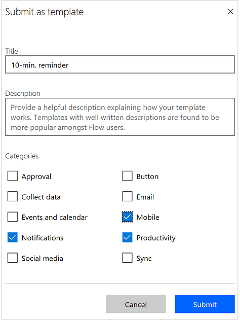

# Inviare un modello alla raccolta di Microsoft Flow
Inviare un modello di flusso alla raccolta di modelli per Microsoft Flow. I modelli consentono agli utenti non solo di creare flussi con maggiore facilità, ma anche di immaginare scenari aggiuntivi che potrebbero trarre vantaggio da un flusso. 

1. Nella pagina **Flussi personali** selezionare i puntini di sospensione (...) per un flusso.
   
    
2. Dal menu visualizzato selezionare **Invia come modello**.
   
    
3. Specificare in titolo significativo, una descrizione chiara dello scenario che verrà automatizzato dal modello e le categorie applicabili per il modello.
   
    
4. Selezionare **Invia**.
   
     Il team di Microsoft Flow verificherà e *se necessario modificherà* il modello. Se il team lo approva, il modello verrà visualizzato nella raccolta di modelli per Microsoft Flow.

