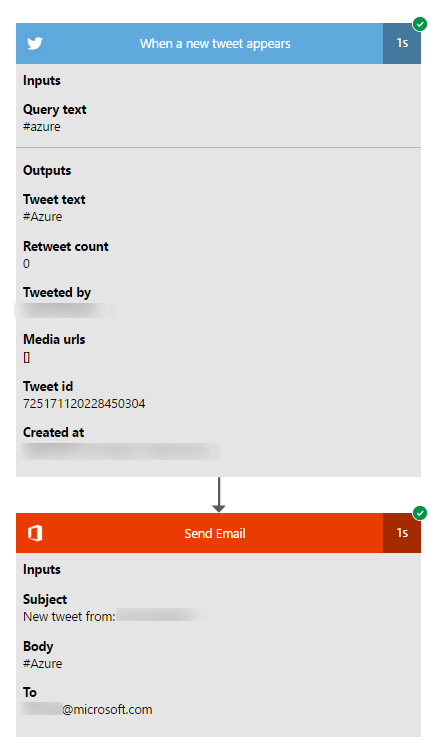

# Guarda i flussi in azione
[!INCLUDE [view-pending-approvals](includes/cc-rebrand.md)]

>[!VIDEO https://www.youtube.com/embed/3wPoUCGm7Yg]

Per assicurarsi che i flussi vengano eseguiti come previsto, eseguire il trigger, quindi esaminare gli input e gli output generati da ogni passaggio nel flusso.

1. Creare o aggiornare un flusso, quindi lasciare aperta la finestra di progettazione dopo aver selezionato **Crea flusso** o **Aggiorna flusso**.

     Ad esempio, [creare un flusso](get-started-logic-flow.md) che invii un messaggio di posta elettronica ogni volta che un utente invia un tweet usando l'hashtag **#azure** .
1. Eseguire l'azione di avvio per il flusso.

    Ad esempio, inviare un tweet che contiene il **#azure** hashtag.

    L'azione iniziale e ogni passaggio successivo indicano se ha avuto esito positivo e il tempo impiegato.

    
1. Selezionare il trigger o l'azione per visualizzare i relativi input e output.

    
1. Selezionare **Modifica flusso** per apportare altre modifiche oppure selezionare **fine** se il flusso funziona come previsto.
