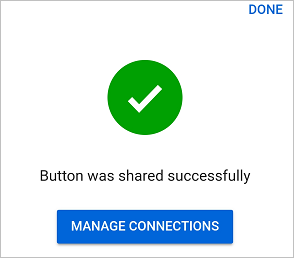
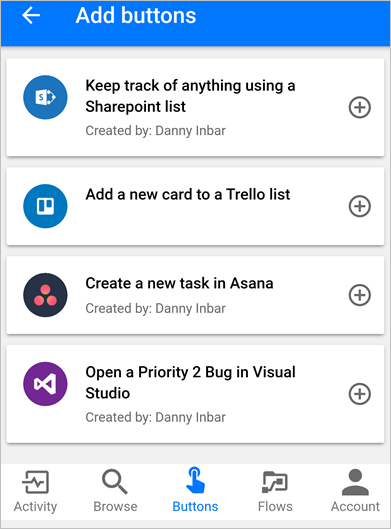
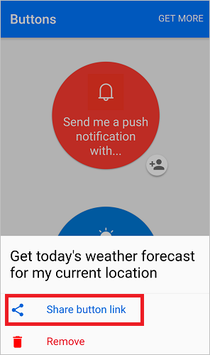

# Condividere i flussi di un pulsante in Microsoft Flow
[!INCLUDE [view-pending-approvals](includes/cc-rebrand.md)]
Nell'app Microsoft Flow per dispositivi mobili è possibile condividere i flussi di un [pulsante](introduction-to-button-flows.md) (pulsanti) con altri utenti o gruppi all'interno dell'organizzazione. Quando si condivide un pulsante, la persona o il gruppo con cui si condivide può eseguire il pulsante, nello stesso modo in cui eseguono i propri pulsanti. È anche possibile [condividere un collegamento](share-buttons.md#re-share-a-button) ai pulsanti condivisi da un altro utente. È possibile [interrompere la condivisione](share-buttons.md#stop-sharing-a-button) dei pulsanti in qualsiasi momento.

> Le schermate usate in questo documento sono state ricavate da un dispositivo Android. Se si usa un iPhone, le immagini possono essere visualizzate in modo diverso, ma la funzionalità è la stessa.
> 
> 

Seguire [questa procedura](share-buttons.md#use-shared-buttons) per usare un pulsante che qualcuno ha condiviso con l'utente.

## Prerequisiti
Per condividere i pulsanti è necessario:

* Un account con accesso a [Microsoft Flow](https://flow.microsoft.com).
* Flusso da condividere.
* Un dispositivo mobile con l'app per dispositivi mobili Microsoft Flow per [Android](https://aka.ms/flowmobiledocsandroid), [iOS](https://aka.ms/flowmobiledocsios)o [Windows Phone](https://aka.ms/flowmobilewindows).
* Un gruppo o un utente all'interno dell'organizzazione con cui condividere il pulsante.

## Condividere un pulsante
È possibile condividere un pulsante dalla scheda **pulsanti** dell'app per dispositivi mobili Microsoft Flow.

1. Toccare l'icona piccola accanto al pulsante che si vuole condividere.
   
    
2. Toccare **invita altri** dalla pagina **utenti pulsante** .
   
    
3. Cercare e quindi selezionare il gruppo o la persona con cui si vuole condividere il pulsante.
   
    
4. Toccare **Send (Invia** ) nella pagina **invite other (invita altri** ).
   
    
5. Toccare **fine** nella pagina che indica che l'operazione di condivisione del pulsante è stata completata correttamente.
   
    

## Richiedi agli utenti di usare le proprie connessioni
> [!NOTE]
> Quando si condivide un pulsante, è possibile consentire alle persone con cui è stato condiviso il pulsante di utilizzare tutte le connessioni utilizzate dal pulsante. È anche possibile richiedere loro di usare le proprie connessioni. Se si consente ad altri utenti di usare le connessioni, non possono accedere alle credenziali nella connessione o riutilizzarle in qualsiasi altro flusso.
> 
> 

Seguire questa procedura per richiedere alle persone con cui sono stati condivisi i pulsanti di usare le proprie connessioni.

1. Selezionare **Gestisci connessioni** sullo schermo che verrà visualizzato immediatamente dopo la condivisione di un pulsante.
2. Selezionare **modifica** sul pulsante che si vuole gestire.
3. Selezionare **fornito dall'utente** o l'indirizzo di posta elettronica.
   
    La scelta indica le connessioni che devono essere usate nel pulsante condiviso.
   
    
   
    È possibile visualizzare o modificare la scelta in qualsiasi momento. A tale scopo, selezionare la scheda **flussi** > il flusso condiviso > **utenti e connessioni** > la scheda **connessioni** > **modifica** sul pulsante che si vuole gestire.
   
    

## Visualizzare l'elenco degli utenti dei pulsanti
È possibile visualizzare tutti i gruppi o gli utenti con cui è stato condiviso un pulsante attenendosi alla seguente procedura dalla scheda **pulsanti** :

1. Toccare l'icona piccola accanto al pulsante a cui si è interessati.
2. Nella pagina **pulsante utenti** visualizzare tutti i gruppi o gli utenti con cui il pulsante è condiviso.
   
    

## Interrompi condivisione di un pulsante
È possibile interrompere la condivisione di un pulsante attenendosi alla seguente procedura dalla scheda **pulsanti** :

1. Toccare l'icona piccola accanto al pulsante che non si vuole più condividere.
2. Nella pagina **utenti pulsante** toccare l'utente o il gruppo con cui si desidera interrompere la condivisione del pulsante.
   
    
3. Toccare **Rimuovi utente** quando viene visualizzata la pagina dell'utente.
   
    
4. Attendere il completamento dell'operazione di rimozione. Si noti che l'elenco **degli utenti del pulsante** viene aggiornato e che l'utente o il gruppo rimosso non è più elencato.
   
    

## Monitorare la cronologia di esecuzione
Tutta la cronologia di esecuzione, incluse le esecuzioni avviate da una persona con cui è stato condiviso un pulsante, viene visualizzata solo nella scheda **attività** dell'app per dispositivi mobili Microsoft flow dell'autore dei pulsanti.

## Usare i pulsanti condivisi
Prima di poter eseguire un pulsante che qualcuno ha condiviso, è necessario aggiungerlo alla scheda **pulsanti** della pagina **Aggiungi pulsanti** .

1. Toccare **get more** (o i **nuovi pulsanti sono disponibili** banner se viene visualizzato) nella scheda **pulsanti** .
   
    
2. Toccare il pulsante che si vuole usare.
   
    Il pulsante toccato viene immediatamente aggiunto alla scheda **pulsanti** dell'app Microsoft Flow. È quindi possibile usare il pulsante dalla scheda **pulsanti** , esattamente come qualsiasi altro pulsante elencato qui.
   
    

## Ricondividere un pulsante
È possibile condividere un collegamento a un pulsante che è stato condiviso con l'utente.

1. Selezionare **...** accanto al pulsante che si vuole condividere.
2. Selezionare **Condividi collegamento al pulsante**.
   
    
3. Selezionare l'app che si vuole usare per condividere il pulsante, quindi seguire i passaggi per inviare il pulsante alla persona con cui si vuole condividere.

## Interrompi utilizzo di un pulsante condiviso
Se non si vuole più usare un pulsante che è stato condiviso, rimuoverlo dalla scheda **pulsanti** eseguendo questi passaggi:

1. Nella scheda **pulsanti** toccare **...** accanto al pulsante che non si vuole più usare.
   
    
2. Toccare **Rimuovi** dal menu visualizzato.

Questo è tutto. Il pulsante non viene più visualizzato nella scheda **pulsanti** dell'app Microsoft Flow.

> [!NOTE]
> Dopo aver rimosso un pulsante condiviso, è possibile aggiungerlo di nuovo selezionando **Ottieni di più** dalla scheda **pulsanti** .
> 
> 

