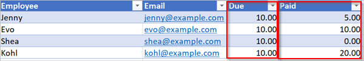

# <a name="use-functions-in-conditions-to-check-multiple-values"></a>Usare le funzioni in condizioni per verificare più valori
Questa procedura dettagliata illustra come usare le funzioni e le **condizioni** per confrontare più valori in **modalità Avanzata**.

Quando si crea un flusso, è possibile usare la scheda [**Condizione**](add-a-condition.md#add-a-condition) in modalità base per confrontare rapidamente un singolo valore con un altro valore. Tuttavia, a volte è necessario confrontare più valori. Ad esempio, potrebbe essere necessario controllare il valore di alcune colonne in un foglio di calcolo o in una tabella di database.

È possibile usare qualsiasi combinazione delle seguenti funzioni logiche nelle proprie condizioni.

| Funzione | Descrizione | Esempio |
| --- | --- | --- |
| <a href="#use-the-and-function">e</a> |Accetta due argomenti e restituisce true se entrambi i valori sono true.<br><b>Nota</b>: entrambi gli argomenti devono essere valori booleani. |Questa funzione restituisce false: <br>e(maggiore(1,10),è uguale a(0,0)) |
| <a href="#use-the-or-function">o</a> |Accetta due argomenti e restituisce true se uno degli argomenti è true. <br><b>Nota</b>: entrambi gli argomenti devono essere valori booleani. |Questa funzione restituisce true:<br>o(maggiore(1,10),è uguale a(0,0)) |
| equals |Restituisce true se due valori sono uguali. |Ad esempio, se parameter1 è someValue, questa funzione restituisce true:<br>equals(parameters('parameter1'), 'someValue') |
| <a href="#use-the-less-function">less</a> |Accetta due argomenti e restituisce true se il primo argomento è minore del secondo argomento. <br><b>Nota</b>: i tipi supportati sono integer, float e string. |Questa funzione restituisce true:<br>less(10,100) |
| lessOrEquals |Accetta due argomenti e restituisce true se il primo argomento è minore o uguale al secondo argomento. <br><b>Nota</b>: i tipi supportati sono integer, float e string. |Questa funzione restituisce true:<br>lessOrEquals(10,10) |
| <a href="#use-the-greater-function">greater</a> |Accetta due argomenti e restituisce true se il primo argomento è maggiore del secondo argomento. <br><b>Nota</b>: i tipi supportati sono integer, float e string. |Questa funzione restituisce false:<br>greater(10,10) |
| greaterOrEquals |Accetta due argomenti e restituisce true se il primo argomento è maggiore o uguale al secondo argomento. <br><b>Nota</b>: i tipi supportati sono integer, float e string. |Questa funzione restituisce false:<br>greaterOrEquals(10,100) |
| <a href="#use-the-empty-function">empty</a> |Restituisce true se l'oggetto, matrice o stringa è vuota. |Questa funzione restituisce true:<br>empty('') |
| not |Accetta due argomenti e restituisce true se gli argomenti sono false. <br><b>Nota</b>: entrambi gli argomenti devono essere valori booleani. |Questa funzione restituisce true:<br>not(contains('200 Success','Fail')) |
| if |Restituisce un valore specifico se l'espressione risulta true o false. |Questa funzione restituisce "yes":<br>if(equals(1, 1), 'yes', 'no') |

## <a name="prerequisites"></a>Prerequisiti
* Avere accesso a Microsoft Flow.
* Un foglio di calcolo con le tabelle descritto più avanti in questa procedura dettagliata. Assicurarsi di salvare il foglio di calcolo in un percorso, ad esempio Dropbox o Microsoft OneDrive, in modo che Microsoft Flow possa accedervi.
* Microsoft Office 365 Outlook (ma è possibile usare qualsiasi servizio di posta elettronica supportato nei flussi.)

## <a name="use-the-or-function"></a>Usare la funzione or
Talvolta il flusso di lavoro deve eseguire un'azione se il valore di un elemento è valueA **o** valueB. Ad esempio, potrebbe essere in corso il tracciamento dello stato delle attività in una tabella del foglio di calcolo. Si supponga che la tabella contenga una colonna denominata *Stato* e che i valori possibili nella colonna *Stato* siano:

* **completato**
* **bloccato**
* **non necessario**
* **non avviato**

Di seguito è riportato un esempio del possibile aspetto del foglio di calcolo:


Dato il foglio di calcolo precedente, si vuole usare Microsoft Flow per rimuovere tutte le righe con una colonna *Stato* impostata su *completato* o *non necessario*.

Creare il flusso.

### <a name="start-with-a-blank-flow"></a>Iniziare con un flusso vuoto
1. Accedere a [Microsoft Flow](https://flow.microsoft.com).
   
    
2. Selezionare la scheda **Flussi personali**.
   
    
3. Selezionare **Crea da zero**.
   
    

### <a name="add-a-trigger-to-your-flow"></a>Aggiungere un trigger al flusso
1. Cercare **Pianifica**, quindi selezionare il trigger **Pianifica - Ricorrenza**
   
    
2. Impostare la frequenza di esecuzione della pianificazione una volta al giorno.
   
    

### <a name="select-the-spreadsheet-and-get-all-rows"></a>Selezionare il foglio di calcolo e ottenere tutte le righe
1. Selezionare **Nuovo passaggio** > **Aggiungi un'azione**.
   
    
2. Cercare **righe**, quindi selezionare **Excel - Ottieni righe**.
   
    Nota: selezionare l'azione "Ottieni righe" che corrisponde al foglio di calcolo che si sta usando. Ad esempio, se si usano i fogli di Google, selezionare **Fogli Google - Ottieni righe**.
   
    
3. Selezionare l'icona di cartella nella casella **Nome file**, passare al foglio di calcolo che contiene i dati e quindi selezionarlo.
   
    
4. Selezionare la tabella che contiene i dati dell'elenco **Nome tabella**.
   
    

### <a name="check-the-status-column-of-each-row"></a>Verificare la colonna Stato di ogni riga
1. Selezionare **Nuovo passaggio** > **Altro** > **Applica a ogni**.
   
    
2. Aggiungere un token **Value** alla casella **Selezionare un output dai passaggi precedenti**.
   
    
3. Selezionare **Aggiungi una condizione** > **Modifica in modalità avanzata**.
4. Aggiungere la seguente funzione **or**. La funzione **or** verifica il valore di ogni riga nella tabella (una riga è nota come elemento quando vi si accede in una funzione). Se il valore della colonna **Stato** è *completato* **o** *non necessario*, la funzione **or** restituisce "true".
   
    La funzione **or** appare come segue:
   
    ````@or(equals(item()?['status'], 'unnecessary'), equals(item()?['status'], 'completed'))````
   
    La scheda **Condizione** è simile all'immagine seguente:
   
    

### <a name="delete-matching-rows-from-the-spreadsheet"></a>Eliminare le righe corrispondenti dal foglio di calcolo
1. Selezionare **Aggiungi un'azione** nella diramazione della condizione **SE SÌ, NON FARE NULLA**.
2. Cercare **Elimina riga**, quindi selezionare **Excel - Elimina riga**.
   
    
3. Nella casella **Nome file** cercare e selezionare il file del foglio di calcolo contenente i dati da eliminare.
4. Nell'elenco **Nome tabella** selezionare la tabella che contiene i dati.
5. Inserire il token **ID riga** nella casella **ID riga**.
   
    

### <a name="name-the-flow-and-save-it"></a>Assegnare un nome al flusso e salvarlo
1. Assegnare un nome al flusso e quindi selezionare il pulsante **Crea flusso**.
   
    

### <a name="run-the-flow-with-the-or-function"></a>Eseguire il flusso con la funzione or
Il flusso viene eseguito dopo il salvataggio. Se è stato creato il foglio di calcolo illustrato in precedenza in questa procedura dettagliata, ecco il suo aspetto dopo il completamento dell'esecuzione:


Si noti che sono stati eliminati tutti i dati dalle righe con "completato" o "non necessario" nella colonna Stato.

## <a name="use-the-and-function"></a>Usare la funzione and
Si supponga di avere una tabella del foglio di calcolo con due colonne. I nomi delle colonne sono Assegnati e Stato. Si supponga di voler eliminare tutte le righe, se il valore della colonna Stato è "bloccato" e il valore della colonna Assegnato è "John Wonder".  A questo scopo, seguire tutti i passaggi illustrati precedentemente in questa procedura dettagliata; tuttavia, quando si modifica la scheda **Condizione** in modalità avanzata, usare la funzione **and** illustrata qui:

````@and(equals(item()?['Status'], 'blocked'), equals(item()?['Assigned'], 'John Wonder'))````

La scheda **Condizione** è simile all'immagine seguente:


### <a name="run-the-flow-with-the-and-function"></a>Eseguire il flusso con la funzione and
Se tutti i passaggi sono stati eseguiti correttamente, il foglio di calcolo sarà simile all'immagine seguente:


Dopo aver eseguito il flusso, il foglio di calcolo sarà simile all'immagine seguente:


## <a name="use-the-empty-function"></a>Usare la funzione vuota
Si noti che esistono diverse righe vuote nel foglio di calcolo. Per rimuoverle, usare la funzione **vuota** per identificare tutte le righe che non hanno testo nelle colonne Assegnato e Stato.

A questo scopo, seguire tutti i passaggi illustrati precedentemente nella sezione **Usare la funzione and** di questa procedura dettagliata; tuttavia, quando si modifica la scheda **Condizione** in modalità avanzata, usare la funzione vuota in questo modo:

````@and(empty(item()?['Status']), empty(item()?['Assigned']))````

La scheda **Condizione** è simile all'immagine seguente:


Dopo aver eseguito il flusso, il foglio di calcolo sarà simile all'immagine seguente:


Le righe aggiuntive vengono rimosse dalla tabella.

## <a name="use-the-greater-function"></a>Usare la funzione greater
Si supponga di aver acquistato biglietti per una partita di calcio per i colleghi e che si stia usando un foglio di calcolo per assicurarsi di essere rimborsati da ogni persona. È possibile creare rapidamente un flusso che invii un messaggio giornaliero a ogni persona che non ha pagato l'intero importo.

Usare la funzione **greater** per identificare i dipendenti che non hanno pagato l'intero importo. È quindi possibile inviare automaticamente un messaggio di promemoria agli utenti che non hanno pagato l'intero importo.

Ecco una visualizzazione del foglio di calcolo:



Ecco l'implementazione della funzione **greater** che identifica tutte le persone che hanno pagato un importo inferiore rispetto a quello dovuto:

````@greater(item()?['Due'], item()?['Paid'])````

## <a name="use-the-less-function"></a>Usare la funzione less
Si supponga di aver acquistato biglietti per una partita di calcio per i colleghi e che si stia usando un foglio di calcolo per assicurarsi di essere rimborsati da ogni persona entro la data concordata. È possibile creare un flusso che invii un promemoria a ogni persona che non ha pagato l'intero importo se la data corrente è antecedente alla data di scadenza di meno di un giorno.

Usare la funzione **and** insieme alla funzione **less** perché vengono convalidate due condizioni:

| Condizione da convalidare | Funzione da usare | Esempio |
| --- | --- | --- |
| L'importo totale dovuto è stato pagato? |maggiore |@greater(item()?['Due'], item()?['Paid']) |
| La data di scadenza è tra meno di un giorno? |meno |@less(item()?['DueDate'], addDays(utcNow(),1)) |

## <a name="combine-the-greater-and-less-functions-in-an-and-function"></a>Combinare le funzioni greater e less in una funzione and
Usare la funzione **greater** per identificare i dipendenti che hanno pagato meno dell'importo completo dovuto e usare la funzione **less** per determinare se la data di scadenza del pagamento è a meno di un giorno dalla data corrente. È quindi possibile scegliere l'azione **Invia un messaggio di posta elettronica** per inviare un promemoria a coloro che non hanno pagato l'importo completo se la data di scadenza è tra meno di un giorno.

Ecco una visualizzazione della tabella del foglio di calcolo:


Ecco l'implementazione della funzione **and** che identifica tutte le persone che hanno pagato un importo inferiore rispetto a quello dovuto quando la data di scadenza è a meno di un giorno dalla data corrente:

````@and(greater(item()?['Due'], item()?['Paid']), less(item()?['dueDate'], addDays(utcNow(),1)))````

## <a name="learn-more"></a>Altre informazioni
Informazioni sulle altre [funzioni](https://docs.microsoft.com/azure/logic-apps/logic-apps-workflow-definition-language#functions)

