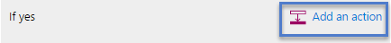

# Attendere l'approvazione in Microsoft Flow
<iframe width="560" height="315" src="https://www.youtube.com/embed/W6oxcYRtW-8?list=PL8nfc9haGeb55I9wL9QnWyHp3ctU2_ThF" frameborder="0" allowfullscreen></iframe>

Creare un flusso che, se si crea un elemento in SharePoint, invii un messaggio di approvazione e quindi una notifica dell'approvazione o del rifiuto dell'elemento. Per seguire esattamente questa esercitazione, creare un semplice elenco di SharePoint come un'azione di trigger, magari usando un'altra origine dati, ad esempio Dropbox o OneDrive.

**Prerequisiti**

* Creare un semplice elenco di SharePoint Online denominato **Registro progetti** con una colonna denominata **Titolo**, e aggiungere una colonna Persona o Gruppo denominata **Assegnato a**.
  
   

## Aggiungere un evento per attivare il flusso
1. In [flow.microsoft.com](https://flow.microsoft.com), selezionare **Flussi personali** nella barra di spostamento in alto e quindi selezionare **Crea nuovo flusso**.
   
    
2. Nella casella **Come si vuole iniziare?**, digitare o incollare **nuovo elemento**, quindi selezionare **SharePoint Online - Quando viene creato un nuovo elemento**.
   
    
3. Se richiesto, accedere a SharePoint Online.
4. In **URL sito**, digitare o incollare l'URL del sito che contiene l'elenco.
   
    
5. In **Nome elenco**, selezionare un elenco, ad esempio **Registro progetti**.
   
    

## Aggiungere l'azione risultante
1. Selezionare il pulsante **+** e quindi selezionare **Aggiungi un'azione**.
   
    
2. Nella casella **Quali operazioni desideri eseguire in seguito?** digitare o incollare **invia messaggio** e quindi selezionare **Office 365 Outlook - Invia messaggio di posta elettronica di approvazione**.
   
    
3. Se richiesto, accedere a Office 365 Outlook.
4. Selezionare il campo **A** e quindi selezionare **Assegnato a Posta elettronica**.
   
    L'utente nella colonna **Assegnato a** riceverà il messaggio di posta elettronica per approvare o rifiutare l'elemento. Quando si crea un elemento per testare il flusso, è necessario specificarlo manualmente in questo campo. In questo modo, non solo si approva o rifiuta l'elemento, ma si riceve anche il messaggio di notifica.
   
    **Nota**: è anche possibile personalizzare i campi **Oggetto** e **Opzioni utente** in base alle esigenze.
   
    

## Aggiungere una condizione
1. Selezionare il pulsante **+** e quindi selezionare **Aggiungi una condizione**.
   
    
2. Nel campo **Nome oggetto** selezionare **Opzione selezionata**.
3. Nel campo **Valore** digitare o incollare **Approva**.
   
    
4. Nell'area **Se sì** selezionare **Aggiungi un'azione**.
   
    
5. Nella casella **Quali operazioni desideri eseguire in seguito?** digitare o incollare **invia messaggio** e quindi selezionare **Office 365 Outlook - Invia messaggio di posta elettronica**.
   
    
6. Nella casella **Oggetto** specificare un oggetto.
   
    Ad esempio, selezionare **Assegnato a NomeVisualizzato**, digitare **ha approvato** con uno spazio su ciascun lato e quindi selezionare **Titolo**.
7. Nella casella **Corpo** specificare il corpo del messaggio, ad esempio **Pronti a procedere con la fase successiva del progetto**.
8. Nel campo **A** immettere un destinatario come **Creato da Posta elettronica**.
   
    La persona che ha creato l'elemento nell'elenco di SharePoint sarà informata se il progetto è stato approvato o rifiutato.
   
    
9. Nell'area **Se no** ripetere gli ultimi cinque passaggi, ma modificare l'**Oggetto** e il **Corpo** in modo da riflettere che il progetto è stato rifiutato.
   
     

## Terminare e testare il flusso
1. Assegnare un nome al flusso e quindi selezionare **Crea flusso**.
   
     
2. Creare un elemento nell'elenco di SharePoint.
   
    Un messaggio di approvazione viene inviato al destinatario specificato. Quando il destinatario seleziona **Approva** o **Rifiuta** in tale messaggio, si riceverà un messaggio che indica la risposta. 

