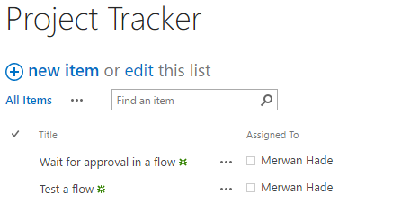

# Attendere l'approvazione in Microsoft Flow

> [!VIDEO https://www.youtube.com/embed/W6oxcYRtW-8?list=PL8nfc9haGeb55I9wL9QnWyHp3ctU2_ThF]
>

Creare un flusso che, se si crea un elemento in SharePoint, invii un messaggio di posta elettronica di approvazione e quindi una notifica dell'approvazione o del rifiuto dell'elemento. Per seguire esattamente questa esercitazione, creare un semplice elenco di SharePoint come un'azione di trigger, magari usando un'altra origine dati, ad esempio Dropbox o OneDrive.

**Prerequisiti**

* Creare un semplice elenco di SharePoint denominato **Registro progetti**, aggiungere una colonna denominata **Titolo** e quindi aggiungere una colonna Persona o Gruppo denominata **Assegnato a**.

   

## Aggiungere un evento per attivare il flusso

1. Accedere a [Microsoft Flow](https://flow.microsoft.com), selezionare **Flussi personali** nella barra di spostamento in alto e quindi scegliere **Crea da zero**.

1. Selezionare la casella **Cerca tra centinaia di connettori e trigger**, immettere **nuovo elemento** e quindi passare a **SharePoint - Quando viene creato un elemento**.

1. Se richiesto, accedere a SharePoint.
1. In **Indirizzo del sito** immettere l'URL del sito di SharePoint contenente l'elenco.

1. In **Nome elenco** selezionare l'elenco creato prima. Se si sta seguendo questa procedura nel dettaglio, il nome è **Registro progetti**.

    

## Aggiungere l'azione risultante

1. Selezionare il pulsante **Nuovo passaggio** e quindi selezionare **Aggiungi un'azione**.

1. Nella casella **Cerca tutti i connettori e le azioni** digitare o incollare **invia e-mail**, quindi selezionare **Office 365 Outlook - Invia messaggio di posta elettronica con opzioni**.

1. Se richiesto, accedere a Office 365 Outlook.

1. Selezionare il campo **A** e quindi selezionare il token **Assegnato a Posta elettronica**.

    L'utente nella colonna **Assegnato a** riceve il messaggio di posta elettronica per approvare o rifiutare gli elementi. Quando si crea un elemento per testare il flusso, specificarlo manualmente in questo campo. In questo modo, non solo si approva o rifiuta l'elemento, ma si riceve anche il messaggio di notifica.

    > [!NOTE]
    > È anche possibile personalizzare i campi **Oggetto** e **Opzioni utente** in base alle esigenze.

    

## Aggiungere una condizione

1. Selezionare il pulsante **Nuovo passaggio** e quindi selezionare **Aggiungi una condizione**.

    
1. Selezionare la prima casella e quindi selezionare il token **SelectedOption**.
1. Selezionare l'ultima casella e quindi digitare **Approva**.

    

1. Nell'area **Se sì** selezionare **Aggiungi un'azione**.

1. Nella casella **Cerca tutti i connettori e le azioni** digitare o incollare **invia e-mail**, quindi selezionare **Office 365 Outlook - Invia un messaggio di posta elettronica**.

1. Nel campo **A** immettere un destinatario come **Creato da Posta elettronica**.

1. Nella casella **Oggetto** specificare un oggetto.

    Ad esempio, selezionare **Assegnato a NomeVisualizzato**, digitare **ha approvato** con uno spazio su ciascun lato e quindi selezionare **Titolo**.

1. Nella casella **Corpo** specificare il corpo del messaggio, ad esempio **Pronti a procedere con la fase successiva del progetto**.

    > [!NOTE]
    > La persona che ha creato l'elemento nell'elenco di SharePoint sarà informata se il progetto è stato approvato o rifiutato.

    

1. Nell'area **Se no** ripetere gli ultimi cinque passaggi, ma modificare l'**Oggetto** e il **Corpo** in modo da riflettere che il progetto è stato rifiutato.

     

## Terminare e testare il flusso

1. Assegnare un nome al flusso e quindi selezionare **Crea flusso**.

     
1. Creare un elemento nell'elenco di SharePoint.

    Un messaggio di posta elettronica di approvazione viene inviato al destinatario specificato. Quando il destinatario seleziona **Approva** o **Rifiuta** in tale messaggio di posta elettronica, si riceverà un messaggio che indica la risposta.

## Altre informazioni

* [Procedura dettagliata di approvazioni moderne di un unico responsabile approvazione](modern-approvals.md)
* Creare [approvazioni sequenziali](sequential-modern-approvals.md)
* Creare [approvazioni parallele](parallel-modern-approvals.md)
* Approvare le [richieste in viaggio](mobile-approvals.md)
